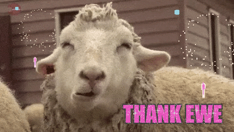

```{r, echo = FALSE, include=FALSE}

options(htmltools.dir.version = FALSE)
knitr::opts_chunk$set(message = FALSE, warning = FALSE, comment = "", cache = FALSE, 
                      echo = T, fig.retina = 3, fig.align = 'center')

library(xaringan)
library(dplyr)
library(ggplot2)
library(tidyr)
library(stringr)
library(magrittr)
library(DT)

xaringanExtra::use_xaringan_extra(c("tileview", "webcam"))
xaringanExtra::use_logo(
  image_url = "R-LadiesGlobal.png",
  width = "50px")

xaringanExtra::use_extra_styles(
  hover_code_line = TRUE,         #<<
  mute_unhighlighted_code = TRUE  #<<
)

```

# Welcome!

&nbsp;

- This meetup is part of a joint effort between RLadies Nijmegen, Rotterdam, 's-Hertogenbosch (Den Bosch), Amsterdam and Utrecht  
&nbsp;

--

- We meet every 2 weeks to go through a chapter of the book "Advanced R" by Hadley Wickham  
&nbsp;

--

- Slides from previous sessions are available: https://github.com/rladiesnl/book_club
&nbsp;

---

# Overall approach

Strategy recommended by Hadley Wickham:

1. Google
    + Remove variable names or values
    + Use specific packages for automation: `errorist107` or `searcher108`
2. Make it repeatable
    + MINIMAL reproducible example 
    + Automated test case (if applicable)
3. Figure out where it is
    + Tools explained here
    + Ask for help (using the reproducible example)
4. Fix it and test it

---

# Tools

**Finding where the error is:**  

- Traceback in RStudio or through the function `traceback()`  

**Fixing the error:**  

- Editor breakpoint  
- Browser breakpoint `browser()`  
- `options(error = browser)` (Opposite: `options(error = NULL)`)  
- `debug()` and `debugonce()`  

---

# Women in the Workforce (TidyTuesday 4-Mar-2019)

Data from the Bureau of Labor Statistics and the Census Bureau about women in the workforce. 

According to the AAUW - "The gender pay gap is the gap between what men and women are paid. Most commonly, it refers to the median annual pay of all women who work full time and year-round, compared to the pay of a similar cohort of men." 

The data is provided as is, and you recognize the limitations and issues in defining gender as binary.

---

# An example

```{r, message=FALSE, warning=FALSE, echo = FALSE, out.width="100%"}

jobs_gender <- readr::read_csv("https://raw.githubusercontent.com/rfordatascience/tidytuesday/master/data/2019/2019-03-05/jobs_gender.csv")
str(jobs_gender)

```


---

# Our goal

```{r, message=FALSE, warning=FALSE, echo = FALSE, fig.width=9, out.height="103%"}

jobs_gender %<>% mutate("major_category" = str_wrap(major_category, width = 30),
                        "minor_category" = str_wrap(minor_category, width = 18)) 

# Get mean_major category
mean_major_category <- jobs_gender %>% 
  group_by(major_category) %>%
  summarise(mean = mean(wage_percent_of_male/100, na.rm = T) ) %>%
  `[`()

# Get palette 
n_cols <- jobs_gender$minor_category %>% unique() %>% length()
color_array <- colorRampPalette(RColorBrewer::brewer.pal(8, "Set2"))(n_cols)

# Plot
ggplot(jobs_gender, aes(x = minor_category, y = wage_percent_of_male/100, color = minor_category)) + 
  geom_boxplot(alpha = 0.3, show.legend = FALSE, outlier.shape = NA) +
  geom_point(position = position_jitter(width = 0.3)) +
  geom_hline(data = mean_major_category, aes(yintercept = mean), linetype = 2, color = "darkgray") +
  facet_wrap(~major_category, scales = "free_x") +
  scale_color_manual(values = color_array) +
  scale_y_continuous(labels = scales::percent_format()) +
  labs(title = "Wage of women in proportion to men in the same job category", y = "")+
  guides(color=guide_legend(ncol=6))+
  theme_light() +
  theme(legend.position = "bottom",
        legend.title = element_blank(),
        legend.text = element_text(size = 9),
        axis.text = element_text(size = 9),
        axis.text.x = element_blank(),
        axis.title.x = element_blank(),
        strip.text = element_text(size = 10))

```

---

# Non-interactive sessions

- Steps are the same than before
- Common problems:
    + Different environment
    + Different working directory
    + Different environment variables (like PATH or R_LIBS)

---

# Specific tools for non-interactive sessions

`dump.frames()`

```{r, eval = FALSE}
# In batch R process ----
dump_and_quit <- function() {
  # Save debugging info to file last.dump.rda
  dump.frames(to.file = TRUE)
  # Quit R with error status
  q(status = 1)
}
options(error = dump_and_quit)

# In a later interactive session ----
load("last.dump.rda")
debugger()
```

If you work in bash...

```{bash, eval = FALSE}
Rscript my_r_script.R &> log_file.txt
```

--- 

Print statements everywhere!!

.panelset[
.panel[.panel-name[Undecipherable error]

```{r, echo = FALSE}
read.delim(file = "files/undecipherable_error.txt", sep = "\t", header = FALSE)
```
]

.panel[.panel-name[Slightly less undecipherable error]

```{r, echo = FALSE}
read.delim(file = "files/undecipherable_error.txt", sep = "\t", header = FALSE)
```

]
]

---

# Other non-errors

- For warnings use: `options(warn = 2)` to turn warnings into error and use the the call stack, like `doWithOneRestart()`, `withOneRestart()`
- For messages use: `rlang::with_abort()` to turn these messages into errors
- A function might never return. Sometimes terminating the function and looking at the `traceback()` is informative
- R crashing completely. This indicates a bug in compiled (C or C++) code.
- If the bug is in your compiled code, you’ll need to follow use an interactive C debugger (or insert many print statements)
- If the bug is in a package or base R, you’ll need to contact the package maintainer. In either case, work on making the smallest possible reproducible example

---
class: middle, inverse

# .fancy[Time to share experiences!!!]

---

# Share your experience

- Did you know this tools?
&nbsp;

- Which debugging tools you use the most?
&nbsp;

- What is the worst error message/debugging experience you have ever had?

---
class: middle, inverse

# .fancy[We are done!]

```{r, echo=FALSE, out.width="130%"}
knitr::include_graphics("done.gif")
```

---
class: middle, inverse

# .fancy[Thank you!]
```{r echo = FALSE, out.width="40%"}

```

### We are almost at the end of the book! Follow the last chapter!!