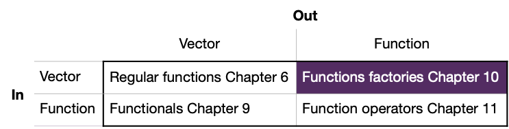
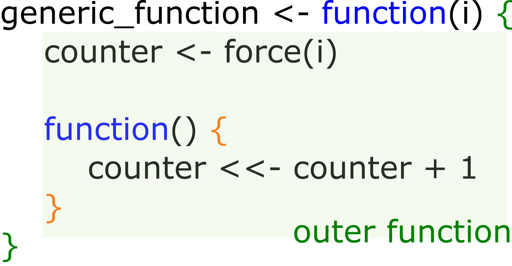
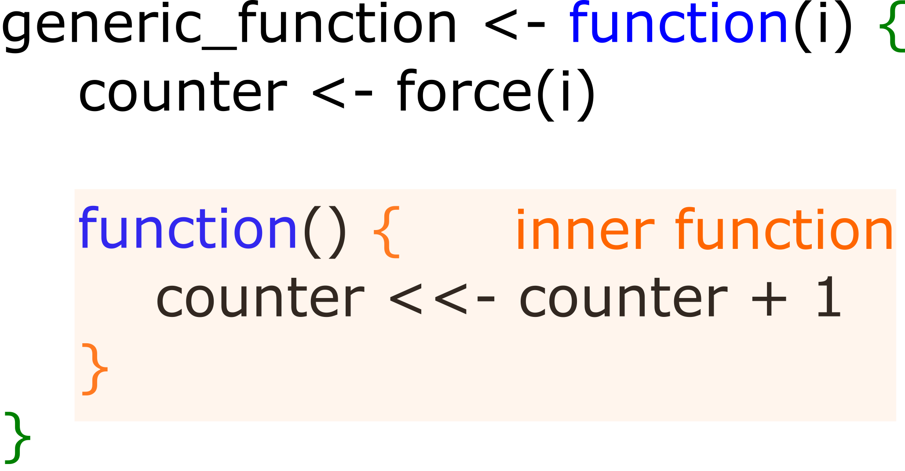
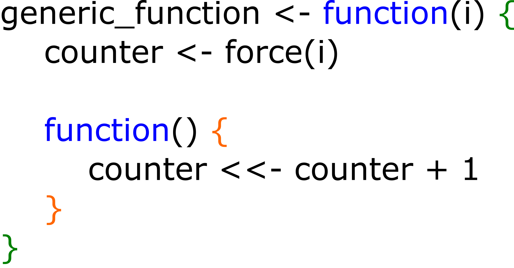
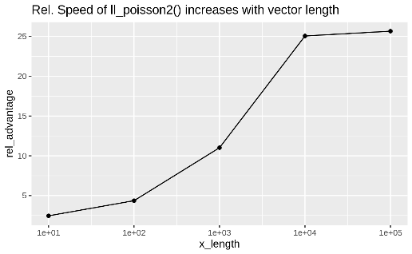

```{r setup, include=FALSE}
options(htmltools.dir.version = FALSE)

knitr::opts_chunk$set(message = FALSE, warning = FALSE, comment = "", cache = FALSE, echo = FALSE, fig.retina = 3)

options(warnPartialMatchDollar = FALSE)

# devtools::install_github("gadenbuie/xaringanExtra")

library(ggplot2)
library(knitr)
library(rlang)
library(scales)
```

```{r xaringanExtra, echo=FALSE}

xaringanExtra::use_tile_view()

xaringanExtra::use_logo(
  image_url = "R-LadiesGlobal.png",
  width = "50px")

xaringanExtra::use_extra_styles(
  hover_code_line = TRUE,         #<<
  mute_unhighlighted_code = TRUE  #<<
)

xaringanExtra::use_webcam()

```

```{r xaringanExtra-clipboard, echo=FALSE}
htmltools::tagList(
  xaringanExtra::use_clipboard(
    button_text = "<i class=\"fa fa-clipboard\"></i>",
    success_text = "<i class=\"fa fa-check\" style=\"color: #90BE6D\"></i>",
    error_text = "<i class=\"fa fa-times-circle\" style=\"color: #F94144\"></i>"
  ),
  rmarkdown::html_dependency_font_awesome()
)
```


# Welcome!

- This is joint effort between RLadies Nijmegen, Rotterdam,
's-Hertogenbosch (Den Bosch), Amsterdam and Utrecht 
--

- We meet every 2 weeks to go through a chapter 
--

- Use the HackMD to present yourself, ask questions and see your breakout room 
--

- We split in breakout rooms after the presentation, and we return to the main jitsi link after xx min  
--

- There are still possibilities to present a chapter :) Sign up at https://rladiesnl.github.io/book_club/  
--

- https://advanced-r-solutions.rbind.io/ has some anwers and we could PR the ones missing  
--

- The R4DS book club repo has a Q&A section.https://github.com/r4ds/bookclub-Advanced_R 

--

---

# Functional programming - Chp 9, 10 and 11  

 
```{r, out.width="150%"}

```

---
# What are Function factories?

> Functions that create functions

* Not super popular or known
* BUT good to know they exist
* helpful to write better code

---
# General explanation of Function factories

* Nested functions
* In most cases -> one internal function

--

```{r, out.width="40%"}

```

--

```{r, out.width="40%"}

```

---
# Code example of exponent function factory

A simple power function
```{r echo=TRUE, eval=FALSE}
power1 <- function(exp) {
  function(x) {
    x ^ exp
  }
}

square <- power1(2)
cube <- power1(3)

square(2)
# 4

# also possible
power1(2)(2)
```

---
# Force evaluation - function in a state of suspense

* Calling the first function, creates an instance of it, but does not evaluate it
* To force execution of the variables in the first function upon instantiation, wrap variables with `force(var)`.

```{r, out.width="40%", fig.align='center'}

```

---
# Stateful functions

* The environment (scope) of the first function can "remember" variables, i.e. create a "state"
* Usually after the function is executed the "execution environment" is discarded. 
* In this case the execution environment is in the secondary internal function. The outer function continues to exist. 

```{r, out.width="40%", fig.align='center'}

```


```{r echo=TRUE, eval=FALSE}
generic_function(5)
# Output 
#> function() counter <<- counter + 
#> <bytecode: 0x4968f00>
#> <environment: 0x4a8f740>

generic_function(5)()
# counter = 6
```

---
# Examples: Ggplot - ggsave


- Option with multiple internal function -> `switch` 

```{r echo=TRUE, eval=FALSE}
plot_dev <- function(ext, dpi = 96) {
  force(dpi)
  
  switch(ext,
    pdf = function(filename, ...) grDevices::pdf(file = filename, ...),
    svg = function(filename, ...) svglite::svglite(file = filename, ...),
    png = function(...) grDevices::png(..., res = dpi, units = "in"),
    stop("Unknown graphics extension: ", ext, call. = FALSE)
  )
}

plot_dev("pdf")
#> function(filename, ...) grDevices::pdf(file = filename, ...)
#> <bytecode: 0x4968f00>
#> <environment: 0x4a8f740>
plot_dev("png")
#> function(...) grDevices::png(..., res = dpi, units = "in")
#> <bytecode: 0x5992f28>
#> <environment: 0x5f34518>


```

---
# Examples: Bootstrap sampling

- Save state in outer function
- Resample in inner function

```{r echo=TRUE, eval=FALSE}
boot_model <- function(df, formula) {
  mod <- lm(formula, data = df)
  fitted <- unname(fitted(mod))
  resid <- unname(resid(mod))
  rm(mod)

  function() {
    fitted + sample(resid)
  }
} 

boot_mtcars2 <- boot_model(mtcars, mpg ~ wt)
head(boot_mtcars2())
#> [1] 25.0 24.0 21.7 19.2 24.9 16.0
head(boot_mtcars2())
#> [1] 27.4 21.0 20.3 19.4 16.3 21.3

```

---
# Exercises 1 

```{r xaringan-panelset, echo=FALSE}
xaringanExtra::use_panelset()
```

.panelset[
.panel[.panel-name[Question]

> Why is it better to force(x) instead of just x?

Definition of force
```{r echo=TRUE, eval=FALSE}
force
> function (x) 
> x
> <bytecode: 0x1fd9660>
> <environment: namespace:base>
```
]

.panel[.panel-name[Answer]

As you can see `force(x)` is just syntactic sugar for `x`. We prefer this explicit form, because “using this function clearly indicates that you’re forcing evaluation, not that you’ve accidentally typed `x`.” (Quote from the textbook).

]
]

---
# Exercise 2

.panelset[
.panel[.panel-name[Question]

> Base R contains two function factories, approxfun() and ecdf(). Read their documentation and experiment to figure out what the functions do and what they return.
]

.panel[.panel-name[Answer]

Let’s begin with `approxfun()` as it is used within `ecdf()`also:

- `approxfun()` takes a 2-dimensional combination of data points (`x` and `y`) as input and returns a stepwise interpolation function, which transforms new `x` values. Additional arguments control how the created function should behave. (The interpolation method may be linear or constant. `yleft`, `yright` and `rule` specify how the newly created function should map new values which are outside of `range(x)`. `f` controls the degree of right-left-continuity via a numeric value from `0` to `1` and `ties` expects a function name like min, mean etc. which defines how non-unique x-y-combinations should be handled when interpolating the data points.)

- `ecdf()` is an acronym for empirical cumulative distribution function. For a numeric vector, `ecdf()` returns the appropriate distribution function (of class “ecdf”, which is inheriting from class “stepfun”). Initially the (x, y) pairs for the nodes of the density function are calculated. Afterwards these pairs are passed to `approxfun()`, which then returns the desired function.

]
]


---
# Exercise 3

.panelset[
.panel[.panel-name[Question]

> Create a function `pick()` that takes an index, `i`, as an argument and returns a function with an argument `x` that subsets `x` with `i`.

```{r echo=TRUE, eval=FALSE}

pick(1)(x)
# should be equivalent to
x[[1]]

lapply(mtcars, pick(5))
# should be equivalent to
lapply(mtcars, function(x) x[[5]])
```

]

.panel[.panel-name[Answer]

```{r echo=TRUE, eval=FALSE}
pick <- function(i) {
  force(i)

  function(x) x[[i]]
}

x <- 1:3
identical(x[[1]], pick(1)(x))
#> [1] TRUE
identical(lapply(mtcars, function(x) x[[5]]),
          lapply(mtcars, pick(5)))
#> [1] TRUE

```
]
]


---
# Exercise 4

.panelset[
.panel[.panel-name[Question]

> Create a function that creates functions that compute the ith central moment of a numeric vector. You can test it by running the following code:

```{r echo=TRUE, eval=FALSE}

m1 <- moment(1)
m2 <- moment(2)

x <- runif(100)
stopifnot(all.equal(m1(x), 0))
stopifnot(all.equal(m2(x), var(x) * 99 / 100))
```
]

.panel[.panel-name[Answer]

The first moment is closely related to the mean and describes the average deviation from the mean, which is 0 (within numerical margin of error). The second moment describes the variance of the input data. If we want compare it to var, we need to undo [Bessel’s correction](https://en.wikipedia.org/wiki/Bessel%27s_correction) correction by multiplying with (N−1)/N.

```{r echo=TRUE, eval=FALSE}
moment <- function(i){
  force(i)

  function(x) sum((x - mean(x)) ^ i) / length(x)
}

m1 <- moment(1)
m2 <- moment(2)

x <- runif(100)
all.equal(m1(x), 0)  # removed stopifnot() for clarity
#> [1] TRUE
all.equal(m2(x), var(x) * 99 / 100)
#> [1] TRUE

```

]
]


---
# Exercise 5

.panelset[
.panel[.panel-name[Question]

> What happens if you don’t use a closure? Make predictions, then verify with the code below.

```{r echo=TRUE, eval=FALSE}
i <- 0
new_counter2 <- function() {
  i <<- i + 1
  i
}
```
]

.panel[.panel-name[Answer]

```{r echo=TRUE, eval=FALSE}
new_counter2()
#> [1] 1
i
#> [1] 1
new_counter2()
#> [1] 2
i
#> [1] 2

i <- 0
new_counter2()
#> [1] 1
i
#> [1] 1

```
]
]


---
# Exercise 6

.panelset[
.panel[.panel-name[Question]

> What happens if you use `<-` instead of `<<-`? Make predictions, then verify with the code below.

```{r echo=TRUE, eval=FALSE}
new_counter3 <- function() {
  i <- 0
  function() {
    i <- i + 1
    i
  }
}
```
]

.panel[.panel-name[Answer]

Without the super assignment `<<-`, the counter will always return `1`. The counter always starts in a new execution environment within the same enclosing environment, which contains an unchanged value for `i` (in this case it remains `0`).

```{r echo=TRUE, eval=FALSE}

new_counter_3 <- new_counter3()

new_counter_3()
#> [1] 1
new_counter_3()
#> [1] 1

```

]
]

---
# Exercise 7


.panelset[
.panel[.panel-name[Question]

> In `boot_model()`, why don’t I need to force the evaluation of `df` or `model`?

]

.panel[.panel-name[Answer]

`boot_model()` ultimately returns a function, and whenever you return a function you need to make sure all the inputs are explicitly evaluated. Here that happens automatically because we use df and formula in `lm()`.

```{r echo=TRUE, eval=FALSE}
boot_model <- function(df, formula) {
  mod <- lm(formula, data = df)
  fitted <- unname(fitted(mod))
  resid <- unname(resid(mod))
  rm(mod)

  function() {
    fitted + sample(resid)
  }
} 
```

]
]


---
# Exercise 8

.panelset[
.panel[.panel-name[Question]

> Why might you formulate the Box-Cox transformation like this?

```{r echo=TRUE, eval=FALSE}
boxcox3 <- function(x) {
  function(lambda) {
    if (lambda == 0) {
      log(x)
    } else {
      (x ^ lambda - 1) / lambda
    }
  }  
}

```

]

.panel[.panel-name[Answer]

`boxcox3()` returns a function where `x` is fixed (though it is not forced, so it may manipulated later). This allows us to apply and test different transformations for different inputs and give them a descriptive name.
 
]
]


---
# Exercise 9

.panelset[
.panel[.panel-name[Question]

> Why don’t you need to worry that `boot_permute()` stores a copy of the data inside the function that it generates?

]

.panel[.panel-name[Answer]

Because it doesn’t actually store a copy; it’s just a name that points to the same underlying object in memory.

```{r echo=TRUE, eval=FALSE}
boot_permute <- function(df, var) {
  n <- nrow(df)
  force(var)

  function() {
    col <- df[[var]]
    col[sample(n, replace = TRUE)]
  }
}
boot_mtcars1 <- boot_permute(mtcars, "mpg")

lobstr::obj_size(mtcars)
#> 7,208 B
lobstr::obj_size(boot_mtcars1)
#> 23,296 B
lobstr::obj_sizes(mtcars, boot_mtcars1)
#> *  7,208 B
#> * 16,088 B


```
]
]

---
# Exercise 10


.panelset[
.panel[.panel-name[Question]

> How much time does `ll_poisson2()` save compared to `ll_poisson1()`? Use `bench::mark()` to see how much faster the optimisation occurs. How does changing the length of `x`change the results?

```{r echo=TRUE, eval=FALSE}
# Definition of ll_poisson1 and ll_poisson2 
ll_poisson1 <- function(x) {
  n <- length(x)

  function(lambda) {
    log(lambda) * sum(x) - n * lambda - sum(lfactorial(x))
  }
}

ll_poisson2 <- function(x) {
  n <- length(x)
  sum_x <- sum(x)
  c <- sum(lfactorial(x))

  function(lambda) {
    log(lambda) * sum_x - n * lambda - c
  }
}

```

]

.panel[.panel-name[Answer]

A benchmark with this data reveals a performance improvement of factor 2 for `ll_poisson2()` over `ll_poisson1()`
```{r echo=TRUE, eval=FALSE}

# provided test data
x1 <- c(41, 30, 31, 38, 29, 24, 30, 29, 31, 38)

bench::mark(
  llp1 = optimise(ll_poisson1(x1), c(0, 100), maximum = TRUE),
  llp2 = optimise(ll_poisson2(x1), c(0, 100), maximum = TRUE)
)
#> # A tibble: 2 x 6
#>   expression      min   median `itr/sec` mem_alloc `gc/sec`
#>   <bch:expr> <bch:tm> <bch:tm>     <dbl> <bch:byt>    <dbl>
#> 1 llp1         30.2µs   34.1µs    28225.    12.8KB     22.6
#> 2 llp2           15µs   17.1µs    55183.        0B     22.1
```

]
.panel[.panel-name[Answer 2]

Regarding differing lengths of x1, we expect even further performance improvements of `ll_poisson2()` compared to `ll_poisson1()`, as the redundant calculations within `ll_poisson1()`, become more expensive with growing length of `x1`. The following results imply that for a length of `x1` of `100000`, `ll_poisson2()` is about 20+ times as fast as `ll_poisson1()`:

```{r, out.width="50%"}

```

]
]


---
# Exercise 11


.panelset[
.panel[.panel-name[Question]

> Which of the following commands is equivalent to `with(x, f(z))`?

1. `x$f(x$z)`.
2. `f(x$z)`.
3. `x$f(z)`.
4. `f(z)`.
5. It depends.

]

.panel[.panel-name[Answer]

5) “It depends” is the correct answer. Usually `with()` is used with a data frame, so you’d usually expect (2), but if `x` is a list, it could be any of the options.

```{r echo=TRUE, eval=FALSE}
f <- mean
z <- 1
x <- list(f = mean, z = 1)

identical(with(x, f(z)), x$f(x$z))
#> [1] TRUE
identical(with(x, f(z)), f(x$z))
#> [1] TRUE
identical(with(x, f(z)), x$f(z))
#> [1] TRUE
identical(with(x, f(z)), f(z))
#> [1] TRUE

```

]
]


---
# Exercise 12

.panelset[
.panel[.panel-name[Question]

> Compare and contrast the effects of env_bind() vs. attach() for the following code.

```{r echo=TRUE, eval=FALSE}
funs <- list(
  mean = function(x) mean(x, na.rm = TRUE),
  sum = function(x) sum(x, na.rm = TRUE)
)

attach(funs)
#> The following objects are masked from package:base:
#> 
#>     mean, sum
mean <- function(x) stop("Hi!")
detach(funs)

env_bind(globalenv(), !!!funs)
mean <- function(x) stop("Hi!") 
env_unbind(globalenv(), names(funs))

```
]

.panel[.panel-name[Answer]

`attach()` adds funs to the search path. Therefore, the provided functions are found before their respective versions from the base package. Further, they can not get accidently overwritten by similar named functions in the global environment. One annoying downsinde of using `attach()` is the possibility to attach the same object multiple times, making it necessary to call `detach()` equally often.

In contrast `rlang::env_bind()` just adds the functions in fun to the global environment. No further side effects are introduced and the functions are overwritten when similarly named functions are defined.

]
]


---

# Thanks to:

- Hadley Wickham for writing [AdvancedR](https://adv-r.hadley.nz/)
- R Core Team (2020). R: A language and environment for statistical computing. R Foundation for Statistical Computing,
  Vienna, Austria. [URL](https://www.R-project.org/).  
- Yihui Xie (2020). [xaringan](https://CRAN.R-project.org/package=xaringan): Presentation Ninja. R package version 0.16. 
- Garrick Aden-Buie (2020). [xaringanExtra](https://github.com/gadenbuie/xaringanExtra): Extras And Extensions for Xaringan Slides. R package version 0.0.17.  

and all the authors of R packages used in this presentation 

--- 

<!-- --- -->

<!-- # Functionals, **function**(function) = vector -->

<!-- ```{r, echo=TRUE} -->
<!-- let_us <- function(f, inputs) f(inputs) -->
<!-- ``` -->

<!-- -- -->

<!-- ```{r, echo=TRUE} -->
<!-- let_us(sum, 1:4) -->
<!-- ``` -->
<!-- -- -->

<!-- ```{r, echo = TRUE} -->
<!-- let_us(median, 1:4) -->
<!-- ``` -->
<!-- -- -->


<!-- ```{r, echo = TRUE} -->
<!-- let_us(range, 1:4) -->
<!-- ``` -->

<!-- -- -->


<!-- ```{r, echo = TRUE} -->
<!-- let_us(sqrt, 1:4) -->
<!-- ``` -->

<!-- --- -->

<!-- # purrr::map( )   -->


<!-- .pull-left[ -->

<!-- ```{r, out.width="100%"} -->
<!-- knitr::include_graphics("Chp9_map.png") -->
<!-- ``` -->

<!-- input slot 1: vector   -->
<!-- input slot 2: function   -->
<!-- output: list -->


<!-- ```{r, echo = TRUE} -->
<!-- str(purrr::map) -->
<!-- ``` -->


<!-- ] -->

<!-- -- -->

<!-- .pull-right[ -->

<!-- ```{r, echo = TRUE} -->
<!-- map(penguins, typeof) -->
<!-- ``` -->


<!-- ] -->

<!-- --- -->

<!-- # purrr::map( ) - atomic functions 1/3 -->


<!-- .pull-left[ -->

<!-- list as output -->
<!-- ```{r, echo = TRUE} -->
<!-- map(penguins, typeof) -->
<!-- ``` -->


<!-- ] -->

<!-- -- -->

<!-- .pull-right[ -->

<!-- chr vector as output -->

<!-- ```{r, echo = TRUE} -->
<!-- map_chr(penguins, typeof) -->
<!-- ``` -->

<!-- ] -->

<!-- --- -->

<!-- # purrr::map( ) - atomic functions 2/3 -->


<!-- logical vector as output -->

<!-- ```{r, echo = TRUE, eval = FALSE} -->
<!-- map_lgl(penguins, is.double) -->
<!-- ``` -->

<!-- -- -->
<!-- ```{r} -->
<!-- map_lgl(penguins, is.double) -->
<!-- ``` -->


<!-- -- -->

<!-- integer vector as output -->

<!-- ```{r, echo = TRUE, eval = FALSE} -->
<!-- n_unique <- function(x) length(unique(x)) -->
<!-- map_int(penguins, n_unique) -->
<!-- ``` -->

<!-- -- -->

<!-- ```{r} -->
<!-- n_unique <- function(x) length(unique(x)) -->
<!-- map_int(penguins, n_unique) -->
<!-- ``` -->

<!-- --- -->

<!-- # purrr::map( ) - atomic functions 3/3 -->

<!-- ```{r, echo = TRUE, eval = FALSE} -->
<!-- map_dbl(penguins, mean, na.rm = TRUE) -->
<!-- ``` -->

<!-- -- -->

<!-- ```{r} -->
<!-- map_dbl(penguins, mean, na.rm = TRUE) -->
<!-- ``` -->

<!-- -- -->


<!-- This is an example of passing arguments:   -->


<!-- -- -->

<!-- ```{r} -->
<!-- knitr::include_graphics("Chp9_arguments.png") -->
<!-- ``` -->

<!-- -- -->

<!-- Extra arguments (after f) will be passed along as is (no decomposition).  -->

<!-- --- -->

<!-- # Anonymous functions and shortcuts 1/ -->

<!-- ```{r, echo = TRUE} -->
<!-- # instead of: -->
<!-- n_unique <- function(x) length(unique(x)) -->
<!-- map_int(penguins, n_unique) -->
<!-- ``` -->

<!-- -- -->

<!-- ```{r, echo = TRUE} -->
<!-- # you can create an inline anonymous function: -->
<!-- map_int(penguins, function(x) length(unique(x))) -->
<!-- ``` -->
<!-- -- -->

<!-- ```{r, echo = TRUE} -->
<!-- # or even with less characters, and with a tilde/twiddle: -->
<!-- map_int(penguins, ~length(unique(.x))) -->
<!-- ``` -->

<!-- --- -->


<!-- # Anonymous functions and shortcuts 2/  -->

<!-- Very useful for making sets of random numbers -->

<!-- ```{r, echo = TRUE} -->
<!-- x <- map(1:3, ~ runif(.x)) -->
<!-- str(x) -->
<!-- ``` -->


<!-- -- -->

<!-- If at the second spot there is a vector/list instead of function,   -->
<!-- result is extraction of elements from the input vector:   -->

<!-- -- -->

<!-- ```{r, echo = TRUE} -->
<!-- map_dbl(x, 1) -->
<!-- ``` -->
<!-- -- -->


<!-- ```{r, eval = FALSE, echo= TRUE} -->
<!-- map_dbl(x, 2) -->
<!-- ``` -->


<!-- ```{r, error = TRUE} -->
<!-- map_dbl(x, 2) -->
<!-- ``` -->

<!-- --- -->

<!-- # Anonymous functions and shortcuts 3/ -->


<!-- ```{r, error = TRUE,echo = TRUE} -->
<!-- map_dbl(x, 2) -->
<!-- ``` -->

<!-- -- -->

<!-- Prevent this error by supplying a default value: -->

<!-- ```{r, echo= TRUE} -->
<!-- map_dbl(x, 2, .default = NA) -->
<!-- ``` -->

<!-- -- -->

<!-- Extract elements by:   -->

<!-- *  location, with an integer vector -->
<!-- *  by name, with a character vector -->
<!-- *  combi name/location, with a list -->


<!-- --- -->

<!-- background-image: url("8cabcf7e19ecf6c73da7c1e7947b5394.gif") -->
<!-- background-size: cover -->

<!-- --- -->
<!-- # Intermezzo on *trim* -->

<!-- -- -->

<!-- Plain mean:  -->
<!-- ```{r,echo = TRUE} -->
<!-- mean(c(1,1,2,2,2,2,2,2,2,2,1000,1000)) -->
<!-- ``` -->
<!-- -- -->

<!-- Trim 20% of the observations at both sides:  -->
<!-- ```{r,echo = TRUE} -->
<!-- mean(c(1,1,2,2,2,2,2,2,2,2,1000,1000), trim = 0.2) -->
<!-- ``` -->

<!-- -- -->

<!-- It cuts of from the ordered vector: -->

<!-- ```{r,echo = TRUE} -->
<!-- mean(c(1000,1,2,2,2,2,2,2,2,2,1000,1), trim = 0.2) -->
<!-- ``` -->

<!-- -- -->
<!-- So it trims the smallest and the largest values. -->

<!-- --- -->

<!-- # Use argument names -->

<!-- Calculate the means for the numeric columns in `penguins`:   -->
<!-- ```{r, echo = TRUE, eval = FALSE} -->
<!-- map_dbl(penguins[,3:6], mean, TRUE) -->
<!-- ``` -->
<!-- -- -->

<!-- ```{r, error = TRUE} -->
<!-- map_dbl(penguins[,3:6], mean, TRUE) -->
<!-- ``` -->

<!-- -- -->

<!-- What we wanted was to have the `na.rm = TRUE`; -->

<!-- ```{r, echo = TRUE, eval = FALSE} -->
<!-- map_dbl(penguins[,3:6], mean, na.rm = TRUE) -->
<!-- ``` -->
<!-- -- -->

<!-- ```{r, error = TRUE} -->
<!-- map_dbl(penguins[,3:6], mean, na.rm = TRUE) -->
<!-- ``` -->

<!-- -- -->

<!-- Another example:   -->
<!-- ```{r, echo = TRUE} -->
<!-- map_dbl(penguins[,3:6], mean, na.rm = TRUE, 0.1) -->
<!-- ``` -->

<!-- -- -->

<!-- The 0.1 appears to be the *trim*. But would you know that by looking at the script?   -->


<!-- --- -->

<!-- # Regression example -->

<!-- ```{r, fig.width = 10} -->
<!-- colors_penguin <- c(Adelie = "#FF8C00", -->
<!--                     Chinstrap = "#A034F0", -->
<!--                     Gentoo = "#018B8B") -->
<!-- penguins %>% -->
<!--   ggplot(aes(x = bill_length_mm, y = bill_depth_mm, -->
<!--              color = species, shape = species)) + -->
<!--   geom_point(size = 2) + -->
<!--   geom_smooth(method = "lm", se = FALSE, size = 1.5) + -->
<!--   scale_color_manual(values = colors_penguin) + -->
<!--   theme_minimal() -->

<!-- ``` -->

<!-- --- -->

<!-- # Regression example -->

<!-- ```{r, echo=TRUE} -->
<!-- penguins_species <- split(penguins, penguins$species) -->
<!-- ``` -->

<!-- .pull-left[ -->

<!-- ```{r, echo = TRUE, eval = FALSE} -->

<!-- penguins_species %>% -->
<!--   # inputs are the 3 splits -->
<!--   # of penguins -->
<!--   # function is the lm: -->
<!--   map(~ lm(bill_depth_mm ~  -->
<!--              bill_length_mm, -->
<!--            data = .x)) -->

<!-- ``` -->

<!-- ] -->

<!-- .pull-right[ -->

<!-- ```{r} -->

<!-- penguins_species %>% -->
<!--   # inputs are the 3 splits of penguins -->
<!--   # function is the lm: -->
<!--   map(~ lm(bill_depth_mm ~ bill_length_mm, -->
<!--            data = .x)) -->

<!-- ``` -->

<!-- ] -->

<!-- --- -->


<!-- # Regression example -->

<!-- ```{r, echo=TRUE} -->
<!-- penguins_species <- split(penguins, penguins$species) -->
<!-- ``` -->

<!-- .pull-left[ -->

<!-- ```{r, echo = TRUE, eval = FALSE} -->

<!-- penguins_species %>% -->
<!--   # inputs are the 3 splits -->
<!--   # of penguins -->
<!--   # function is the lm: -->
<!--   map(~ lm(bill_depth_mm ~  -->
<!--              bill_length_mm, -->
<!--            data = .x)) %>% -->
<!--   # inputs are the models -->
<!--   # function is coef() -->
<!--   map(coef)  -->

<!-- ``` -->

<!-- ] -->

<!-- .pull-right[ -->

<!-- ```{r} -->

<!-- penguins_species %>% -->
<!--   # inputs are the 3 splits of penguins -->
<!--   # function is the lm: -->
<!--   map(~ lm(bill_depth_mm ~ bill_length_mm, -->
<!--            data = .x)) %>% -->
<!--   # with baseR coef() extract coefficients -->
<!--   map(coef) -->

<!-- ``` -->

<!-- ] -->

<!-- --- -->


<!-- # Regression example -->

<!-- ```{r, echo=TRUE} -->
<!-- penguins_species <- split(penguins, penguins$species) -->
<!-- ``` -->

<!-- .pull-left[ -->

<!-- ```{r, echo = TRUE, eval = FALSE} -->

<!-- penguins_species %>% -->
<!--   # inputs are the 3 splits -->
<!--   # of penguins -->
<!--   # function is the lm: -->
<!--   map(~ lm(bill_depth_mm ~  -->
<!--              bill_length_mm, -->
<!--            data = .x)) %>% -->
<!--   # inputs are the models -->
<!--   # function is coef() -->
<!--   map(coef) %>% -->
<!--   # inputs are sets of coefficients -->
<!--   # subset to get the slopes -->
<!--   map(2) -->

<!-- ``` -->

<!-- ] -->

<!-- .pull-right[ -->

<!-- ```{r} -->

<!-- penguins_species %>% -->
<!--   # inputs are the 3 splits of penguins -->
<!--   # function is the lm: -->
<!--   map(~ lm(bill_depth_mm ~ bill_length_mm, -->
<!--            data = .x)) %>% -->
<!--   # with baseR coef() extract coefficients -->
<!--   map(coef) %>% -->
<!--   # subset to get the slopes -->
<!--   map(2) -->

<!-- ``` -->

<!-- ] -->


<!-- --- -->

<!-- # purrr::map2( )   -->


<!-- ```{r, out.width="80%"} -->
<!-- knitr::include_graphics("Chp9_map2.png") -->
<!-- ``` -->
<!-- -- -->

<!-- ```{r, echo = TRUE} -->
<!-- str(purrr::map2) -->
<!-- ``` -->
<!-- -- -->


<!-- input slot 1: vector   -->
<!-- input slot 2: another vector   -->
<!-- input slot 3: function   -->
<!-- input slot 4: additional arguments to function   -->
<!-- output: list -->

<!-- --- -->

<!-- # purrr::map2( ) - examples -->


<!-- ```{r, echo=TRUE, eval = FALSE} -->
<!-- map2(1:3, 4:6, ~.x ^ .y) -->
<!-- ``` -->

<!-- -- -->

<!-- ```{r} -->
<!-- map2(1:3, 4:6, ~.x ^ .y) -->
<!-- ``` -->

<!-- -- -->


<!-- ```{r, echo = TRUE, eval = FALSE} -->
<!-- map2_chr(penguins$species, penguins$island, str_c, sep = " - ") %>% head(30) -->
<!-- ``` -->

<!-- -- -->

<!-- ```{r} -->
<!-- map2_chr(penguins$species, penguins$island, str_c, sep = " - ") %>% head(30) -->
<!-- ``` -->

<!-- --- -->

<!-- # purrr::map2( ) recycles -->


<!-- ```{r, echo=TRUE, eval = FALSE} -->
<!-- map2(1:3, 4,  ~.x ^ .y) -->
<!-- ``` -->

<!-- -- -->

<!-- ```{r} -->
<!-- map2(1:3, 4,  ~.x ^ .y) -->
<!-- ``` -->

<!-- -- -->

<!-- This is equivalent with   -->
<!-- treating the second argument as an additional argument to the function in a map():   -->

<!-- -- -->

<!-- ```{r, echo=TRUE, eval = FALSE} -->
<!-- map(1:3, ~.x ^ .y, 4) -->
<!-- ``` -->

<!-- -- -->

<!-- ```{r} -->
<!-- map(1:3, ~.x ^ .y, 4) -->
<!-- ``` -->

<!-- --- -->

<!-- # purrr::pmap( ) -->


<!-- ```{r, out.width="80%"} -->
<!-- knitr::include_graphics("Chp9_pmap.png") -->
<!-- ``` -->
<!-- -- -->

<!-- ```{r, echo = TRUE} -->
<!-- str(purrr::pmap) -->
<!-- ``` -->
<!-- -- -->


<!-- input slot 1: list   -->
<!-- input slot 2: function   -->
<!-- input slot 3: additional arguments to function   -->
<!-- output: list -->

<!-- --- -->

<!-- # purrr::pmap( ) - example   -->

<!-- Use pmap to draw sets of random samples from a number of normal distributions:   -->

<!-- -- -->

<!-- ```{r, echo = TRUE} -->
<!-- str(rnorm) -->
<!-- ``` -->
<!-- -- -->
<!-- So we need a tibble with the desired inputs:  -->
<!-- -- -->
<!-- ```{r, echo = TRUE} -->

<!-- params <- tibble(n = 3:5, mean = c(30, 20, 10), sd = 1:3) -->

<!-- ``` -->
<!-- -- -->

<!-- Because the variable names in `params` match the argument names in `rnorm`, this works:   -->

<!-- -- -->

<!-- ```{r, echo = TRUE, eval = FALSE} -->
<!-- pmap(params, rnorm) -->
<!-- ``` -->

<!-- -- -->


<!-- ```{r} -->
<!-- pmap(params, rnorm) -->
<!-- ``` -->

<!-- --- -->

<!-- # purrr::imap( ) - example names  -->

<!-- ```{r, echo = TRUE} -->
<!-- str(imap) -->
<!-- ``` -->

<!-- -- -->


<!-- `imap(x,f)`:   -->
<!-- -- -->

<!-- *  x has names $\rightarrow$ `map2(x, names(x), f)` -->

<!-- -- -->
<!-- *  x has NO names $\rightarrow$ `map2(x, seq_along(x), f)`   -->

<!-- -- -->

<!-- **Example**  -->

<!-- ```{r, echo = TRUE, eval = FALSE} -->
<!-- imap_chr(penguins, ~ str_c("First value of ", .y, " is ", .x[[1]])) -->
<!-- ``` -->
<!-- -- -->


<!-- ```{r} -->
<!-- imap_chr(penguins, ~ str_c("First value of ", .y, " is ", .x[[1]])) -->
<!-- ``` -->

<!-- --- -->
<!-- # purrr::imap( ) - example no names -->

<!-- ```{r, echo = TRUE} -->
<!-- x <- map(1:3, ~ sample(1000, 10)) -->
<!-- ``` -->

<!-- -- -->

<!-- ```{r, echo = TRUE} -->
<!-- x -->
<!-- ``` -->

<!-- -- -->

<!-- ```{r, echo = TRUE, eval = FALSE} -->
<!-- imap_chr(x, ~ paste0("The highest value of ", .y, " is ", max(.x))) -->
<!-- ``` -->

<!-- -- -->
<!-- ```{r} -->
<!-- imap_chr(x, ~ paste0("The highest value of ", .y, " is ", max(.x))) -->
<!-- ``` -->

<!-- --- -->

<!-- background-image: url("tumblr_mvg9gwlqxd1qhpnsyo1_500.gif") -->
<!-- background-size: cover -->

<!-- --- -->


<!-- # modify( ) -->

<!-- Returns  a modified copy, same type of output as input. -->

<!-- -- -->

<!-- ```{r, echo=TRUE} -->
<!-- str(modify) -->
<!-- ``` -->
<!-- -- -->

<!-- ```{r, eval = FALSE, echo = TRUE} -->
<!-- map(penguins[3:6], ~.x*2) %>% str() -->
<!-- ``` -->
<!-- -- -->


<!-- ```{r} -->
<!-- map(penguins[3:6], ~.x*2) %>% str() -->
<!-- ``` -->
<!-- -- -->

<!-- ```{r, eval = FALSE, echo = TRUE} -->
<!-- modify(penguins[3:6], ~.x*2) %>% str() -->
<!-- ``` -->
<!-- -- -->


<!-- ```{r} -->
<!-- modify(penguins[3:6], ~.x*2) %>% str() -->
<!-- ``` -->

<!-- --- -->

<!-- # walk( )  -->

<!-- Most functions are used for their return value.   -->
<!-- -- -->

<!-- Some mainly for their side-effects, like plot(), write.csv(), ...   -->
<!-- -- -->

<!-- These latter functions do have an invisible return value (see 6.7.2),   -->
<!-- -- -->

<!-- that become visible with map( ).   -->

<!-- -- -->

<!-- ```{r, echo = TRUE} -->
<!-- print(3:4) -->
<!-- ``` -->
<!-- -- -->

<!-- ```{r, echo = TRUE, eval = FALSE} -->
<!-- map_chr(3:4, print) -->

<!-- ``` -->

<!-- -- -->

<!-- ```{r} -->
<!-- map_chr(3:4, print) -->

<!-- ``` -->

<!-- -- -->

<!-- Use `walk` when you only want the side-effect:   -->
<!-- -- -->


<!-- ```{r, echo = TRUE, eval = FALSE} -->
<!-- walk(3:4, print) -->

<!-- ``` -->

<!-- -- -->

<!-- ```{r} -->
<!-- walk(3:4, print) -->

<!-- ``` -->

<!-- --- -->

<!-- # walk( ) - example saving multiple files -->

<!-- ```{r, echo = TRUE}  -->
<!-- temp <- tempfile()  -->
<!-- # returns a vector of character strings  -->
<!-- # which can be used as names for temporary files -->
<!-- temp -->
<!-- ``` -->

<!-- -- -->

<!-- ```{r, echo = TRUE} -->
<!-- # make the temporary directory -->
<!-- dir.create(temp) -->
<!-- # and see that it is empty -->
<!-- dir(temp) -->
<!-- ``` -->

<!-- -- -->

<!-- ```{r, echo = TRUE, eval = FALSE} -->
<!-- peng <- split(penguins, penguins$species) -->
<!-- paths <- file.path(temp, paste0("species-", names(peng), ".csv")) -->
<!-- walk2(peng, paths, write.csv) -->
<!-- dir(temp) -->
<!-- ``` -->

<!-- -- -->


<!-- ```{r} -->
<!-- peng <- split(penguins, penguins$species) -->
<!-- paths <- file.path(temp, paste0("species-", names(peng), ".csv")) -->
<!-- walk2(peng, paths, write.csv) -->
<!-- dir(temp) -->
<!-- ``` -->


<!-- -- -->

<!-- ```{r, echo = TRUE} -->
<!-- # to clean up all the temp directories and content made -->
<!-- unlink(temp, recursive = TRUE) -->
<!-- ``` -->

<!-- --- -->

<!-- # reduce( ) -->

<!-- ```{r, out.width="60%"} -->
<!-- knitr::include_graphics("Chp9_reduce.png") -->
<!-- ``` -->
<!-- -- -->

<!-- ```{r, echo = TRUE} -->
<!-- str(reduce) -->
<!-- ``` -->
<!-- --- -->

<!-- # reduce( ) - example intersect   -->

<!-- ```{r, echo=TRUE} -->
<!-- mylist <- map(1:3, ~ sample(1:10, 15, replace = T)) -->
<!-- str(mylist) -->
<!-- ``` -->

<!-- -- -->

<!-- How to find the common numbers?   -->

<!-- -- -->

<!-- .pull-left[ -->
<!-- ```{r, echo = TRUE} -->
<!-- out <- mylist[[1]] -->
<!-- (out <- intersect(out, mylist[[2]])) -->
<!-- (out <- intersect(out, mylist[[3]])) -->
<!-- ``` -->
<!-- ] -->

<!-- -- -->

<!-- .pull-right[ -->
<!-- ```{r, echo = TRUE} -->
<!-- reduce(mylist, intersect) -->
<!-- accumulate(mylist, intersect) -->
<!-- ``` -->

<!-- ] -->

<!-- --- -->

<!-- # reduce( ) - use of .init 1/2 -->

<!-- ```{r, echo = TRUE, eval = FALSE} -->
<!-- reduce(1:4, `*`) -->
<!-- ``` -->

<!-- ```{r} -->
<!-- reduce(1:4, `*`) -->
<!-- ``` -->


<!-- -- -->

<!-- ```{r, echo = TRUE, eval = FALSE} -->
<!-- reduce(3, `*`) -->
<!-- ``` -->
<!-- -- -->

<!-- ```{r} -->
<!-- reduce(3, `*`) -->
<!-- ``` -->
<!-- -- -->


<!-- ```{r, echo = TRUE, eval = FALSE} -->
<!-- reduce("purrrrrr", `*`) -->
<!-- ``` -->
<!-- -- -->

<!-- ```{r} -->
<!-- reduce("purrrrrr", `*`) -->
<!-- ``` -->

<!-- -- -->
<!-- So, obviously no check on input type ... -->
<!-- --- -->
<!-- # reduce( ) - use of .init 2/2 -->


<!-- ```{r,echo = TRUE, eval = FALSE} -->
<!-- reduce(integer(), `*`) -->
<!-- ``` -->
<!-- -- -->

<!-- ```{r, error = TRUE} -->
<!-- reduce(integer(), `*`) -->
<!-- ``` -->
<!-- -- -->
<!-- From the help on `init`:   -->
<!-- If supplied, will be used as the first value to start the accumulation, rather than using .x[[1]]. This is useful if you want to ensure that reduce returns a correct value when .x is empty. If missing, and .x is empty, will throw an error.   -->
<!-- -- -->
<!-- ```{r, echo = TRUE} -->
<!-- # prod returns the product of all the values present in its arguments. -->
<!-- prod(integer()) -->
<!-- ``` -->
<!-- -- -->


<!-- ```{r, echo = TRUE, error = FALSE} -->
<!-- reduce(integer(), `*`, .init=1) -->
<!-- ``` -->
<!-- -- -->


<!-- ```{r, echo = TRUE, error = TRUE} -->
<!-- reduce("purrrrrr", `*`, .init = 1)   # and now this DOES throw an error -->
<!-- ``` -->
<!-- --- -->

<!-- # Map-reduce   -->

<!-- ```{r, out.width="100%"} -->
<!-- knitr::include_graphics("MapReduce_Work_Structure.png") -->
<!-- ``` -->
<!-- Source: https://whatsbigdata.be/wp-content/uploads/2014/06/MapReduce_Work_Structure.png   -->
<!-- --- -->

<!-- # Predicate functionals 1/4  -->

<!-- A **predicate function** is a function that returns TRUE or FALSE.   -->

<!-- ```{r, echo = TRUE} -->
<!-- is.numeric(penguins$species) -->
<!-- ``` -->

<!-- -- -->

<!-- A **predicate functional** applies a predicate function to each element of a vector:   -->

<!-- ```{r, echo = TRUE} -->
<!-- # some returns TRUE when first TRUE element is seen -->
<!-- some(penguins, is.numeric) -->
<!-- ``` -->
<!-- -- -->

<!-- ```{r, echo=TRUE} -->
<!-- # every returns FALSE when first FALSE element is seen -->
<!-- every(penguins, is.numeric) -->
<!-- ``` -->
<!-- -- -->

<!-- ```{r, echo=TRUE} -->
<!-- # none has to check entire vector -->
<!-- none(mylist, is.numeric) -->
<!-- ``` -->
<!-- --- -->

<!-- # Predicate functionals 2/4  -->

<!-- ```{r, echo = TRUE} -->
<!-- detect(penguins %>% head(), is.factor)        # value of the first match -->
<!-- ``` -->
<!-- -- -->

<!-- ```{r, echo = TRUE} -->
<!-- detect_index(penguins %>% head(), is.factor)  # location of the first match -->
<!-- ``` -->
<!-- -- -->
<!-- ```{r, echo = TRUE} -->
<!-- keep(penguins %>% head(n = 1), is.numeric) -->
<!-- ``` -->


<!-- -- -->
<!-- ```{r, echo = TRUE} -->
<!-- discard(penguins %>% head(n = 1), is.numeric) -->
<!-- ``` -->

<!-- --- -->

<!-- # Predicate functionals 3/4 -->

<!-- ```{r, echo = TRUE, eval = FALSE} -->
<!-- map_dbl(penguins, mean, na.rm = TRUE) -->
<!-- ``` -->

<!-- -- -->

<!-- ```{r} -->
<!-- map_dbl(penguins, mean, na.rm = TRUE) -->
<!-- ``` -->

<!-- -- -->

<!-- ```{r, echo = TRUE, eval = FALSE} -->
<!-- map_dbl(keep(penguins, is.numeric), mean, na.rm = TRUE) -->
<!-- ``` -->

<!-- -- -->

<!-- ```{r} -->
<!-- map_dbl(keep(penguins, is.numeric), mean, na.rm = TRUE) -->
<!-- ``` -->

<!-- --- -->

<!-- # Predicate functionals 4/4 -->


<!-- ```{r, echo = TRUE, eval = FALSE} -->
<!-- map_if(penguins,is.numeric, mean, na.rm = TRUE) %>% str() -->
<!-- ``` -->
<!-- -- -->

<!-- ```{r} -->
<!-- map_if(penguins,is.numeric, mean, na.rm = TRUE) %>% str() -->
<!-- ``` -->
<!-- -- -->

<!-- ```{r, echo = TRUE, eval = FALSE} -->
<!-- modify_if(penguins,is.numeric, mean, na.rm = TRUE) %>% str() -->
<!-- ``` -->
<!-- -- -->

<!-- ```{r} -->
<!-- modify_if(penguins,is.numeric, mean, na.rm = TRUE) %>% str() -->
<!-- ``` -->

<!-- --- -->

<!-- # bye -->


<!-- --- -->

<!-- background-image: url("done.gif") -->
<!-- background-size: cover -->

<!-- -- -->

<!-- ```{r, out.width="100%"} -->
<!-- knitr::include_graphics("break.png") -->
<!-- ``` -->

<!-- --- -->

<!-- # Breakout questions   -->

<!-- * Did you use these functions before? Please share some details/tips/stories.  -->

<!-- * What are the 23 primary variants of `map( )` Hadley Wickham mentiones in 9.4? -->

<!-- * In case you want to try some exercises, try these:   -->
<!--   *  9.2.6.3 -->
<!--   *  9.2.6.6 -->
<!--   *  9.6.3.5 -->
<!--   *  or any other exercise :) -->


