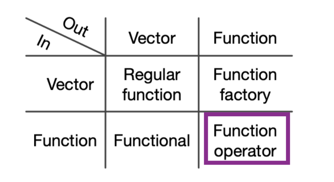

```{r setup, include=FALSE}
options(htmltools.dir.version = FALSE)

knitr::opts_chunk$set(message = FALSE, warning = FALSE, comment = "", cache = FALSE, echo = T, fig.retina = 3)

options(warnPartialMatchDollar = FALSE)

#devtools::install_github("gadenbuie/xaringanExtra")

library(knitr)
library(rlang)
library(xaringanExtra)
library(purrr)
library(memoise)
```

```{r xaringanExtra, echo=FALSE}
xaringanExtra::use_tile_view()

xaringanExtra::use_logo(
  image_url = "R-LadiesGlobal.png",
  width = "50px")

xaringanExtra::use_extra_styles(
  hover_code_line = TRUE,         #<<
  mute_unhighlighted_code = TRUE  #<<
)

xaringanExtra::use_webcam()

```


# Welcome!

- This book club is a joint effort between RLadies Nijmegen, Rotterdam,
's-Hertogenbosch (Den Bosch), Amsterdam and Utrecht 


- We meet every ~2 weeks to go through a chapter, presented by one of our community members (sign up to present! https://tinyurl.com/smsfdos)


- Use the HackMD markdown file (https://tinyurl.com/y6hy5pag) to introduce yourself, ask questions and see your breakout room assignment.


- We will run through a short presentation, then split into breakout rooms of 5-6 people to solve exercises together.


---

# Functional programming - Chp 9, 10 and 11  

This is the last in a 3-chapter series on functional programming-- a way of creating clean code that's easily re-used.

Function operators, as Hadley Wickham says, are like 'adverbs' -- they're closely related to function factories (last chapter) and can be applied to your code to make it more reusable.

```{r, out.width="80%", echo=F}

```

---

# Using existing function operators: safely

The chapter walks through two nice examples of existing function operators. 

The first uses purrr::safely -- it's a way of capturing errors that might occur only sporadically in complex code.

Let's first use a simple functional, map_dbl, with arguments x (a list of data) and sum (function).

Note that it throws an error.
```{r}
x <- list(
  c(0.512, 0.165, 0.717),
  c(0.064, 0.781, 0.427),
  c(0.890, 0.785, 0.495),
  c('NA')
)

# map_dbl(x, sum)
# Error in .Primitive("sum")(..., na.rm = na.rm) : 
#  invalid 'type' (character) of argument
```

---

# Using existing function operators: safely

If instead we wrap the whole thing in the function operator safely, we can catch the error and preserve the output that did work.

```{r}
out <- map(x, safely(sum))
str(out)
```
---

# Using existing function operators: safely

This can be prettied up with some more code, to re-sort the output...

```{r}
out <- transpose(map(x, safely(sum)))
str(out)
```
---

# Using existing function operators: safely

...and then id where errors occurred, and what the offending element of x is.
```{r}
ok <- map_lgl(out$error, is.null)

ok
x[!ok]
```

---

# Using existing function operators: memoise

Memoising (which is guess is pronounced 'memo-ising', but it looks like a French word 'mem-oise-ing') is a way of cacheing results for future computations.

This is great for speeding up code, but it uses a lot of memory.  So use with caution, not with abandon...

Memoising is recommended only for 'pure' functions-- those where the output depends on more than the input.

---

# Using existing function operators: memoise

The book points out Fibonacci numbers as a sort of sequence that could benefit from this. Note how the compute time increases...
```{r}
fib <- function(n) {
  if (n < 2) return(1)
  fib(n - 2) + fib(n - 1)
}
system.time(fib(23))

system.time(fib(24))

system.time(fib(30))
```

---

# Using existing function operators: memoise

This makes fib() a good candidate for memo-ising.  Look at that speed up!

```{r}
fib2 <- memoise::memoise(function(n) {
  if (n < 2) return(1)
  fib2(n - 2) + fib2(n - 1)
})

system.time(fib2(23))

system.time(fib2(24))

system.time(fib2(30))


```

---

# Creating a new function operator: downloading URLs

Here's a simple code block that downloads files from URLs. 

Works great for small number of inputs, but as the inputs increase, we will want to add a delay between each call (to avoid getting in trouble with the server) and to give ourselves a progress bar.

One could do this as a for loop-- that's certainly my first inclination! But the book shows us how to do it in a better way. 

```{r}
urls <- c(
  "adv-r" = "https://adv-r.hadley.nz", 
  "r4ds" = "http://r4ds.had.co.nz/"
)
path <- paste(tempdir(), names(urls), ".html")

walk2(urls, path, download.file, quiet = TRUE)

## to display where files are
tempdir()
```

---
# Creating a new function operator: downloading URLs

As a first step, let's add a bit of delay between calls. Pretty easy to do.

```{r}
delay_by <- function(f, amount) {
  force(f)
  force(amount)
  
  function(...) {
    Sys.sleep(amount)
    f(...)
  }
}

system.time(runif(100))

system.time(delay_by(runif, 0.1)(100))
```

---
# Creating a new function operator: downloading URLs

This just slots in to the walk2 function!

```{r}
walk2(urls, path, delay_by(download.file, 0.1), quiet = TRUE)

## check it:
system.time(walk2(urls, path, download.file, quiet = TRUE))

system.time(walk2(urls, path, delay_by(download.file, 0.1), quiet = TRUE))
```
---

# Creating a new function operator: downloading URLs

Making a progress bar is a little harder, but do-able with an internal counter, as we learned with function factories.

```{r}
dot_every <- function(f, n) {
  force(f)
  force(n)
  
  i <- 0
  function(...) {
    i <<- i + 1
    if (i %% n == 0) cat(".")
    f(...)
  }
}

walk2(
  urls, path, 
  dot_every(delay_by(download.file, 0.1), 1), 
  quiet = TRUE
)

```

---

# Creating a new function operator: downloading URLs

For bonus readability, clean it up further with the pipe:

```{r}
walk2(
  urls, path, 
  download.file %>% dot_every(1) %>% delay_by(0.1), 
  quiet = TRUE
)

```


---
# Exercises 11.2.3 

```{r, echo=FALSE}
xaringanExtra::use_panelset()
```

.panelset[
.panel[.panel-name[Question]

(1.) Base R provides a function operator in the form of Vectorize(). 

a. What does it do? 

b. When might you use it?

]

.panel[.panel-name[Answer a1]

In R a lot of functions are “vectorised”. Vectorised has two meanings. First, it means (broadly) that a function inputs a vector or vectors, and does something to each element. Secondly, it usually implies that these operations are implemented in a compiled language such as C or Fortran, so that the implementation is very fast.

However, despite what the function’s name implies, Vectorize() is not able to speed up the provided function. It rather changes the input format of the supplied arguments (vectorize.args), so that they can be iterated over.
]

.panel[.panel-name[Answer a2]

In essence, Vectorize() is mostly a wrapper for mapply(). Let’s take a look at an example from the documentation:

```{r}
vrep <- Vectorize(rep.int)
vrep

vrep(1:2, 3:4)
```
]

.panel[.panel-name[Answer b]
Vectorize() provides a convenient and concise notation to iterate over multiple arguments, but has some major drawbacks that mean you generally shouldn’t use it. See https://www.jimhester.com/post/2018-04-12-vectorize/ for more details.

(from https://advanced-r-solutions.rbind.io/)

]
]

---
# Exercises 11.2.3 

```{r, echo=FALSE}
xaringanExtra::use_panelset()
```

.panelset[
.panel[.panel-name[Question]

(2.) Read the source code for possibly(). How does it work?

]

.panel[.panel-name[Answer]

possibly() modifies functions to return a specified default value in case of an error (otherwise) and to suppress any error messages (quiet = TRUE).

While reading the source code, we notice that possibly() internally uses purrr::as_mapper(). This enables users to supply not only functions, but also formulas or atomics via the same syntax as known from other functions in the purrr package. Besides this, the new default value (otherwise) gets evaluated once to make it (almost) immutable.

The main functionality of possibly() is provided by base::tryCatch(). In this part the supplied function (.f) gets wrapped and the error and interrupt handling are specified.

(from https://advanced-r-solutions.rbind.io/)

]
]

---
# Exercises 11.2.3 

```{r, echo=FALSE}
xaringanExtra::use_panelset()
```

.panelset[
.panel[.panel-name[Question]

(3.) Read the source code for safely(). How does it work?

]

.panel[.panel-name[Answer]

safely() modifies functions to return a list, containing the elements “result” and “error”. It works in a similar fashion as possibly() and besides using as_mapper(), safely() also provides the otherwise and quiet argument. However, in order to provide the result and the error in a consistent way, the tryCatch() part of the implementation returns a list with the same structure in both cases. In the case of successful evaluation “error” equals to NULL and in case of an error “result” equals to otherwise, which is NULL by default.

(from https://advanced-r-solutions.rbind.io/)

]
]

---
# Exercises 11.3.1 

```{r, echo=FALSE}
xaringanExtra::use_panelset()
```

.panelset[
.panel[.panel-name[Question]

(1.) Weigh the pros and cons of download.file %>% dot_every(10) %>% delay_by(0.1) versus download.file %>% delay_by(0.1) %>% dot_every(10).

]

.panel[.panel-name[Answer]

Both commands will print a dot every 10 downloads and will take the same amout of time to run, so the differences may seem quite subtle.

In the first case, first the dot functionality is added to download.file. Then the delay is added to this already tweaked function. This implies, that the printing of the dot will also be delayed and the first dot will be printed as soon as the download for the 10th url starts.

In the latter case. The delay is added first and the dot-functionality is wrapped around it. This order will print the first dot immediately after the 9th download is finished, the the short delay occurs before the 10th download actually starts.

(from https://advanced-r-solutions.rbind.io/)

]
]

---
# Exercises 11.3.1 

```{r, echo=FALSE}
xaringanExtra::use_panelset()
```

.panelset[
.panel[.panel-name[Question]

(2.) Should you memoise file.download()? Why or why not?

]

.panel[.panel-name[Answer]

Memoising file.download() will only work if the files are immutable; i.e. if the file at a given url is always same. There’s no point memoising unless this is true. Even if this is true, however, memoise has to store the results in memory, and large files will potentially take up a lot of memory.

This implies that it’s probably not beneficial to memoise file.download() in most cases. The only exception is if you are downloading small files many times, and the file at a given url is guaranteed not to change.

(from https://advanced-r-solutions.rbind.io/)

]
]

---
# Exercises 11.3.1 

```{r, echo=FALSE}
xaringanExtra::use_panelset()
```

.panelset[
.panel[.panel-name[Question]

(3.) Create a function operator that reports whenever a file is created or deleted in the working directory, using dir() and setdiff(). What other global function effects might you want to track?

]

.panel[.panel-name[Answer pt 1]

```{r}
## create a function...
dir_compare <- function(old, new) {
  if (setequal(old, new)) {
    return()
  }

  added <- setdiff(new, old)
  removed <- setdiff(old, new)

  changes <- c(
    if (length(added) > 0) paste0(" * '", added, "' was added"),
    if (length(removed ) > 0) paste0(" * '", removed ,
                                     "' was removed")
  )
  message(paste(changes, collapse = "\n"))
}
```
]
.panel[.panel-name[Answer pt 2]
```{r}
##wrap it up in a function operator
track_dir <- function(f) {
  force(f)
  function(...) {
    dir_old <- dir()
    on.exit(dir_compare(dir_old, dir()), add = TRUE)

    f(...)
  }
}

## try it out:
file_create <- track_dir(file.create)
file_remove <- track_dir(file.remove)

file_create("delete_me")
file_remove("delete_me")
```
(from https://advanced-r-solutions.rbind.io/)

]
]

---
# Exercises 11.3.1 

```{r, echo=FALSE}
xaringanExtra::use_panelset()
```

.panelset[
.panel[.panel-name[Question]

(4.) Write a function operator that logs a timestamp and message to a file every time a function is run.
]

.panel[.panel-name[Answer pt 1]

```{r}
append_line <- function(path, ...) { 
  cat(..., "\n", sep = "", file = path, append = TRUE)
}

logger <- function(f, log_path) {
  force(f)
  force(log_path)

  append_line(log_path, "created at: ", as.character(Sys.time()))
  function(...) {
    append_line(log_path, "called at: ", as.character(Sys.time()))
    f(...)
  }
}
```
]
.panel[.panel-name[Answer pt 2]

```{r}
log_path <- tempfile()
mean2 <- logger(mean, log_path)
Sys.sleep(5)
mean2(1:4) 

Sys.sleep(1)
mean2(1:4)

readLines(log_path)
```
(from https://advanced-r-solutions.rbind.io/)

]
]

---
# Exercises 11.3.1 

```{r, echo=FALSE}
xaringanExtra::use_panelset()
```

.panelset[
.panel[.panel-name[Question]

(5.)  Modify delay_by() so that instead of delaying by a fixed amount of time, it ensures that a certain amount of time has elapsed since the function was last called. That is, if you called g <- delay_by(1, f); g(); Sys.sleep(2); g() there shouldn’t be an extra delay.

]

.panel[.panel-name[Answer]

```{r}
delay_atleast <- function(amount, f) {
  force(f)
  force(amount)

  # Store the last time the function was run
  last_time <- NULL

  # Return modified 'delay-aware' function
  function(...) {
    if (!is.null(last_time)) {
      wait <- (last_time - Sys.time()) + amount
      if (wait > 0) {
        Sys.sleep(wait)
      }
    }

    # Update the time after the function has finished
    on.exit(last_time <<- Sys.time()) 

    f(...)
  }
}
```

]
]

---
# And more:

- Solutions today all came from https://advanced-r-solutions.rbind.io/


- The R4DS book club repo also has a Q&A section.https://github.com/r4ds/bookclub-Advanced_R 


