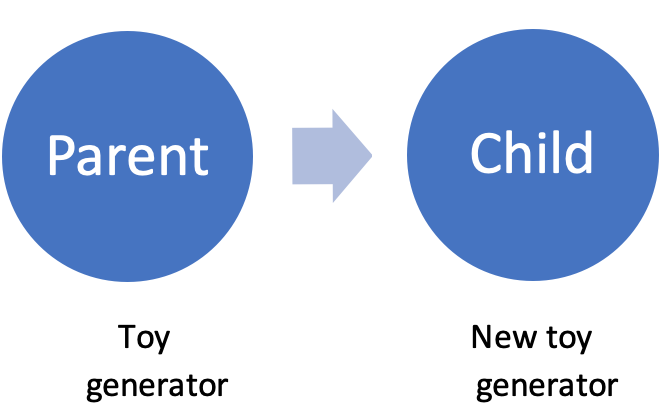

<style type="text/css">

body, td {
   font-size: 14px;
}
code.r{
  font-size: 16px;
}
pre {
  font-size: 12px
}
</style>

```{r setup, include=FALSE}
options(htmltools.dir.version = FALSE)
```

```{r xaringan-themer, include=FALSE}
library(xaringanthemer)
mono_accent(
 base_color = "#0F425CFF",
  black_color = "#0F425CFF",
  header_color = "#CC8214FF",
  text_bold_color = "#800000FF",
  table_row_even_background_color = "#FFFFFF",
  title_slide_text_color = "#CC8214FF",
  table_border_color = "#01665E",
  header_font_google = google_font("Chilanka"),
  text_font_google   = google_font("Lato", "400", "400i"))
```


## Welcome!

This is chapter 14 of the R Ladies Netherlands bookclub. 

We're reading Advanced R by Hadley Wickham.

https://adv-r.hadley.nz/

<br>
<br>
--

## The Plan
We will work through all of Advanced R together!

You can find all materials on Github:
https://github.com/rladiesnl/book_club

We are going to rotate through every 2 weeks, with an event hosted by each of the NL RLadies chapters involved.
---
# Object- Oriented Programming (OPP)

- Small number of well understood objects.
- God for building tools instead for analysing data.
- Functions behaviour depends on the object.

<br>
--

# There are 9 different packages for OPP

- S3: Simple system good to start. We saw it last chapter
- S4: Bioconductor. We will see it later
- ReferenceClasses (RC).
- R6: Kind of RC but simple way.

---

class: middle center bg-white


--
# Built on top of environments, it uses S3.

--
# Follows the OOP paradigm.

--
# R6 objects are mutable.

--


---

class: middle center bg-white

#Let's use R6 in a 

<br>
--


---
# Defining a class: "Toy class"
R6Class generates a class and the arguments
```{r echo=TRUE, results='hide',message=F, warning=F}
library(R6)
Toy <- R6Class(
  classname = "Toy",
  public = list(
                  #Attributes
                    name = NA,
                    phrase = NA,
                    
                  #Methods
                    initialize = function(name = NA, phrase = NA) {
                                          self$name <- name
                                          self$phrase <- phrase
                                          self$greet()},
                  
                    greet = function() {
                            cat(paste0("Hello, my name is ", self$name, ". ",self$phrase,".\n"))
                      }
                )
  
  )

```
---
# Creating a new object: object of "Toy class"

--
```{r echo=TRUE, eval=TRUE}
woody <- Toy$new(name = "Woody",
                 phrase = "There's a snake in my boot")
```
--

--
```{r echo=TRUE, eval=TRUE}
buzz <- Toy$new(name = "Buzz lightyear",
                 phrase = "To infinity…and beyond!")
```

---
# Reference semantics
```{r echo=TRUE, eval=TRUE}
woody$name <- "Sheriff Woody Pride" 
```
--
```{r echo=TRUE, eval=TRUE}
woody$name
```
--
Let’s create woody2 by assignment from woody:
```{r echo=TRUE, eval=TRUE}
woody2 <- woody

```
--
Check their memory locations
```{r echo=TRUE, eval=TRUE, message=F, warning=F}
c(pryr::address(woody), pryr::address(woody2))
```

---
What is the current name of woody?
```{r echo=TRUE, eval=TRUE}
woody$name
```
--
Let's modify the woody2's name
```{r echo=TRUE, eval=TRUE}
woody2$name<-"Woody, the second"
woody2$name
```
--
What is the current name of woody?
```{r echo=TRUE, eval=TRUE}
woody$name
```
---
# Cloning : now let's create woody 3 by cloning woody2

```{r echo=TRUE, eval=TRUE}
woody3 <- woody2$clone()
```
--
Check their memory locations
```{r echo=TRUE, eval=TRUE}
c(pryr::address(woody2),pryr::address(woody3))
```
--
Modify the woody3's name
```{r echo=TRUE, eval=TRUE}
woody3$name<-"Woody, the third"
woody3$name
```
--
What is the current name of woody2?
```{r echo=TRUE, eval=TRUE}
woody2$name
```
---
# Inheritance
The toy fabric wants to launch a new Toy version that sings!!
```{r echo=TRUE, eval=TRUE}
NewToy <- R6Class("NewToy",
                  inherit = Toy,
                  public = list(
                                #Add a new attribute
                                song = NA,
                                
                                #Modify method
                                initialize = function(name = NA, phrase = NA, song= NA) {
                                                      self$name <- name
                                                      self$phrase <- phrase
                                                      self$song <- song
                                                      self$greet()},
                                #Modify method
                                greet = function() {
                                         cat(paste0("Hello, my name is ", self$name, ". ",
                                                    self$phrase,
                                                    " and ", self$song, ".\n"))}
                    ))

```
---
```{r echo=TRUE, eval=TRUE}
NewToy
```
--



---
# Keeps the toy class features but with a new song!!

```{r echo=TRUE, eval=TRUE}
trex <- NewToy$new(name = "T-rex",
                 phrase = "I don't like confrontations!",
                 song = "You've got a friend in me!!!")

```
--

### For internal access to parents functions:
super$greed()

### For external access, create a super_ function:
super_ = function() 
          super
trex$super_()$greed()          
---
# Adding attributes or methods after creating a generator

The toy fabric wants to add a new attribute "additions" 
--
```{r echo=TRUE, eval=TRUE}
NewToy$set("public", "addition",0)
```  
--
and also a new function that updates the "additions" attribute
--
```{r echo=TRUE, eval=TRUE}
NewToy$set("public", "update_addition", function(x=0) {
  self$addition <- self$addition + x 
  invisible(self)
}) 
```  
!!!Side-effect R6 methods should always return self invisibly!!!.
This returns the “current” object and makes it possible to chain together multiple method calls.
--
```{r echo=FALSE, eval=TRUE}
NewToy
```
---

```{r echo=TRUE, eval=TRUE}
MrPotato <- NewToy$new(name = "Mr. Potato Head",
                 phrase = "Where's my ear? Who's seen my ear?",
                 song = "You've got a friend in me!!!")
```  
--
```{r echo=TRUE, eval=TRUE}
MrPotato$addition
```
--
```{r echo=TRUE, eval=TRUE,warning=TRUE,error=TRUE}
trex$addition
```
---
#Method chaining : like pipelines!!


--

Add two angry eyes
--
```{r echo=TRUE, eval=TRUE}
MrPotato$update_addition(2)$addition
```
Add one mustache, add 10 monkeys and remove 2 monkeys that ran away.
--
```{r echo=TRUE, eval=TRUE}
MrPotato$update_addition(1)$update_addition(10)$update_addition(-2)$addition
```

---
# Controlling access


---
### 1. Private: attributes and methods available only within the class

Date of fabrication and a default status.
```{r echo=TRUE, eval=TRUE}
NewToy$set("private", "date",Sys.time())
NewToy$set("private", "IsOn",FALSE)
```  
--
Methods can have access to the private attributes as:
```{r echo=TRUE, eval=TRUE}
NewToy$set("public", "TurnOn", function() {
  private$IsOn <-TRUE 
}) 
```    
--
```{r echo=TRUE, eval=TRUE}
Jessie <- NewToy$new(name="Jessie",phrase="Yee-haw!",song="Yee-haw!")
```  
--
```{r echo=TRUE, eval=TRUE}
Jessie$date
```
---
### 2. Active fields: provide access to any of the private attributes.
These are functions that behave like variables.
```{r echo=TRUE, eval=TRUE}
NewToy$set("active","date_fabric_access",function() {
      private$date})
```
--
Lets create a Hamm toy
```{r echo=TRUE, eval=TRUE}
Hamm <- NewToy$new(name="Hamm",phrase="I am also Evil Dr. Porkchop!",song="You've got a friend in me!!")
```  
--
Can we directly access the date?
--
```{r echo=TRUE, eval=TRUE}
Hamm$date 
```
--
But the toy fabric can do it..
--
```{r echo=TRUE, eval=TRUE}
Hamm$date_fabric_access   # not a_thing$date_fabric_access()
```
---
These functions can also be used to set values to private arguments but with additional checks.
```{r echo=TRUE, eval=TRUE}
# Create the private attribute
NewToy$set("private", "ReferenceNumber",NA) 
# Create a function to access the private reference value
NewToy$set("active","ReferenceNumber_access",function() {
  private$ReferenceNumber})
# Create a function to set the private reference value
NewToy$set("active", "set_ReferenceNumber_fabric", function(val=NA) {
  if (is.na(val)|!is.numeric(val)) {
    private$ReferenceNumber
  }else{
    private$ReferenceNumber <- val}})
```
--
```{r echo=TRUE, eval=TRUE}
Forky <- NewToy$new(name="Forky",phrase="I am not a toy,I am trash!",song="You've got a friend in me!!")
```  
--
```{r echo=TRUE, eval=TRUE}
Forky$set_ReferenceNumber_fabric="AF44646"
Forky$ReferenceNumber_access
```
--
```{r echo=TRUE, eval=TRUE}
Forky$set_ReferenceNumber_fabric=1234
Forky$ReferenceNumber_access
```
---
# Additional functions

### Print: overrides the print behaviour

```{r echo=TRUE, eval=FALSE}
 print = function(...) {
    cat("Toy: \n")
    cat("  Name: ", self$name, "\n", sep = "")
    cat("  Phrase:  ", self$age, "\n", sep = "")
    invisible(self)
  }
```

### Finalize :

```{r echo=TRUE, eval=FALSE}
 finalize = function() {
    message("Cleaning up ", self$name)
    unlink(self$name)
  }
```

---
# Exercises

## Q1: Create a bank account R6 class that stores a balance and allows you to deposit and withdraw money.

--

```{r echo=TRUE, eval=TRUE}
BankAccount <- R6Class(
  classname = "BankAccount",
  public = list( #Attributes
                 balance = 0,
                 #Methods
                 deposit = function(dep = 0) {
                           self$balance = self$balance + dep
                           invisible(self)},
                withdraw = function(draw) {
                           self$balance = self$balance - draw
                           invisible(self)}
  ))
```

--

```{r echo=TRUE, eval=TRUE}
my_account <- BankAccount$new()
my_account$balance
```

--

```{r echo=TRUE, eval=TRUE}
my_account$deposit(5)$withdraw(15)$balance
```

---
## Now create a subclass that throws an error if you go into overdraft.
--
```{r echo=TRUE, eval=TRUE}
BankAccountStrict <- R6Class(
  classname = "BankAccount",
  inherit = BankAccount,
  public = list(
    withdraw = function(draw = 0) {
      if (self$balance - draw < 0) {
        stop("Your `withdraw` must be smaller ",
             "than your `balance`.", call. = FALSE)
      }
      super$withdraw(draw = draw)
    }))
```
--
```{r echo=TRUE, eval=TRUE}
my_strict_account <- BankAccountStrict$new()
my_strict_account$balance
```
--
```{r echo=TRUE, eval=TRUE,warning=TRUE,error=TRUE}
my_strict_account$deposit(5)$withdraw(15)
```
--
```{r echo=TRUE, eval=TRUE}
my_strict_account$balance

```
---

## Q3 Why can not you model a bank account with an S3 class?

--

Because S3 classes obey the semantics of copy-on-modify. 
Therefore every time you make a transaction, you would get a new copy of the object.

---

## Q5: Create an R6 class that manages the current working directory.

--

```{r echo=TRUE, eval=TRUE}
WorkingDirectory <- R6Class(
  classname = "WorkingDirectory", 
  public = list(
    get = function() {
      getwd()
    },
    set = function(value) {
      setwd(value)
    }
  ))
```

--

```{r echo=TRUE, eval=TRUE}
my_wd<- WorkingDirectory$new()
my_wd$get()  
```

--

```{r echo=TRUE, eval=TRUE}
my_wd$set("/Users/johannamunoz/Documents/GitHub/")
my_wd$get() 
```

---

## Q6 Why can not you model the current working directory with an S3 class?

--

Because S3 classes are not suitable for modelling state that changes over time.
S3 methods should (almost) always return the same result when called with the same inputs.

---

## Q4: Can subclasses access private fields/methods from their parent?
--
```{r echo=TRUE, eval=TRUE}
ClassA <- R6Class(
  classname = "ClassA",
  private = list(
    attribute = "data",
    method = function() {
      "function output"
    }))

ClassB <- R6Class(
  classname = "ClassB",
  inherit = ClassA,
  public = list(
    test = function() {
      cat("Attribute:  ", super$attribute, "\n", sep = "")
      cat("Method: ", super$method(), "\n", sep = "")
    }
  )
)

ClassB$new()$test()
```
--

Subclasses can access private methods from their superclasses, but not private attributes.  

---
# References
Chang, Winston. 2019. R6: Encapsulated Classes with Reference Semantics. https://CRAN.R-project.org/package=R6.

R6 online documentation at https://r6.r-lib.org.

Great explanation:
https://r6.r-lib.org/articles/Introduction.html

Great examples: https://homerhanumat.github.io/r-notes/oo.html

Solutions to book exercises: https://advanced-r-solutions.rbind.io/r6.html


