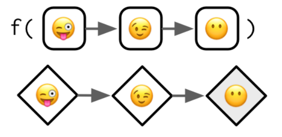
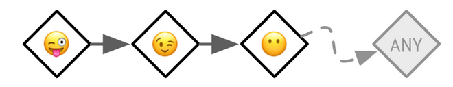
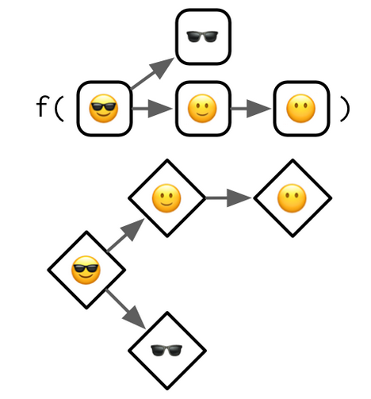
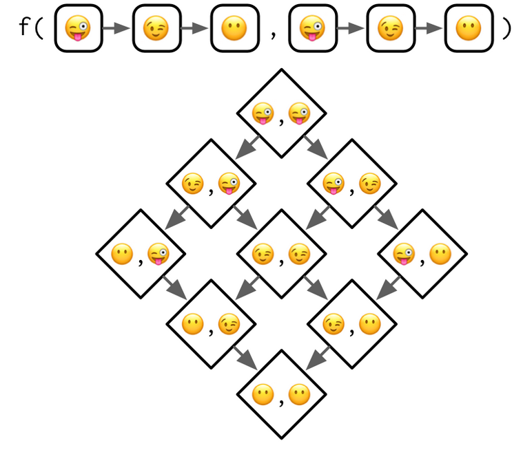
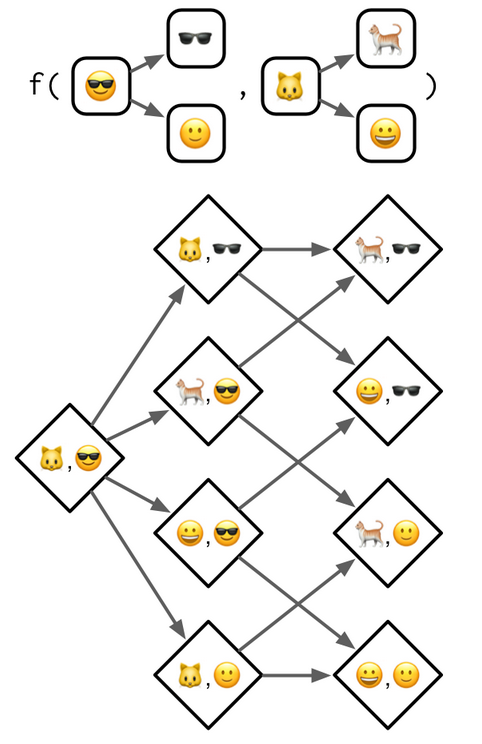

```{r setup, include=FALSE}
options(htmltools.dir.version = FALSE)

knitr::opts_chunk$set(message = FALSE, warning = FALSE, comment = "", cache = FALSE, echo = FALSE, fig.retina = 3)

options(warnPartialMatchDollar = FALSE)

# devtools::install_github("gadenbuie/xaringanExtra")

library(tidyverse)
library(knitr)
library(methods)
library(VGAM)

my_base_size <- 18

```

```{r xaringanExtra, echo=FALSE}

xaringanExtra::use_tile_view()

xaringanExtra::use_logo(
  image_url = "R-LadiesGlobal.png",
  width = "50px")

xaringanExtra::use_extra_styles(
  hover_code_line = TRUE,         #<<
  mute_unhighlighted_code = TRUE  #<<
)

xaringanExtra::use_webcam()

xaringanExtra::use_panelset()


```


# Welcome!

- This is joint effort between RLadies Nijmegen, Rotterdam,
's-Hertogenbosch (Den Bosch), Amsterdam and Utrecht 
--

- We meet every 2 weeks to go through a chapter 
--

- Use the HackMD to present yourself, ask questions and see your breakout room 
--

- There are still possibilities to present a chapter :) Sign up at https://rladiesnl.github.io/book_club/  
--

- https://advanced-r-solutions.rbind.io/ has some anwers and we could PR the ones missing  
--

- The R4DS book club repo has a Q&A section.https://github.com/r4ds/bookclub-Advanced_R 

--


```{r, out.height= "90%"}
knitr::include_graphics("tenor.gif")
```

---

# Thanks to:

- Hadley Wickham for writing [AdvancedR](https://adv-r.hadley.nz/)
- R Core Team (2020). R: A language and environment for statistical computing. R Foundation for Statistical Computing,
  Vienna, Austria. URL https://www.R-project.org/.  
- Yihui Xie (2020). xaringan: Presentation Ninja. R package version 0.16. https://CRAN.R-project.org/package=xaringan 
- Garrick Aden-Buie (2020). xaringanExtra: Extras And Extensions for Xaringan Slides. R package version 0.0.17.  https://github.com/gadenbuie/xaringanExtra  

- Alan Agresti for writing "An Introduction to categorical Data Analysis, 3rd edition"
- https://stackoverflow.com/questions/4713968/r-what-are-slots , for pointing out `slotNames()`

and all the authors of R packages used in this presentation 


---

class: center, inverse, middle
background-image: url("images/cool.png")

# Chp 15  
# S4

---

# Alligator Example  

(adapted from Agresti, p 161) 
```{r, fig.height = 4}
dAlligators <- read.table("Alligators.dat",
                          header = TRUE) %>%
  rename(length = x, food = y)

dAlligators %>%
  ggplot(aes(x = length, y = food)) +
           geom_jitter(width = 0, height = 0.05) +
  theme_minimal(base_size = my_base_size)

```

F = fish, I = Invertebrates, O = other  

--

Can you predict the type of food an aligator mainly eats, with help of its length? 

--

This is where multiniminal models come in:   

---

We build a multinominal model with VGAM::vglm: 

--


```{r, echo = TRUE}
fit <- vglm(food ~length,
                  family = "multinomial",
                  data = dAlligators)
```

--

With the help of this model, we can make predictions for all types of food, per length: 

```{r}

new_alli <-  seq(from = 1, to = 4, by = 0.01)
dNewAlli <- tibble(length = new_alli)

predictions <- predict(fit, newdata = dNewAlli, type = "response") 

dNewAlli_pred <- tibble(length = new_alli) %>%
  mutate(F = predictions[,1],
         I = predictions[,2],
         O= predictions[,3])

dNewAlli_pred_long <- dNewAlli_pred %>%
  pivot_longer(cols = -length,
               names_to = "food",
               values_to = "prediction")

```

```{r, fig.height=4}

ggplot() +
  geom_point(data = dNewAlli_pred_long,
       aes(x = length, y = prediction, color = food, group = food)) +
  geom_text(data = dNewAlli_pred_long %>% filter(length == 2.75),
            aes(x = length, y = prediction, label = food),
           nudge_y = .05,
          fontface = "bold") +
 theme_minimal(base_size = my_base_size) +
  ylim(c(0,1)) +
  guides(col=FALSE)
```

--

let us take a look at the object `fit`, with the function `str()`:  

```{r, echo = TRUE, eval = FALSE}
str(fit)
```


---

```{r}
str(fit)
```

---

# Slots

So object `fit` has a lot of slots.  

--

Slots are named parts of the object, they have a name and a class.  

--


Let us take a look at which slots this object `fit` has:  

--


```{r, echo=TRUE, eval = FALSE}
# this function is not in the book
slotNames(fit)
```

--

```{r, echo=FALSE}
# this function is not in the book
slotNames(fit)
```

---


Zoom in at the first slot:  

--

```{r, echo = TRUE, eval = FALSE}
# first the object, then a string with the slot name
slot(fit, "extra")
```

--

```{r, echo = FALSE}
# first the object, then a string with the slot name
slot(fit, "extra")
```


--

This looks like a list, and this is indeed the case:  

```{r}
class(slot(fit,"extra"))
```

--

.pull-left[

There is another way to get to a slot.  
Warning:  
It is advised to use this other way ONLY  
when you are working on the methods (when you are creating own S4 object classes).  
But it IS possible :).  
it is with use of the   
@

]

--

.pull_right[

```{r, echo = TRUE}
fit@extra
```

]


---

# Basics  

Let us define our own S4 class: 

```{r, echo = TRUE}
setClass("OnlineMeet", 
  slots = c(name = "character", 
            max_participants = "numeric",
            url = "character"))
```

--

Make a new object from this class:

```{r, echo = TRUE}
Chitchat <- new("OnlineMeet",
                name = "Chit chat",
                max_participants = 20,
                url = "to be determined")
```
--

.pull-left[ 

Take a look at the class with `is()`

```{r, echo = TRUE}
is(Chitchat)
```

]
--


.pull-right[

Check a slot:
```{r, echo=TRUE}
slot(Chitchat, "url")
```
]

---

## Refresher on Generics (generic functions) 

A *generic* is a user interface for functions with the same name that are defined on different classes.  

--

From the Help: `summary` is a generic function used to produce result summaries of the results of various model fitting functions. The function invokes particular methods which depend on the class of the first argument.  

--

```{r, echo = TRUE}
summary(factor(dAlligators$food)) # --> summary.factor
```
--

```{r, echo = TRUE}
summary(dAlligators) # --> summary.data.frame
```

---


## Accessor functions, for getting and setting 

Accessor functions are S4 generics:   

--

Like this for getting the max_participants of Chitchat:  

```{r, echo = TRUE, eval = FALSE}
max_participants(Chitchat)

```
--

```{r, error=TRUE}
max_participants(Chitchat)

```

--

So we have to define this function. 
We have to define two layers actually:  

*  Define the **generic** `max_participants`
--

*  Define the **class specific method** for this generic

--

First set the generic:  

```{r,echo = TRUE, eval = FALSE}
setGeneric("max_participants", function(x) standardGeneric("max_participants"))
```

--

```{r}
setGeneric("max_participants", function(x) standardGeneric("max_participants"))
```

--

The help on SetGeneric mentions:  
*The setGeneric function exists for its side effect: saving the generic function to allow methods to be specified later. It returns name.*

---

So what happens if we run this now:  

```{r,echo = TRUE, eval = FALSE}
max_participants(Chitchat)
```
--

```{r, error=TRUE}
max_participants(Chitchat)
```

--

The complete error message: 

`Error in (function (classes, fdef, mtable) : unable to find an inherited method for function ‘max_participants’ for signature ‘"OnlineMeet"’` 

--

This of course means we still have to define `max_participants.OnlineMeet`

--

```{r, echo = TRUE}
setMethod(f = "max_participants",
          signature = "OnlineMeet",
          definition = function(x) x@max_participants)
```

--

When we run this, no side effects

--

.pull-left[

Now run again:

```{r,echo = TRUE, eval = FALSE}
max_participants(Chitchat)
```


```{r, error=TRUE}
max_participants(Chitchat)
```

]

--

.pull-right[

```{r, out.height= "60%"}

```

]


---

## And now the setter  

```{r, echo = TRUE, eval = FALSE}
max_participants(Chitchat) <- 25
```
--

```{r, error = TRUE}
max_participants(Chitchat) <- 25
```

--

So define the generic for `max_participants<-`: 


```{r,echo = TRUE, eval = FALSE}
setGeneric("max_participants<-", function(x, value) standardGeneric("max_participants<-"))
```

--

```{r}
setGeneric("max_participants<-", function(x, value) standardGeneric("max_participants<-"))
```


Now try again:

```{r, echo = TRUE, eval = FALSE}
max_participants(Chitchat) <- 25
```
--

```{r, error = TRUE}
max_participants(Chitchat) <- 25
```

--

So we have to define the class specific method:  

---

So we have to define the class specific method:  

```{r, echo = TRUE}
setMethod(f = "max_participants<-",
          signature = "OnlineMeet",
          definition = function(x, value){
            x@max_participants <- value
            x
          })
```

--

Now try again:

```{r, echo = TRUE, eval = FALSE}
max_participants(Chitchat) <- 25
```
--

```{r, error = TRUE}
max_participants(Chitchat) <- 25
```

No feedback, so let us use the getter to check:  

```{r, echo =TRUE, eval = FALSE}
max_participants(Chitchat)
```

--

```{r}
max_participants(Chitchat)
```

--


.pull-left[

```{r, out.height= "60%"}

```

]

--


.pull-right[

`setMethod()` will automatically call `setGeneric()` if the first argument isn’t already a generic

]

---

# Classes  

To define an S4 class, call setClass with three mas o menos required arguments:  


```{r, echo = TRUE}
setClass("OnlineMeet",                      # a name, S4 convention UpperCamelCase
  slots = c(name = "character",            # named char vector for the slots  
            max_participants = "numeric",
            url = "character"),
  prototype = list(name = NA_character_,   # default values for the slots
                   max_participants = NA_real_,
                   url = NA_character_))
```

--

```{r, echo = TRUE, eval = FALSE}
another_meet <- new("OnlineMeet", name = "Another one")
str(another_meet)
```

--

```{r}
another_meet <- new("OnlineMeet", name = "Another one")
str(another_meet)
```

--

Not in the book: The **formal class** indicates it is an S4 object, as does

--

```{r, echo=TRUE}
isS4(another_meet)
```


---

## Inheritance  

Make use of slots and behaviours from other classes with `**contains**`:

--

```{r, echo = TRUE}
setClass("OnlineBookclub",                  # a name, S4 convention UpperCamelCase
  contains = "OnlineMeet",                  # the classes to inherit from
  slots = c(book = "character"),            # the extra slots
  prototype = list(book = NA_character_))   # default values for the extra slots
```

--

Make a new `OnlineBookclub` object: 

```{r, echo = TRUE}
bookclub_advancedR <- new("OnlineBookclub",
                          name = "Boookclub AdvancedR",
                          book = "Advanced R")

```

--

Have a look at the object:  

--

```{r}
str(bookclub_advancedR)
```

---

## Introspection  

Want to know from what classes n object inherits from? Use `is()`:

```{r, echo = TRUE, eval = FALSE}
is(bookclub_advancedR)
```

--

```{r}
is(bookclub_advancedR)
```

Want to have a `TRUE` of `FALSE` with regard to a certain inheritance?  
Use `(is)` with the second argument:  

--


```{r, echo = TRUE, eval = FALSE}
is(bookclub_advancedR, "OnlineMeet")
```

--

```{r}
is(bookclub_advancedR, "OnlineMeet")
```

---

## Redefinition  

Be careful with re-defining a class after already having made ojects from it.  

```{r, echo = TRUE, eval = FALSE}
setClass("A", slots = c(x = "numeric"))
a <- new("A", x = 10)
a
```

--

```{r}
setClass("A", slots = c(x = "numeric"))
a <- new("A", x = 10)
a
```

--

Now let us alter the definition of class `A`:  

--

```{r, echo = TRUE}
setClass("A", slots = c(a_different_slot = "numeric"))
```

--

And have a look at object `a` again:  

--

```{r, error = TRUE, echo = TRUE}
a
```

---

## Helper  

Making objects from classes? Only use `new()` if you are the developer.  
--

Make a helper function for the users:  

```{r, echo = TRUE}
OnlineMeet <- function(                           # same name as the class
  name, max_participants = NA_real_, url = NA_character_) {    
  max_participants <- as.double(max_participants) # optional tweaking of inputs
  
  new("OnlineMeet", name = name,                  # call to new()
      max_participants = max_participants,
      url = url)
}
```

--

The helper used by the user:    

--

```{r, echo = TRUE, eval = FALSE}
OnlineMeet("Talktalk")
```

--


```{r}
OnlineMeet("Talktalk")
```

---

## Validator  `setValidity()`

A function that checks inputs for (combined) correctness, to prevent invalid objects. 

```{r, echo = TRUE, eval = FALSE}
setValidity("<class>", function(object) {
  if (<something that is not ok>) {
    "an informative message explaining the problem"
  } else {
    TRUE
  }
})
```

--

Example:  

--

```{r, echo = TRUE}
setValidity("OnlineMeet", function(object) {
  if (object@max_participants <= 0) {
    "It is not a meet without participants, please let @max_participants > 0"
  } else {
    TRUE
  }
})
```

---

setValidity is called automatically when using the new() function,  
so also with the userfriendly wrapper: 

--

```{r, echo=TRUE, eval = FALSE}
OnlineMeet("Sound of Silence", max_participants =  -2)
```

--

```{r, error = TRUE}
OnlineMeet("Sound of Silence", max_participants =  -2)
```
--

`Error in validObject(.Object) : invalid class “OnlineMeet” object: It is not a meet without participants, please let @max_participants > 0`

--

But you do want to make an invalid object?  
Modify an existing one:  

--

```{r, echo = TRUE}
max_participants(another_meet) <- -100
another_meet
```

---

# Generics and methods (a bit more detailed then in "Basics")  

Convention is, use names for generics that are `lowerCamelCase`
Write the definition on 1 line, without { } used with writing morel ines in a function.  

--

```{r, echo = TRUE, eval = FALSE}
setGeneric("myGeneric", function(x) standardGeneric("myGeneric"))
```

--

## Signature  

`signature` is an argument to `setGeneric`. From the help:

```{r, echo = TRUE, eval = FALSE}
setGeneric(name, def= , group=list(), valueClass=character(),
           where= , package= , signature= , useAsDefault= ,
           genericFunction= , simpleInheritanceOnly = )
```

--

With signature you can control the arguments to be used for method dispatch.  
It can be useful to exclude some arguments from the method. If not specified, it will use **all**, except for ... .

---

## Methods  

Besides the generic, you also need methods for function specific behaviour. Make them with `setMethod()`:  

```{r, echo = TRUE, eval = FALSE}
setMethod("myGeneric", "<class name> ", function(x) {
  # method implementation
})
```

--

Want to see al the methods for a class? 
--

```{r, echo = TRUE}
methods(class = "OnlineMeet")
```
--

Want to see al the methods for a generic?  
--


```{r, echo = TRUE}
methods("show")
```

---

## Make a `show` method for the generic `show`  

First look at the arguments that are needed: 

```{r, echo = TRUE, eval = FALSE}
args(getGeneric("show"))
```

--

```{r}
args(getGeneric("show"))
```

--

So we need an **object** for our new method `show`

--

```{r, echo = TRUE}
setMethod("show", "OnlineMeet", function(object) {
  cat(is(object)[[1]], "\n",
      "  The name of this OnLineMeet: ", object@name, "\n",
      "  there is room for :  ", object@max_participants, "\n",
      "  and will be hosted at:   ", object@url,
      sep = "" ) })
```

--

Use it on our object Chitchat:

--

```{r, eval = FALSE, echo = TRUE}
show(Chitchat)
```

--


```{r}
show(Chitchat)
```


---

## Accessors - `validObject()` in setter

Always include `validObject()` in the setter method:

```{r, echo = TRUE}
setMethod(f = "max_participants<-",
          signature = "OnlineMeet",
          definition = function(x, value){
            x@max_participants <- value
            validObject(x)    #<-- new line     
            x
          })
```

--

Try it:

```{r, echo = TRUE, eval = FALSE}
max_participants(Chitchat) <- -200
```

--

```{r, error = TRUE}
max_participants(Chitchat) <- -200
```

--

`ValidObject()` can also be used on its own:  

--

```{r, echo = TRUE, error = TRUE}
validObject(another_meet)
```

---

# Method dispatch  

## Single class, single parent

```{r}

```

--


Top part: a generic with one argument, that has a class hierarchy that is three levels deep.  

--

Bottom: method graph, displays all the possible methods that could be defined. Methods that do exist, have a grey background  

--

To find the method that actually gets called when calling with 😜:  

Start in the box with the 😜,  
when box is white, follow the arrow to next box 😉 ,a more general class,  
continu moving in the graph until encounter with grey box, here for 😶 class. Eureka!  

--

If no method is found, method dispatch has failed and an error is thrown.   
So alway define methods for the terminal nodes.  

---

## Pseudo-classes  


```{r}

```

--

Not a real class, but you can define methods for it.  
It is kind of greatest grandest parents. 
The distance to it, is larger then the distance between other classes.  

---

## Multiple inheritance  


```{r}

```

Which method to pick now?  

--

The closest one: with the least steps needed.  

--

But what if it is a tie?  

--

This is called **ambiguous**,   

--

and best resolved by defining a method for a class that is closer to the class you called from.


--

Meanwhile, try to monimize the number of defined methods

---

## Multiple dispatch  


More then one object as args in the generic:  
--

```{r}

```

--

Again, choose the **closest** one, and in case of **ambiguity**, try to resolve it.  


---

## Multiple dispatch and multiple inheritance  

--


```{r}

```

--

Ask yourself if it is really needed to have this complexity.  
maybe you are better of with a simpler design.  

---

# S4 and S3  

In a class definition, you can use S3/S4 objects in slots and in contains.  

--

But you have to translate the S3 class to a formally defined class with `setOldClass()`.  

--

```{r,echo = TRUE, eval = FALSE}
# already provided with base R
setOldClass("data.frame")
setOldClass(c("ordered", "factor"))
```

--

It is regarded better to combine it with the class definition: 

--

```{r, echo = TRUE, eval = FALSE}
setClass("factor",
  contains = "integer",
  slots = c(
    levels = "character"
  ),
  prototype = structure(   # Why structure and not list?
    integer(),
    levels = character()
  )
)
setOldClass("factor", S4Class = "factor")
```

--

If building on S3 from packages, ask package maintainer to add this to package.

---

If an S4 object inherits from an S3 class or a base type,  
it will have a special virtual slot called .Data.  
This contains the underlying base type or S3 object:  

--

```{r,echo = TRUE}
RangedNumeric <- setClass(
  "RangedNumeric",
  contains = "numeric",
  slots = c(min = "numeric", max = "numeric"),
  prototype = structure(numeric(), min = NA_real_, max = NA_real_)
)

rn <- RangedNumeric(1:10, min = 1, max = 10)
```

--

```{r, echo = TRUE, eval = FALSE}
slotNames(rn)
```

--

```{r}
slotNames(rn)
```

--

```{r, echo = TRUE}
rn@.Data
```


---


It is possible to convert an existing S3 generic to an S4 generic. 
 
--


```{r, echo = TRUE}
methods("mean")  # see all the methods of mean
```

--

.pull-left[

```{r, echo = TRUE}
sloop::ftype(mean)
```


```{r, echo = TRUE}
sloop::ftype(mean.Date)
```


]

--

.pull-right[

```{r, echo = TRUE}
sloop::is_s3_generic("mean")
```

]

--

Now convert `mean` to S4 generic: 
--
```{r, echo=TRUE}
setGeneric("mean")
```


---

See the difference:  

--

```{r, echo = TRUE}
methods("mean")
```

--

.pull-left[

```{r, echo = TRUE}
sloop::ftype(mean)
```


```{r, echo = TRUE}
sloop::ftype(mean.Date)

```

]

--

.pull-right[

```{r, echo = TRUE}
sloop::is_s3_generic("mean")
```

]

---


class: center, inverse, middle
background-image: url("images/cool.png")

# Chp 16  
# Trade-offs

---

# S4 vs. S3  

S3 is simpler and more widely used.  

--
S4 requires more  upfront planning --> pays of at larger projects.  

--
S4 is more formal --> less training required for new contributors

--

S4 widely used at Bioconductor (https://www.bioconductor.org/).  

--
Bioconductor now has 1903 packages (CRAN 16390).  
--

At one time 609 out of 1211 packages defined S4 classes.  
(https://bioconductor.org/packages/release/bioc/vignettes/S4Vectors/inst/doc/S4QuickOverview.pdf)

--

S4 is also a good fit for complex systems of interrelated objects (minimise code duplication through careful implementation of methods).  
--
Example: Matrix package (Bates and Maechler 2018).   
--

Its purpose: efficiently store and compute with many different types of sparse and dense matrices.  
--

Content version 1.2.18: 102 classes, 21 generic functions, and 1998 methods.  

---

# R6 vs. S3  

## Name spacing

S3:  Generic functions are global: all packages share the same namespace.  

*  use the same verbs for working with different types of objects
*  strong naming conventions
*  it forces you to think more deeply about naming
*  S3 generics must have the same core arguments, which means they generally have non-specific names like x or .data  
--

R6:  Encapsulated methods are local: methods are bound to a single object.  

*  R6 methods can vary more widely and use more specific and evocative argument names

---

## Threading state  

--

```{r}

```

---

## Threading state 

S3 copies on modify  
R6 modifies on demand  

--

## Method chaining in R6  

```{r, eval = FALSE, echo = TRUE}
s <- Stack$new()
s$
  push(10)$
  push(20)$
  pop()
```

--

Commonly used in other programming languages, like Python and JavaScript.  
--

Is made possible with one convention: any R6 method that is primarily called for its side-effects (usually modifying the object) should return invisible(self).  
--

The primary advantage of method chaining:   useful autocomplete.  
--

The primary disadvantage: only the creator of the class can add new methods (and there’s no way to use multiple dispatch).


---

# Exercises  

.panelset[
.panel[.panel-name[Exercise 15.2.1.1]

`lubridate::period()` returns an S4 class.  


What slots does it have? 


What class is each slot?  


What accessors does it provide?

]

.panel[.panel-name[Solution]

```{r, echo = TRUE}
BoookclubPeriod <- lubridate::period(c(1, 30), c("hour", "minute"))

str(BoookclubPeriod)
```

All the time parts getters work as expected. To get the Data part is different:

```{r, echo = TRUE}
lubridate::minute(BoookclubPeriod)
getDataPart(BoookclubPeriod)  
```


]
]


---

# Exercises  

.panelset[
.panel[.panel-name[Exercise 15.4.5.1]

Add age() accessors for the Person class.


]

.panel[.panel-name[Solution]

```{r, echo = TRUE, eval = FALSE}

# first add a generic for the getter
setGeneric("age", function(x) standardGeneric("age"))

# and then make a method for the class Person
setMethod("age", "Person", function(x) x@age)

# and repeat for the setter
setGeneric("age<-", function(x, value) standardGeneric("age<-"))

setMethod("age<-", "Person", function(x, value) {
  x@age <- value
  validObject(x)
  x
})
```

]
]


---

background-image: url("solong.png")