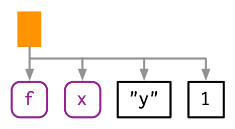

<style>
  .col2 {
    columns: 2 200px;         /* number of columns and width in pixels*/
    -webkit-columns: 2 200px; /* chrome, safari */
    -moz-columns: 2 200px;    /* firefox */
  }
</style>

```{r setup, include=FALSE}

options(htmltools.dir.version = FALSE)

knitr::opts_chunk$set(message = FALSE, warning = FALSE, comment = "", cache = FALSE, echo = T, fig.retina = 3, fig.align = 'center')

if(!require(xaringanExtra)){
  devtools::install_github("gadenbuie/xaringanExtra", 
                           dependencies = TRUE, upgrade = "never")
}

if(!require(rlang)){
  install.packages("rlang")
}

if(!require(lobstr)){
  install.packages("lobstr")
}

```

```{r xaringanExtra, echo=FALSE}
xaringanExtra::use_tile_view()

xaringanExtra::use_logo(
  image_url = "R-LadiesGlobal.png",
  width = "50px")

xaringanExtra::use_extra_styles(
  hover_code_line = TRUE,         #<<
  mute_unhighlighted_code = TRUE  #<<
)

xaringanExtra::use_webcam()

xaringanExtra::use_panelset()

```
# Welcome!

&nbsp;

- This book club is a joint effort between RLadies Nijmegen, Rotterdam,
's-Hertogenbosch (Den Bosch), Amsterdam and Utrecht  
&nbsp;

- We meet every 2 weeks to go through a chapter  
&nbsp;

- Use the [HackMD](https://hackmd.io/RTwJmhNKRPas0JUrHjAGqw) to present yourself, ask questions and see your breakout room  
&nbsp;

- There are still possibilities to present a chapter :) Sign up at [rladiesnl.github.io/book_club](https://rladiesnl.github.io/book_club/)


---
class: middle, inverse

# .fancy[Let's start!]

```{r echo = FALSE}


```

---
# Metaprogramming
  
&nbsp;

- Code is data  
&nbsp;
  
&nbsp;
  
- Code is a tree  
&nbsp;
  
&nbsp;
  
- Code can generate code  

---

# Expressions

> "Expressions, an object that captures the structure of the code without evaluating it (i.e. running it)"

--

Here is some code:

```{r error=TRUE}
y <- x * 10
```
--

Here is some expression: 
```{r}
z <- rlang::expr(y <- x * 10)
z
```

--

Here is how to evaluate an expression:

```{r}
x <- 4
eval(z)
y
```
---
# Objectives  
  
&nbsp;
  
- Understand expressions!  
&nbsp;
 
- Learn how to inspect and modify captured code  
&nbsp;
  
- Eventually be able to generate code with code  
  
  
--
  
&nbsp;

We will use two packages for that:

```{r, eval=FALSE}

library(rlang)

library("lobstr")

```

---
# Abstract Syntax Trees (AST)

- Useful to inspect and modify expressions
    + Let's us see the "hierarchy" of the code

--


```{r}
lobstr::ast(f(x, "y", 1))
```
<div class="col2">

```{r, echo = FALSE}

```

```{r, echo = FALSE, out.width="80%"}

```
</div>

---
# Understanding the tree

- Leaves: symbols or constants (comments not included)
- Branches: call objects (function calls)
    + The first child (f) is the function that gets called
    + The second and subsequent children (x, "y", and 1) are the arguments to that function

.panelset[
.panel[.panel-name[lobstr AST]

```{r}
lobstr::ast(f(g(1, 2), h(3, 4, i())))
```
]

.panel[.panel-name[Graphical AST]

```{r, echo = FALSE, out.width="50%"}
knitr::include_graphics("fig2.png")
```
]
] 

---
# Infix calls

These two are the same:
```{r, eval=FALSE}
y <- x * 10
`<-`(y, `*`(x, 10))
```
--

```{r}
expr(`<-`(y, `*`(x, 10)))
```
--

.panelset[
.panel[.panel-name[lobstr AST]

```{r}
lobstr::ast(y <- x * 10)
```

]

.panel[.panel-name[Graphical AST]

```{r, echo = FALSE, out.width="30%"}
knitr::include_graphics("fig3.png")
```

]
]

---
# Expressions  
  
- Constant  
- Symbol  
- Call  
  
```{r, echo = FALSE}
expression_df <- data.frame("Expression type" = c("Constant", "Symbol", "Call"), 
                            "Content" = c("NULL or length-1 vector", "Name of an object", "Captured function call"),
                            "Creation" = c("self-quoting", "expr() or sym()", "expr()"),
                            "Testing function" = c("rlang::is_syntactic_literal()", "is.symbol()", "is.call()"))

knitr::kable(expression_df, align = "c", col.names = gsub("[.]", " ", names(expression_df)))
```

---
# Expressions - Examples

**Constant**
```{r}
x <- "y"
x
rlang::is_syntactic_literal(2L)
```

**Symbol**
```{r}
#Symbol
x <- sym("y")
x
is.symbol(x)
```

---
**Call**

```{r}
lobstr::ast(read.table("important.csv", row.names = FALSE))
x <- expr(read.table("important.csv", row.names = FALSE))
x
is.call(x)
```
---
# Subsetting calls  

- Calls behave like lists
    + First element is the function being called
    + The other elements are the arguments
    
```{r}

x[[1]]
is.symbol(x[[1]])
as.list(x[-1])
x$row.names ### Note this only works if the arguments are named in your call!!  
```

---

- What if you forgot to name your arguments? How to find in which position it is inside the call?
--
ANSWER: You don't need to!
  
```{r}
x <- rlang::call_standardise(x)
as.list(x[-1])
x$file
```

--
  
- Still, `rlang::call_standardise()` will have problems with the `...` arguments  
--
  
&nbsp;

&nbsp;

- Do you start seeing applications?  

---
# Example from a friend

Note of caution! There are other ways (probably better) to do this! But my friend had reasons to want to do it this way:  

```{r}
# VERY simplified version of her data:

df_1 <- matrix(1:12, ncol = 3)
df_2 <- matrix(letters, ncol = 2)
df_3 <- matrix(20:200, ncol = 10)

all_my_matrices <- c("df_1", "df_2", "df_3")

for(mx in all_my_matrices){
  
  # Whatever changes she wanted to make
  
  write.csv(eval(as.name(mx)), paste0(mx, ".csv"))
  
}

```

---
# Function position

- First position in the call object 
```{r}

lobstr::ast(foo())

```

- What about functions that do not exist in the current environment?

.panelset[
.panel[.panel-name[lobstr AST]

```{r}
lobstr::ast(pkg::foo(1)) ## Function belongs to a different package

lobstr::ast(obj$foo(1)) ## Function is a method of an R6 object

```

]

.panel[.panel-name[Graphical AST]

```{r, echo = FALSE, out.width="50%"}

```

]
]


---
# Constructing calls

- Create a call from its components using `rlang::call2()`

```{r}
# Note the use of "" or expr() when calling existing objects
call2("mean", x = expr(x), na.rm = TRUE) 

call2(expr(base::mean), x = expr(x), na.rm = TRUE)
```

--

&nbsp;

&nbsp;

- And now... do you see the application?

---
# Parsing

Some definitions:
> **Parsing:** process by which a computer language takes a string and constructs an expression  
> **Grammar:** rules that govern parsing  

--

Important to consider:  
- *Operator precedence:* In the expression `1 + 2 * 3`, which function would be evaluated first? (`+` or `*`)  
    + What about the function `!`? 

--
  
- *Associativity:* In the expression `1 + 2 + 3`, which function would be evaluated first? (the first `+` or the second `+`)  
    + And when you have two `^` like in `2^3^2`?  
    + And when you have two `<-` like in `x <- y <- 3`?  
    
---
# Parsing

- Sometimes you have code stored in a string, and you want to parse it yourself 
    + `rlang::parse_expr()`  or  (`rlang::parse_exprs()`  when you have multiple expressions separated by "\n" or ";")

```{r}
x1 <- "y <- x + 10"
x1
is.call(x1)

x2 <- rlang::parse_expr(x1)
x2
is.call(x2)
```

---
# Deparsing

- Given an expression, you want the string that would generate it

```{r}
z <- expr(y <- x + 10)
expr_text(z)
```
  
  
--
  
&nbsp;

&nbsp;

- Do you see the use of parsing/deparsing?

---
# An example from Twitter 

```{r, echo = FALSE, out.width="78%", fig.cap="Taken from a post from Garrick Aden-Buie (@grrrck, 18-10-2020)"}

```

---
# A real life example (mine)

**My problem:**   I have many S4 objects that need to be merged using a special function from a package (`pkg::merge_S4()`). However, every time I have a different number of S4_objects and the `pkg::merge_S4()` does not accept lists or strings! :( 
```{r}

# Make a list of my S4 objects (I actually use functions to create those S4 objects and then get the list of their names with `ls()`)
my_list_of_S4s <- c("my_S4_1", "your_S4_2", "your_S4_3")

#Build my call
my_call_in_text <- paste("pkg::merge_S4(", paste(my_list_of_S4s, collapse = ","), ")")
my_call_in_text

my_call_ready <- parse_expr(my_call_in_text)
my_call_ready

# Actually call it (not run now because my fake function does not exist)
#eval(my_call_ready)

```

---
# Disclaimers  

&nbsp;

- I did not cover the last two sections of the chapter 18!  
&nbsp;

&nbsp;
  
- There are other ways to do metaprogramming (follow chapter 19 about quasiquotation!) or other ways to solve the examples I put here
&nbsp;

&nbsp;
  
- Although I hope you learnt something today, this is by no means a deep dive into metaprogramming... this is just the beginning!

---
class: middle, inverse

# .fancy[Time for exercises!]

```{r echo = FALSE, out.width="90%"}


```

---
# Exercise 1 

.panelset[
.panel[.panel-name[Question]

Reconstruct the function corresponding to these AST

```{r, echo = FALSE}
lobstr::ast(f(g(h())))
ast(1 + 2 + 3)
ast((x + y) * z)
```
]

.panel[.panel-name[Answer]

```{r}
lobstr::ast(f(g(h())))
```

```{r}
ast(1 + 2 + 3)
```

```{r}
ast((x + y) * z)
```
]
]

---
# Exercise 2

.panelset[
.panel[.panel-name[Question]

What’s happening with the ASTs below? (Hint: carefully read ?"^")

```{r}
ast(x ** y)
ast(1 -> x)
```

]

.panel[.panel-name[Answer]

1. ** is translated by R’s parser into ^. 

2. The expression is flipped when R parses it:

```{r}
str(expr(a -> b))
```

]
]

---
# Exercise 3

.panelset[
.panel[.panel-name[Question]

What does the call tree of an if statement with multiple else if conditions look like? Why?

]

.panel[.panel-name[Answer_curly]

In the "else" part of the AST just another expression is being evaluated, which happens to be an if statement.

```{r}
ast(
  if (FALSE) {
    1
  } else if (TRUE) {
    2
  }
)
```
]

.panel[.panel-name[Answer_no_curly]

Without curly brackets:
```{r}
ast(
  if (FALSE) 1 
  else if (TRUE) 2 
)
```
]
]

---
# Exercise 4 

.panelset[
.panel[.panel-name[Question]

What happens when you subset a call object to remove the first element, e.g. `expr(read.csv("foo.csv", header = TRUE))[-1]` Why?

]

.panel[.panel-name[Answer]

When the first element of a call object is removed, the second element moves to the first position, which is the function to call. Therefore, we get `"foo.csv"(header = TRUE)`

]
]

---
# Exercise 5

.panelset[
.panel[.panel-name[Question]

What happens when you subset a call object to remove the first element? e.g. `expr(read.csv("foo.csv", header = TRUE))[-1]`. Why?

]
.panel[.panel-name[Answer]

When the first element of a call object is removed, the second element moves to the first position, which is the function to call. Therefore, we get `"foo.csv"(header = TRUE)`

]
]

---
# Exercise 6

.panelset[
.panel[.panel-name[Question]

Why does this code not make sense?

```{r}

x <- expr(foo(x = 1))
names(x) <- c("x", "")

```

]
.panel[.panel-name[Answer]

We know that the first element of a call is always the function that gets called.

Let’s see what happens when we run the code:

```{r}
x <- rlang::expr(foo(x = 1))
x

names(x) <- c("x", "")
x

names(x) <- c("", "x")
x

```


So giving the first element a name just adds metadata that R ignores.

]
]

---
# Exercise 7

.panelset[
.panel[.panel-name[Question]

Construct the expression `if(x > 1) "a" else "b"` using multiple calls to `call2()`. How does the structure code reflect the structure of the AST?

]
.panel[.panel-name[Answer]

Similar to the prefix version we get

```{r}
call2("if", call2(">", sym("x"), 1), "a", "b")
```

When we read the AST from left to right, we get the same structure: Function to evaluate, expression, which is another function and is evaluated first, and two constants which will be evaluated next.

```{r}
ast(`if`(x > 1, "a", "b"))
```

]
]

---
class: middle, inverse

# .fancy[We are done!]

```{r, echo=FALSE, out.width="130%"}


```

---
class: middle, inverse

# .fancy[Thank you!]
```{r echo = FALSE, out.width="40%"}

```

## Do you want to present next?
### Or just follow the book club until the end!!
