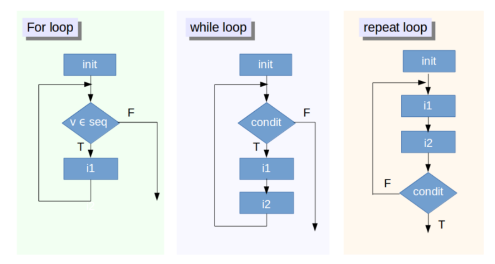

```{r xaringan-themer, include=FALSE}

library(xaringanthemer)
library(pagedown)

mono_accent(
  header_font_google = google_font("Lora", "500"),
  text_font_google   = google_font("Lato", "400", "400i")
)
```

### Welcome R-Ladies Netherlands Book-Club!

.left[
- R-Ladies is a global organization to promote gender diversity in the R 
community via meetups, mentorship in a safe and inclusive environment. 
]

<br>
--

.left[
- **R-Ladies Netherlands Book-Club** is a collaborative effort between 
RLadies-NL chapters in Nijmengen, Rotterdam, Den Bosch, Amsterdam, Utrecht.
]

--

- We meet every **2 weeks** to go through one of the chapters of Hadley Wickam _Advanced R_, and run through  exercises to put the concepts into practice.  

---

### Today's Session!

<br>

- Starts with a  30-45 min presentation

- Breakout session - we **split** into breakout rooms to practice exercises.

--
<br>
<br>

- Please use the **HackMD** (shared in email and in chat) to present yourself, ask overarching questions, and to find your break out room.

- Use the **chat** to participate in the discussion during the presentation and your breakout session. 

- The Bookclub github repository has also been made available. 

--
<br>
<br>

- Any questions?

---

### Resources

- Solutions to the exercises from _Advanced R_ can be found in the (Advanced R Solutions Book)[https://advanced-r-solutions.rbind.io/index.html]  

- The R4DS book club repo has a Q&A section  section.https://github.com/r4ds/bookclub-Advanced_R

--
<br>

- We are always looking for new speakers! If you are interested, please sign up to present a chapter at https://rladiesnl.github.io/book_club/

.center[

]

---

name: title
class: center, middle

## Control Flows ##

---

## Outline

The outline for today is: 

1. What do we mean by control flows?
<br>  
--

2. Choices

  - if()
  - ifelse()
  - switch()
<br>  
--

3. Loops

  - for loops
  - break
  - next
  - `repeat()` and `while()`
<br>  
--
<br>  

4. Breakout Sessions


---

### Let's get to it! 

.center[

]

---

### 1. What do we mean by control flows

--

- Controls flows are a **fundamental concept** in computer programming  

--

- Allow us to express the **order** and the **way** a command of execution components are put together to perform a specific task.

--

- Control flow commands allow your R code to choose between different options, in other words, **make decisions**. 

--

- Control flows are used to: 
  * Execute a action using **certain conditions** --> ifelse()
  * Execute an action **repetitively** --> for loop
  * **manipulate a sequential flow** --> breaking code


---

### 1. What do we mean by control flows

<br>
<br>

- There are 3 main groups of control flows in programming: 
  1. Sequencing ( do this, THEN this, THEN this ...)
  2. Selection/choices (if, unless)
  3. Iteration (for, while, repeat...)

<br>


---

### Examples of control flows: 

--
<br>  

1. Convert a list of daily recorded air temperatures  from Fahrenheit to Celcius.
<br>

--
<br>
2. Produce a function but skips all input values that aren't numeric.
<br>

--
<br>
3. Prevent an iterative function from performing if the input value is `NA`.

--
<br>  
<br>  

+ **YOUR TURN!** Can you share an example of a instance when you recently used  a control flow command? (_Use chat_) 


---

### 1. What do we mean by control flows

<br>

- In Hadley Wickham's book chapter, we look at **choices**  and **loops** 

<br>
.center[

]

---

### 2. Choices 

- Choices are expressed using **If statement**

<br>

--

`if (condition){true_action}`

- if the condition is true, than the action is evaluated

--

<br>

`if (condition){true_action} else {false_action}`

- Using `else`, an optional other  action can be evaluated if the condition is `FALSE.`

--

<br>
<br>

- in R, we use `{}`  to compound the action statements.

---

### School Grade Example

Example given using a function to translate to letter grades:

```{r}
grade <- function(x) {
  
  if (x > 90) {
    
    "A"
    
  } else if (x > 80) {
    
    "B"
  } else if (x > 50) {
    
    "C"
  } else {
    
    "F"
  }
}

```

If student gets above 90, received A.
If student gets above 80, recieves B.
If student gets above 50, receives C.
If the grade does not meet this above conditions, student receives F.

--

*Note the order of conditional statements here* 

---
### `Else` is R-Optional 

Choice statements don't always need an `else`. `if` invisibly returns `NULL` if the condition is `FALSE`.

```{r eval = F}

x = 3

if(x == 3){
  
  print('yes!')
  
  }

```
--

```{r echo = F}

x = 3

if(x == 3){
  
  print('yes!')
  
  }

```

--

```{r }

x = 3

if(x == 1){
  
  print('yes!')
  
  }

```

---

### `Else` is R-Optional 

Longer example 

```{r }

## greetings is a function that concatenates words depending on condition:

greetings <- function(name, birthday = FALSE) {
  
  paste0("Hi ", name,
         if (birthday) " and HAPPY BIRTHDAY")

}
```

--

```{r echo = T}

greetings("Maria", FALSE)

```

--

```{r echo = T}

greetings("Jaime", TRUE)

```

---

### 2.1 Invalid Inputs

The `condition` inputed in the `if()` function must be evaluated to a `TRUE` or `FALSE`. Here are some examples of inputs that are invalid: 

```{r echo=T, error=T}

if ("x") 1

```

--

```{r, error=T}

if (logical()) 1
```

--

```{r, error=T}
if (NA) 1
```

---

### 2.1 Invalid Inputs

Another invalid input are logical vectors of **length greater than 1.**

```{r error=TRUE}

vector <-c("a","b","c")

if(vector == "a") print("yes!!")

```

--

- notice that `'yes!!'` result still appears, because it is the first element in the vector
<br>

--

```{r echo = TRUE}

vector <-c("a","b","c")

if(vector == "b") print("yes!!")

```

--

- doesn't work this time! But all we get a is a **warning**, not an **error**.

--

...This brings us to our next section...

---


### 2.2 Vectorised if 

- There are three other functions presented that can be used as alternative to `if()`: 

  * `ifelse()`

  * `dplyr::case_when()`

  * `switch()`

---

### 2.2 `ifelse()` 

- `ifelse()` function can handle vectors longer than 1

- This function **tests** the condition:

    `ifelse(condition, action if TRUE, action if FALSE)`
    
--

<br>

- Taking my vector used above. With ifelse(), our output will be a list:


```{r echo = TRUE}

vector <-c("a","b","c")

ifelse(vector == "b","yes!!","no!")

```


---

### 2.2 `ifelse()`

- Again, taking from the examples from the chapter: 

```{r echo = TRUE}

x <- 1:10 

# print xxx when the remainder of x divided by 5 is 0.  

ifelse(x %% 5 == 0, "XXX", x)

```

<br>

--

```{r echo = TRUE}

# print 'even' when  when the remainder of x divided by 2 is 0, print 'odd'.

ifelse(x %% 2 == 0,
       "even",
       "odd")

```

---

### 2.2 `case_when()`

- Another example presented is the `dplyr::case_when()` which allows for **multiple conditions.** 

In this example, we have 3 different conditions to apply: 

```{r echo=TRUE}

dplyr::case_when(
  x %% 35 == 0 ~ "fizz buzz",
  x %% 5 == 0 ~ "fizz",
  x %% 7 == 0 ~ "buzz",
  is.na(x) ~ "???",
  TRUE ~ as.character(x)
)

```

---

### 2.3 `switch()` statement

- `switch()` is closely related to the `if()` statement. 

--

- Typically, we use `if()` in the following way:

```{r echo = T}

x_option <- function(x){
  
  if (x == "a") {
    "option 1"
  } else if (x == "b") {
    "option 2" 
  } else {
    stop("Invalid `x` value")
  }
}  

```

--

- `switch()` is more succinct: 

```{r echo = T}

x_option <- function(x) {
  switch(x,
    a = "option 1",
    b = "option 2",
    stop("Invalid `x` value")
  )
}

```

---

### 2.3 `switch()` statement

- Indeed, each condition is alreadylisted. No need for `else`.

--

- **Note! The last component of the `switch()` should throw an error.** 

--

<br>

- If multiple inputs have same output, `switch()` can be written the following way:  

```{r }

legs <- function(x) {
  switch(x,
    cow = ,
    dog = 4,        ## cat and dog are given the condition "= 4"
    human = ,
    chicken = 2,     ## human and chicken are given the condition "= 2"
    plant = 0,
    stop("Unknown input")
  )
}

```

It is recommended that the inputs for `switch()` function is recommended to be of type character. 

---


name: title
class: top, middle

## Breather ##


---

### 3.0 Loops 

- For loops are used to perform an action **iteratively** over indices in a vector.

- In R, the format is the following: 

  `for (item in vector) action_to_perform`

- So, for example, action is to **print** every item in a vector.

```{r eval = F}

for (i in 1:3) {
  
  print(i)
  
  }

```

--

```{r echo = F}

for (i in 1:3) {
  
  print(i)
  
  }

```

---

### 3.0 Loops 


```{r eval = F}

vector <- 1:4

for (j in vector){
  
 print(
   
   j/(j+1)
   
   )
}


```

--

```{r echo = F}

vector <- 1:4

for (j in vector){
  
 print(
   
   j/(j+1)
   
   )
}


```

---

### 3.0 Loops 

- `if else` in for loop:

```{r }

vector <- 1:8

for (k in vector){
  
if(k < 4){
  print(
    paste0(k," is less than 4!")
  )
  
} else{
  print(
    paste0(k," is greater than 4!"))

      }
  }


```

---

### Overwriting variables with for loops

- A for loop will overwrite a previously defined variable.

```{r echo = TRUE}

i <- 100

for (i in 1:3) {
  print(i)
  }

```

--

```{r }

print(i)

```

---

### Terminating For Loops **early**


2 ways to terminate a for loop early: 

  - `next` to exit the current interation 
  
  - `break` to exit the entire `for` loop
  
--

```{r echo = T}

for (i in 1:10) {
  
  if (i < 3) 
    next
  
    print(i)
  
  if (i >= 5)
    break

}

```

--

* Keep in mind the order of the actions here

---

### 3.1 Common pitfalls

--

1) Preallocate the output container for faster process. Here are two examples:

--

```{r }
means <- c(1, 50, 20)
out <- vector("list", length(means))

for (i in 1:length(means)) {
  out[[i]] <- rnorm(10,means[[i]])

  }
out
```

---

### 3.1 Common pitfalls

1) Preallocate the output container for faster process. Here are two examples:

--

```{r }
vector <- c("a", "b", "c")
output_list <-list()

for (i in 1:length(vector)){
  
  output_list[i] <- paste(vector[i],vector[i+1])
}
output_list

```

---

### 3.1 Common pitfalls

2) Using 1:length(x) gives error when x has a length of 0.

```{r echo = TRUE, error = TRUE}

means <- c()

out <- vector("list", length(means))

for (i in 1:length(means)) {
  
  out[i] <- rnorm(10, means[i])

  }

```

--

```{r echo = TRUE}

1:length(means)

```

---

### 3.1 Common pitfalls

2) Using 1:length(x) gives error when x has a lenghth of 0.

<br>

- use **`seq_along()`** instead of **`1:length()`**: 

```{r }

means <- c()

out <- vector("list", length(means))

for (i in seq_along(means)) {
  out[[i]] <- rnorm(10, means[[i]])
}

out

```

---

### 3.1 Common Loopholes

3) Problems arise when iterating over S3 Vectors (Categorical Data, Dates, Time, etc)

```{r echo = TRUE, eval=F}

dates <- as.Date(c("2020-01-01", "2010-01-01"))

for (i in dates) {
  print(i)
}

## For loop strips the attributes of s3 vectors

```

```{r echo = F, eval = T}

dates <- as.Date(c("2020-01-01", "2010-01-01"))

for (i in dates) {
  print(i)
}

## for loop strips attributes of s3 vectors

```

--

```{r echo = TRUE}

dates <- as.Date(c("2020-01-01", "2010-02-01"))

for (i in seq_along(dates)) {
  
  print(dates[[i]])

  }


```

---

### 3.2 Related tools

For loops are helpful when you know exactly what you want to iterate over.

However, if you do not know what you want to iterate over, there are two other loops we can use.

--

* **`while(){}`** performs action when condition is `TRUE`

```{r ech=TRUE}

i <- 5

while (i < 6) {

  print(i)

  i = i+1

  }

```

---

### 3.2 Related tools

For loops are helpful when you know exactly what you want to iterate over.

However, if you do not know what you want to iterate over, there are two other loops we can use.


* `repeat(){}` performs action forever - repeat is an infinite loop! A `break` is therefore necessary here. 

```{r echo = T}

i <- 0

repeat{
  
  print(i)
  
  if(i > 4)
    
    break
  
  i <- i+1
  
} 

```


---

name: title
class: middle

```{r, out.width="100%", fig.align="center", echo= F}



```

---

### 3.3 Nested for loops

Some instances, you will need to put a loop inside a loop! 

This is the case if you want to iterate through rows and columns.

--

```{r echo= T}

matrix <- matrix(c(1,2,3, 3,4,5, 1,2,3),
                 nrow=3, ncol=3, byrow = T)
matrix

```

--

```{r echo=TRUE}

for(i in 1:dim(matrix)[1]) {
  for(j in 1:dim(matrix)[2]) {
    
    matrix[i,j] = matrix[i,j] * 2
  }
}

matrix

```

---

name: title
class: center, middle

## Thank you ##
 
Questions? Break for 10 min, and meet in your breakout rooms

_Check hackMD for your breakout room assignment_

---

name: title
class: center, middle

## Exercises - break out sessions in progress ##

---

### 1. Choices

**Q1: What type of vector does each if the following calls to ifelse() return?**

--

```{r eval=F}

ifelse(TRUE, 1, "no")

```

--

```{r echo = F}

ifelse(TRUE, 1, "no")
```

--

```{r eval=F}

ifelse(FALSE, 1, "no")

```

--

```{r echo = F}

ifelse(FALSE, 1, "no")

```

--

```{r eval=F}

ifelse(NA, 1, "no")

```

--

```{r echo = F}

ifelse(NA, 1, "no")

```

--

<br><br>

* Recall that the arguments of ifelse() are `test` , `yes` and `no`.

* The function returns the entry for **yes when test is TRUE**, **no when test is FALSE**, or **NA when test is NA**.

---

**Q2: Why do the following code chunks work?**

--

```{r }

a <- 1:10

if (length(a)) "not empty" else "empty"

```

```{r }

a <- numeric()

if (length(a)) "not empty" else "empty"

```

--
<br>

* Typically, if() expects a logical condition that it can test
  - `if(a>4)`, `if(5 %in% a)`.  

* But `if()` also accepts a numeric vector where 0 is treated as false and all other numbers are treated as TRUE.

That is why the condition is:  
- TRUE  - i.e. `not empty` -   when length>0.
- FALSE - i.e. `empty`    when length=0.

---

### 2. Loops

**Q3: Given that x is `length(x) = 0`, why does this code succeed with errors or warnings?**

```{r }

x <- numeric()
out <- vector("list", length(x))

for (i in 1:length(x)) {
  out[i] <- x[i] ^ 2
}

out

```

--

Let's break down the code behavior: 

--

+ Because the vector is of length 0, the loop goes from `i = 1` to `i = 0`. This works still, because `:` counts down, as well as up. 

--

* During first iteration, `x[1]` will generate `NA` because it is out of the bounds of x. And, `NA^2` leads to `NA`. 
* `x[0]` returns `numeric(0)` which does not change when squared. Here, we assign a 0-length vector to a 0-length subset `out[0]` which works but changes nothing. 

--

In sum, each step is a valid  operation. 

---

### 2. Loops

**Q4: What does the following code tell you about when the vector being iterated over is evaluated? Specifically, we are interested in `xs` **

```{r }

xs <- c(1, 2, 3)

for (x in xs) {

    xs <- c(xs, x * 2)
    print(xs)

    }
xs

```

--

* `x` takes the values of `xs` which gets redefined in this loop.  

* Based on the output, x is evaluated once at the beginning on the initial xs, not after each iteration.

---
### 2. Loops

**Q5: What does the following code tell you about how/when the index is updated?**

```{r } 

for (i in 1:3) {
  
   i <- i * 2
   print(i)

}

```

<br><br>

--

The index is updated in the beginning of each iteration. 


---


### 2. Loops - Your turn 

**Q6: Repeat statements: without running this code, what is the expected output? **

```{r eval = FALSE}
x <- 3

repeat {
  
  print(x)

  x = x+1
}

```

--

**What is missing?**

--

conditional statement (`if()`) to `break` loop

--

```{r eval = FALSE}

repeat {
  
  print(x)

  x = x+1

  if(x>15){
    break
  }
    
}

```

---

**Q7: Write a while statement**

```{r eval = F}

while("this condition is true"){
  
  print("do a thing")
  
} 

```


---


**Q8: Free flow with  control flows!**

<br>

If you still have time, write a code chunk that uses all the following control flow commands to 
produce an specific output:


* `if(){}` or `ifelse()`
* `switch()` or `case_when()`
* `for(){}`  
* `while(){}`


And ... try using different data types! For example,

* Dates 
* String
* Categorical data


