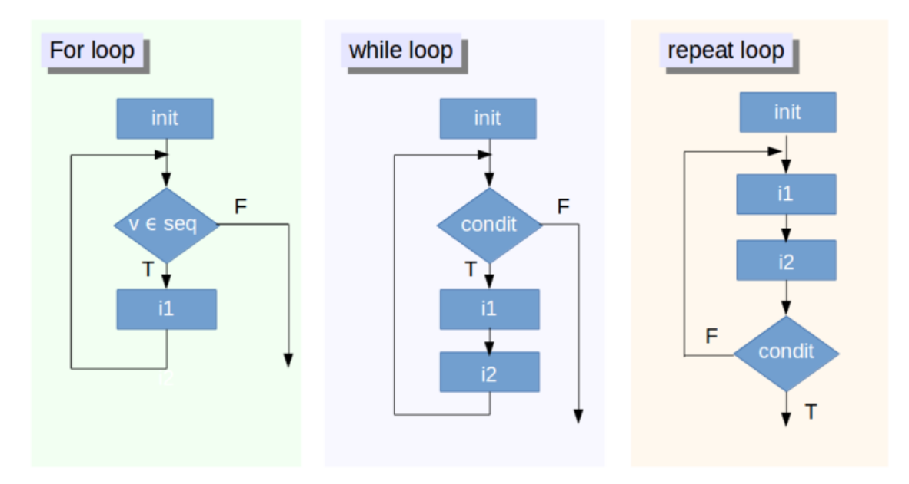

```{r xaringan-themer, include=FALSE}

library(xaringanthemer)
mono_accent(
  header_font_google = google_font("Lora", "500"),
  text_font_google   = google_font("Lato", "400", "400i")
)
```

### Welcome R-Ladies Netherlands Book-Club!


- This is collaborative effort between RLadies Nijmengen, Rotterdam, Den Bosch, Amsterdam, Utrecht.

--

- We meet every 2 weeks to go through one of the chapters and run through related exercises. 

--

- Please use the HackMD (shared) to present yourself, ask questions and see your breakout room

--

- We split in breakout rooms after the presentation, and we return to the main jitsi link after 30 min.

--
<br><br>

--
- Solutions to the exercises from _Advanced R_ can be found in the (Advanced R Solutions Book)[https://advanced-r-solutions.rbind.io/index.html]  

- The R4DS book club repo has a Q&A section.https://github.com/r4ds/bookclub-Advanced_R

<br>
- We are always looking for new speakers! If you are interested, please sign up to present a chapter at https://rladiesnl.github.io/book_club/

---

name: title
class: center, middle

## Control Flows ##

---

## Outline

Note that this is a relatively short chapter, but we will go through many examples and exercises. 

The outline for today is: 

  - What do we mean by control flows?

--

  - Choices

--

  - Loops

--

  - Applications 

--

- Breakout Sessions


---
### Let's get to it! 

<center>

</center>


---

### 1. What do we mean by control flows

--

- Controls flows are a fundamental concept in computer programming  

--

- Allow us to express the **order** and the **way** a command of execution components are put together to perform a specific task.

--

- There are 3 main groups of control flows in programming: 
  1. Sequencing ( do this, THEN this, THEN this ...)
  2. Selection/choices (if, unless)
  3. Iteration (for, while, repeat...)

---
### 1. What do we mean by control flows

-- 

- Control flow commands allow your R code to choose between different options, in other words, **make decisions**. 

--

- Control flows are used to execute a action using **certain conditions**, or execute an action **repetitively**, or **manipulate a sequential flow** by breaking code under certain circumstances.

---
### 1. What do we mean by control flows

Examples of control flows: 


+ Anyone want to volunteer and share an example, or  recent experience where you produced some R code with control flows. Why did you need to use control flow command? 

--

1. Perform an mathematical algorithm on a series on numbers - say convert a the temperatures recorded at every hour of the day from F to C.

2. Produce a function but skip all values that aren't numeric. 

3. Prevent an iterative function from performing if the input value is `NA`.


---
## 1. What do we mean by control flows

- In Hadley Wickam's book, this chapter looks at **choices**  and **loops** 

<br><br>


---

---

## 2. Choices 

- Choices are expressed using **If statement**

--

`if (condition){true_action}`

- if the condition is true, than the action is evaluated

--
<br>

`if (condition){true_action} else {false_action}`

- Using `else`, an optional other  action can be evaluated if the condition is `FALSE.`

--
<br>
- in R, we use `{}`  to compound the action statements.

---
### 2. Choices

Example given using a function to translate to letter grades:

```{r}
grade <- function(x) {
  
  if (x > 90) {
    
    "A"
    
  } else if (x > 80) {
    
    "B"
  } else if (x > 50) {
    
    "C"
  } else {
    
    "F"
  }
}

```

If student gets a above 90, received A. 
If student gets above 80, recieves B.
If student gets above 50, receives C.
If the grade does not meet this above conditions student receives F.
--
*Note the order of conditional statements: we cannot have the first conditional statement after the second one, in the way that it is written.* 

---
### 2.0 Choices 

Using `else`: 

Choice statements don't always need an `else`. `if` invisibly returns NULL if the conditional is False.

```{r }

## code chunk to add
```

- The output here will be blank

and many functions drop NULL so a function that has this condition within works perfectly

```{r}

greet <- function(name, birthday = FALSE) {
  paste0(
    "Hi ", name,
    if (birthday) " and HAPPY BIRTHDAY"
  )
}
greet("Maria", FALSE)
#> [1] "Hi Maria"
greet("Jaime", TRUE)
#> [1] "Hi Jaime and HAPPY BIRTHDAY"

```


---

### 2.1 Invalid Inputs

The `condition` inputed in the if() function must be evaluated to a `TRUE` or `FALSE`. 

```{r echo=FALSE, error=T}

if ("x") 1

```

```{r, error=T}

if (logical()) 1
```

```{r, error=T}
if (NA) 1
```

---
### 2.1 Invalid Inputs

Another invalid input are logical vectors of length greater than 1.

```{r error=TRUE}

vector <-c("a","b","c")

if(vector == "a") print("yes!!")

```
--
- notice that `'yes!!'` result still appears, because it is the first element in the vector
--
```{r echo = TRUE}

vector <-c("a","b","c")

if(vector == "b") print("yes!!")

```
--
- doesn't work this time! But all we get a is a **warning**, not an **error**.

---

### 2.1 Invalid Inputs


In R version 3.5.0 or greater, you can turn this warning into an error by setting an **environment variable**:

```{r echo = F, error=TRUE}

Sys.Setenv("_R_CHECK_LENGTH_1_CONDITION_" = "TRUE")

```

```{r echo=TRUE, error=TRUE}

if(vector == "b") print("YES!!!")

```

Indeed, now we get a **Error**! 

This brings us to our next section...

---

### 2.2 Vectorised if 

- Alterinatively, the `ifelse()` function can handle vectors
- This function tests a condition:
  `ifelse("condition", "action if TRUE", "Action if FALSE")`

- Taking my vector used above, our output will be a list:

```{r echo = TRUE}

vector <-c("a","b","c")

ifelse(vector == "b","yes!!","no!")

```

---

### 2.2 Vectorised if 

- Again, taking from the examples from the chapter: 

```{r echo = TRUE}

x <- 1:10 

# print xxx when the remainder of x divided by 5 is 0.  

ifelse(x %% 5 == 0, "XXX", x)

```

--

```{r echo = TRUE}

# print 'even' when  when the remainder of x divided by 2 is 0, print 'odd'.

ifelse(x %% 2 == 0,
       "even",
       "odd")

```

---
### 2.2 Vectorised if 


- Another example presented is the `dplyr::case_when()` which allows for **multiple conditions.** 

In this example, we have 3 different conditions to apply: 

```{r echo=TRUE}

dplyr::case_when(
  x %% 35 == 0 ~ "fizz buzz",
  x %% 5 == 0 ~ "fizz",
  x %% 7 == 0 ~ "buzz",
  is.na(x) ~ "???",
  TRUE ~ as.character(x)
)

```

---
### 2.3 switch() statement

- `switch()` is closely related to the `if()` statement. 

- While with `if()` you have to write it out 
--
```{r echo = T}

x_option <- function(x){
  
  if (x == "a") {
    "option 1"
  } else if (x == "b") {
    "option 2" 
  } else if (x == "c") {
    "option 3"
  } else {
    stop("Invalid `x` value")
  }

}  

```
--

- `switch()` is more succinct: 

```{r echo = T}

x_option <- function(x) {
  switch(x,
    a = "option 1",
    b = "option 2",
    c = "option 3"
    # stop("Invalid `x` value")
  )
}

```

Indeed, each condition is listed and no need for `else`.
--

- **Note! The last component of the `switch()` should throw an error.** 

---
### 2.3 switch() statement

- With `switch()`, if multiple inputs have the same output, `switch()` can be written the following way:  

```{r }

legs <- function(x) {
  switch(x,
    cow = ,
    horse = ,
    dog = 4,
    human = ,
    chicken = 2,
    plant = 0,
    stop("Unknown input")
  )
}

```


Note that it is recommended that the inputs for `switch()` function is recommended to be of type character. 

---

### 3.0 Loops 

For loops are used to perform an action **iteratively** over indices in a vector.

In R, the format is the following: 

`for (item in vector) action_to_perform`


- So, for example, action is to **print** every item in a vector.

```{r }

for (i in 1:3) {
  
  print(i)
  
  }

## note - i can be named anything 

```

---
### 3.0 Loops 

- Another more developed example:

```{r }

vector <- 1:8

for (j in vector){
  
 print(
   ((j+(j+1))/(j))
 )
  
  }


```
--
- And with an `if else` statement:

```{r }

vector <- 1:8

for (k in vector){
  
if(k < 4){
  print(
    paste0(k," is less than 4!")
  )
  
} else{
  print(
    paste0(k," is greater than 4!"))
    }

  }


```


---

### 3.0 loops

- Additionally, for loop will overwrite variable if previously defined. 

```{r echo = TRUE}

i <- 100

for (i in 1:3) {
  print(i)
  }

```
--
```{r }

print(i)

```

---
###3.0 For Loops:

Terminating For Loops early: 

2 ways to terminate a for loop early: 
- `next` to exit the current interation 
- `break` to exit the entire `for` loop

```{r echo = T}

for (i in 1:10) {
  
  if (i < 3) 
    next
  
    print(i)
  
  if (i >= 5)
    break

}

```

---

### 3.1 Common pitfalls

1. Preallocate the output container for faster process:
--
```{r }
means <- c(1, 50, 20)
out <- vector("list", length(means))

for (i in 1:length(means)) {
  out[[i]] <- rnorm(10,means[[i]])

  }

```

--
```{r }
vector <- c("a", "b", "c")
output_list <-list()

for (i in 1:length(vector)){
  
  output_list[i] <- paste(vector[i],vector[i+1])
}
output_list

```

---
### 3.1 Common pitfalls

2.  Using 1:length(x) gives error when x has a lenghth of 0.

```{r echo = TRUE, error = TRUE}

means <- c()

out <- vector("list", length(means))

for (i in 1:length(means)) {
  out[[i]] <- rnorm(10, means[[i]])
}

```

```{r echo = TRUE}

1:length(means)

```
--
Alternatively, in the for loop, use `seq_along()` instead of `1:length()`: 

```{r }

means <- c()

out <- vector("list", length(means))

for (i in seq_along(means)) {
  out[[i]] <- rnorm(10, means[[i]])
}

out

```

---
### 3.1 Common Loopholes

3. Problems arise when iterating over S3 Vectors (Categorical Data, Dates, Time, etc)

```{r echo = TRUE}

dates <- as.Date(c("2020-01-01", "2010-01-01"))

for (i in dates) {
  print(i)
}

## for loop strips attributes of s3 vectors

```

```{r echo = TRUE}

dates <- as.Date(c("2020-01-01", "2010-02-01"))

for (i in seq_along(dates)) {
  print(dates[[i]])
}


```

---
### 3.2 Related tools

For loops are helpful when you know exactly what you want to iterate over. However, if you do not know what you want to iterate over, there are two other loops we can use.

1. `while(){}` performs action when condition is true

```{r ech=TRUE}

i <- 8

while (i < 6) {

  print(i)

  i = i+1

  }

```

2. `repeat(){}` performs action forever - repeat is an infinite loop! A `break` is therefore necessary here. 

```{r echo = T}

i <- 0

repeat{
  
  print(i)
  
  if(i >8)
    
    break
  
  i <- i+1
  
} 

```

---

```{r, out.width="60%"}

```

---

### 3.3 Nested for loops

Some instances, you will need to put a loop inside a loop! 
This is the case to iterate through rows and columns.

This is possible if the data structure you are iterating over is a matrix:

```{r echo= T}

matrix <- matrix(c(1,2,3, 3,4,5, 1,2,3),
                 nrow=3, ncol=3, byrow = T)
matrix

```

```{r echo=TRUE}

for(i in 1:dim(matrix)[1]) {
  for(j in 1:dim(matrix)[2]) {
    
    matrix[i,j] = matrix[i,j] * 2
  }
}

matrix

```

---

name: title
class: center, middle

## Exercises - break out sessions ##

---

### 1. Choices

**Q1: What type of vector does each if the following calls to ifelse() return?**

--
```{r eval=F}

ifelse(TRUE, 1, "no")

```

--

```{r echo = F}

ifelse(T,1, "no")
```
--
```{r eval=F}

ifelse(FALSE, 1, "no")

```
--
```{r echo = F}

ifelse(FALSE, 1, "no")

```
--
```{r eval=F}

ifelse(NA, 1, "no")

```
--

```{r echo = F}

ifelse(NA, 1, "no")

```
--
<br><br>

The arguments of ifelse() are `test`, `yes` and `no`.

The function returns the entry for yes when test is TRUE, no when test is FALSE or NA when test is NA.

---

**Q2: Why do the following code chunks work?**

```{r }

a <- 1:10

if (length(a)) "not empty" else "empty"

```

```{r }

a <- numeric()

if (length(a)) "not empty" else "empty"

```

--
if() expects a logical condition that it can test such as `if(a>4)` or `if(5 %in% a)`.  

But if() also accepts a numeric vector where 0 is treated as false and all other numbers are treated as TRUE.

That is why the condition is:  
+ TRUE i.e. `not empty` when length>0.
+ FALSE i.e. `empty` when length=0.

---
### 2. Loops

**Q3: Why does this code succeed with errors or warnings?**

```{r }
x <- numeric()
out <- vector("list", length(x))

for (i in 1:length(x)) {
  out[i] <- x[i] ^ 2
 }
out

```
--
Let's break down the code behavior: 

--
+ Because the vector is of length 0, the loop goes from `i = 1` to `i = 0`. This works still, because : counts down, as well as up. 

--

+ During first iteration, `x[1]` will generate NA because it is out of the bounds of x. And, `NA^2` leads to `NA`. 

+ `x[0]` returns `numeric(0)` which does not change when squared. Here, we assign a 0-length vector to a 0-length subset `out[0]` which works but changes nothing. 

--

In sum, each step is a valid  operation. 

---
### 2. Loops

**Q4: What does the following code tell you about when the vector being iterated over is evaluated? Specifically, we are interested in `xs` **

```{r }

xs <- c(1, 2, 3)

for (x in xs) {

    xs <- c(xs, x * 2)
    print(xs)

    }
xs

```

--
<br><br>

x takes the values of `xs` which gets redefined in this loop.  
Based on the output, x is evaluated once at the beginning on the initial xs, not after each iteration.

---
### 2. Loops

**Q5: What does the following code tell you about when the index is updated? **

```{r} 

for (i in 1:3) {
  
   i <- i * 2
   print(i)

   }
```
<br><br>
--

The index is udated in the beginning of each iteration. 
