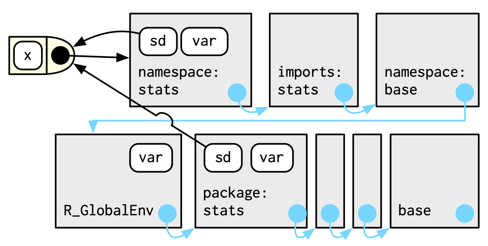

<style>
  .col2 {
    columns: 2 200px;         /* number of columns and width in pixels*/
    -webkit-columns: 2 200px; /* chrome, safari */
    -moz-columns: 2 200px;    /* firefox */
  }
</style>

```{r setup, include=FALSE}
options(htmltools.dir.version = FALSE)
knitr::opts_chunk$set(message = FALSE, warning = FALSE, comment = "", cache = FALSE, echo = FALSE, fig.retina = 3)
library(knitr)
```

# Welcome!

- This is a joint effort between RLadies Nijmegen, Rotterdam,
's-Hertogenbosch (Den Bosch), Amsterdam and Utrecht 

--

- We meet every 2 weeks to go through a chapter 

--

- Use the [HackMD](https://hackmd.io/fzgOycJzSgGcelsdk5ZKNw?both) to present yourself, ask questions and see your breakout room 

--

- We split in breakout rooms after the presentation, and we return to the main jitsi link after 20 min  

--

- There are still possibilities to present a chapter :) Sign up at [rladiesnl.github.io/book_club](https://rladiesnl.github.io/book_club/)

--

- [advanced-r-solutions.rbind.io](https://advanced-r-solutions.rbind.io/) has some anwers and we could PR the ones missing  

--

- The R4DS book club repo has [a Q&A section](https://github.com/r4ds/bookclub-Advanced_R). 

--

- This week's chapter: [Environments](https://adv-r.hadley.nz/environments.html)!

---

# Contents  


- Environment basics
--


- Recursing over environments
--


- Special environments
--


- Call stacks
--


- As data structures
--


- Let's practice!  


---

# Let's start!!

``` {r out.width = "150%", fig.align="center"}

```

---

# Environment basics


- You for sure have used environments

--

  - Functions
--

  - Packages
  
--

- Similar to lists... with some exceptions. 

--

- In an environment:

--

  - Every name must be unique.
--

  - The names in an environment are not ordered.
--

  - An environment has a parent.
--

  - Environments are not copied when modified.

---

## Let's explore environments

```{r echo=TRUE, results='hide'}

library(rlang)

```
--

Creating an environment is like creating a list!

```{r echo=TRUE}

e1 <- env(
  a = FALSE,
  b = "a",
  c = 2.3,
  d = 1:3)

```

```{r out.width="50%", fig.align='center'}
knitr::include_graphics("book_figures/1_bindings.png")
```

---

### Copy on modify vs Modify in place
--

<div class="col2">

<b>Copy on modify<b>

```{r out.width="50%", fig.align='center'}
knitr::include_graphics("book_figures/copy_on_modify1.png")
```

&nbsp;

```{r out.width="50%", fig.align='center'}
knitr::include_graphics("book_figures/copy_on_modify2.png")
```

<b>Modify in place<b>

```{r out.width="50%", fig.align='center'}
knitr::include_graphics("book_figures/modify_in_place1.png")
```

&nbsp;

```{r out.width="50%", fig.align='center'}
knitr::include_graphics("book_figures/modify_in_place2.png")
```

</div>

--

Modified in place (not copy on modify) means also that environments can contain themselves!


```{r out.width="40%", fig.align='center'}
knitr::include_graphics("book_figures/2_loop.png")
```

---

## Working with environments is special

--

- To print them
--

```{r echo=TRUE}

e1

```
--

```{r echo=TRUE}

env_print(e1)

```
--


- To see what they contain:
--

```{r echo=TRUE}

env_names(e1)

```

---

## Important environments


- Current environment or `current_env()` is where your code is currently executing!

--

- Global environment or `global_env()` is where you can experiment interactively. also called 'workspace'. 
--


```{r echo=TRUE}
identical(global_env(), current_env())

```
--

- Note that we did not use normal ` ==` operator!

---

## Parents
--

```{r echo=TRUE}
e2a <- env(d = 4, e = 5)
e2b <- env(e2a, a = 1, b = 2, c = 3)
```

```{r echo = FALSE, out.width="50%", fig.align='center'}
include_graphics("book_figures/3_parents.png")
```

---

## Finding parents

```{r echo = TRUE}
lobstr::obj_addr(e2a)
```

```{r echo = TRUE}
lobstr::obj_addr(e2b)
```
--
**Parent of** `e2b`**:**
```{r echo = TRUE}
env_parent(e2b) 
```

--

**Parent of** `e2a`**:**
```{r echo = TRUE}
env_parent(e2a)

```

---

## The orphan environment `r emo::ji("cry")`
--

- All environments have parents except the empty environment or `empty_env()` 
--

```{r echo = TRUE, error=TRUE}
env_parent(empty_env())
```

--

&nbsp;
&nbsp;

Actually, the `empty_env()` is sort of everyone else's great-grandma!!

---

# HEY!! Don't forget about me!!

``` {r echo = FALSE, out.width="55%", fig.align = 'center'}

```

---
**Almost full ancestry**
``` {r echo = TRUE}
env_parents(e2b)
```

--

**True full ancestry**
``` {r echo = TRUE}
env_parents(e2b, last = empty_env())
```
--

Did you notice? The ancestors of the global_env() include every attached package!!

---

## Super assignment <<-

```{r echo = TRUE}
x <- 0 # Normal assignment
x
```

--

```{r echo = TRUE}
f <- function() {
  x <<- 1 # Super assignment! Modifies x outside the function!
}
f()
x
```


---

## Subsetting environments

--

**The good way**


```{r echo = TRUE, error = TRUE}
e3 <- env(x = 1, y = 2)
e3$x
e3[["y"]]
```

---
## Subsetting environments

**The bad way**


```{r echo = TRUE, error = TRUE}
e3[[1]]
```

```{r echo = TRUE}
e3$z
```

```{r echo = TRUE, error = TRUE}
env_get(e3, "xyz") #If you want an error instead of NULL
```

---

## Add/Remove bindings


**Add**


``` {r echo = TRUE}
e3$z <- 3

env_poke(e3, "a", 100)

env_bind(e3, b = 10, c = 20)

```
--

``` {r echo = TRUE}
env_names(e3)
```
---
## Add/Remove bindings

**Remove** does not work like lists!!

``` {r echo = TRUE}
e3$a <- NULL
env_has(e3, "a")
```
--

```{r echo = TRUE}
e3$a
```
--

You need to unbind instead!

```{r echo = TRUE}
env_unbind(e3, "a")
env_has(e3, "a")
```

---

##  Advanced bindings...
--

**Delayed bindings** are evaluated the first time they are accessed!

```{r echo = TRUE}
env_bind_lazy(current_env(), b = {Sys.sleep(1); 1})
system.time(print(b))
```

--

```{r echo = TRUE}
system.time(print(b))
```

--

**Active bindings** are re-computed every time they are accessed:

```{r echo = TRUE}
env_bind_active(current_env(), z1 = function(val) runif(1))
```

---

## Recursing over environments

How to find a variable?

```{r echo = FALSE, fig.align='center'}
include_graphics("book_figures/4_recursing.png")
```
            e4b      -->         e4a       -->        empty_env

--

Three possible scenarios:
1. `where("a", e4b)` will find a in e4b.

--
1. `where("b", e4b)` doesn’t find b in e4b, so it looks in its parent, e4a, and finds it there.

--
1. `where("c", e4b)` looks in e4b, then e4a, then hits the empty environment and throws an error.

---
class: inverse, middle, center

# Special environments

---
## Function environment

- A function binds the current environment when it is created

--

- Functions in R capture or enclose their environments
  - function = _closure_
--

```{r echo = TRUE}
y <- 1
f <- function(x) x+y
fn_env(f)
```


```{r echo = FALSE, out.width="40%", fig.align = 'center'}
include_graphics("book_figures/7_binding.png")

```

---

## Package environments

Packages also have parents and are parents themselves! 

```{r echo = FALSE, out.width = "60%", fig.align = 'center'}
include_graphics("book_figures/5_search-path.png")
```

--

Ancestry follows the order in which they have been attached!  -->  _search path_
--
&nbsp;
&nbsp;

```{r echo = TRUE}
search()
```


---

## Wait a minute...

We know that search path depends on how you loaded packages... 

--
  
Does that mean that the package will find different functions if packages are loaded in a different order?
--


``` {r echo = FALSE, out.width = "75%", fig.align = 'center'}

```

---

## Namespace

Make sure that every package works the same way regardless of what packages are attached by the user.

--

An example:

```{r echo = TRUE}
sd
```

--

`sd` (like any package function) is associated with:
--


- The _package environment_ that is determined by search path

    - `stats::sd`
    
--
  
- The _namespace environment_ that controls how the function finds its variables


---

## Understanding how package/namespaces work:

```{r echo = FALSE, out.width="100%", fig.align='center'}

```

---

## Execution environments

```{r echo = TRUE, results='hide'}
g <- function(x) {
  if (!env_has(current_env(), "a")) {
    message("Defining a")
    a <- 1
  } else {
    a <- a + 1
  }
  a
}

```
--

What will the function return the first time it’s run?
--

```{r echo = TRUE}
g(10)
```
--

What will happen if I call the function a second time?
--

```{r echo = TRUE}
g(10)
```
--

A new execution environment is created every time you call the function!

---

## Making execution environments less _ephemeral_
--

- Returning the environment

```{r echo = TRUE}
h2 <- function(x) {
  a <- x * 2
  current_env()
}


e <- h2(x = 10)
env_print(e)
```

- Return an object with a binding to that environment (**function factories**)

  
---

# Call stacks

Functions have two contexts:
--

- **Execution environment:** depends on where the function was created

--

- **Call stack: ** depends on where the function was called 

--

  - Useful default whenever you write a function that takes an environment as an argument.
  
--

  - `rlang::caller_env()`

---

## Simple call stacks

```{r echo = TRUE, results='hold'}
f <- function(x) {
  g(x = 2)
}
g <- function(x) {
  h(x = 3)
}
h <- function(x) {
  lobstr::cst()
}


f(x = 1)
```
---

## Call stack with lazy evaluation

```{r echo = TRUE, results = 'hold'}
a <- function(x) b(x)
b <- function(x) c(x)
c <- function(x) x


a(f())
```

---
## Dynamic scoping

Looking up variables in the calling stack rather than in the enclosing environment

"Unique" of R.

---

## Environments as Data Structures

Using them as data structures, they can help to solve some problems:
--

1. Avoiding copies of large data  
  + For other/better ways check R6 objects (Ch. 14)  
  
1. Managing state within a package  
  + Objects in a package are locked, so you can’t modify them directly unless you create a function that can access them (through environments)  
  
1. As a hashmap  
  + Data structure that takes constant time to find an object based on its name
  + Environments provide this behaviour by default (out of the scope) 

---

# ARE YOU AN EXPERT IN ENVIRONMENTS NOW?!!


```{r echo = FALSE, out.width="150%", fig.align='center'}

```

---

# Time to practice!!

```{r echo = FALSE, out.width="60%", fig.align='center'}

```

---

## **Question 1**

### What is the difference between `lobstr::cst()` and `traceback()`? 

&nbsp;
&nbsp;
&nbsp;
--


z) `traceback()` does not work for environments
&nbsp;
&nbsp;

j) The order of `traceback()` and `lobstr::cst()` is reversed
&nbsp;
&nbsp;

m) `lobstr::cst` only gives you information about the last environment 

---

## **Question 2**	

Let’s say you first load package `tseries` and then `chron`, both containing a function named `is.weekend`. 

### From which package does R use the function and why?

_Also: what does this have to do with environments in R?_

&nbsp;
&nbsp;
--


i) From the package `tseries`
&nbsp;
&nbsp;

o) From the package `chron`

---

## **Question 3**

### Which of the following characteristics is not a difference between an environment and a named list? 

&nbsp;
&nbsp;
--


h) Environments are copied when modified, lists are not 
&nbsp;
&nbsp;

m)	Every name in an environment must be unique
&nbsp;
&nbsp;

t ) The names in an environment are not ordered
&nbsp;
&nbsp;

---

## **Question 4**

### Which of the following code will show you the full ancestry of environment e2b? 
&nbsp;
&nbsp;
--

```{r echo = TRUE}
e2a <- env(d = 4, e = 5)
e2b <- env(e2a, a = 1, b = 2, c = 3)
```
&nbsp;

n)	`env_parents(e2b, last = empty_env())`
&nbsp;

o)	`env_parents(e2b, last = global_env())`
&nbsp;

v)	`env_parent(e2b)`
&nbsp;

z)	`env_full_ancestry(e2b)`

---
## **Question 5**

### What is the difference between assignment (`<-`) and super assignment (`<<-`)? And when is this useful?

&nbsp;
&nbsp;
--


w)	Assignment modifies a variable, while super assignment always creates a new variable. 
&nbsp;
&nbsp;

h)	To create a variable in a new environment you always needs to use super assignment; regular  assignment does not work in this case. 
&nbsp;
&nbsp;

s)	Assignment creates a variable in the current environment and super assignment modifies an existing variable found in a parent environment.

---
## **Question 6**	

### Which of the following gives an error?


```{r, echo=T}
e8 <- env(x=1, y=2, u=4) 
```

m)	`e8$w`
&nbsp;

k)	`e8[[1]]`
&nbsp;

v)	`e8[["u"]]`
&nbsp;

h)	`e8[c("x", "y")]`
&nbsp;

u)	none of the above
&nbsp;

w)	all of the above
&nbsp;

e)	m, k and h
&nbsp;

o) k and h

---
## **Question 7**

### Which of the following code removes an element from an environment?

&nbsp;
&nbsp;
--

s)	`rm(e2a$x)`
&nbsp;

n)	`env_unbind(e2a, x)`
&nbsp;

k)	`e2a$x <- NULL` 
&nbsp;

x)	both n and k 
&nbsp;

c)	both s and n 

---
# Extra questions

&nbsp;
--

- How does R look for objects? Why is this important?
&nbsp;

--

- How do you determine the environment from which a function was called? 
&nbsp;

--

- If you have an environment `e2` that contains another environment `e1`. What would happen if you change or add a variable in `e1`. Would `e2` be affected? What use do you see in this behavior?

---

# Answer
&nbsp;
&nbsp;

--

<center>

J  O  H  N  S  O  N

</center>

&nbsp;
&nbsp;
--
.pull-left[

```{r echo = FALSE, out.width="80%", fig.align='center'}

```
]

.pull-right[

**Full name:** [Katherine Johnson](https://en.wikipedia.org/wiki/Katherine_Johnson) 

**Who is she?** American mathematician and one of the first African-American women to work as a NASA scientist.

]
---

```{r echo = FALSE, out.width="100%", fig.align='center'}

```
