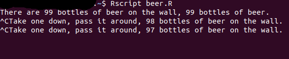

```{r setup, include=FALSE}
options(htmltools.dir.version = FALSE)
library(rlang)

```

background-image: url("https://media.giphy.com/media/44jJQXPAbvKfK/giphy.gif")
background-position: 50% 50%
class: top, inverse


# RLadies 
<a href="https://rladies.org/"><i class="fa fa-link fa-fw"></i>&nbsp; rladies.org</a><br>
<a href="https://rladies.org/code-of-conduct/"><i class="fa fa-link fa-fw"></i>&nbsp; Code of conduct</a><br>

<br/><br/><br/>

### Let's keep in touch!
<a href="http://twitter.com/semiramis_cj"><i class="fa fa-twitter fa-fw"></i>&nbsp; @semiramis_cj</a><br>

<br/>
...and let's get started!!

---
# We signal conditions as developers: "The state of things is..."
What would be the use cases? 

- messages
`r icon::fa("envelope")`
```{r eval=FALSE}
base::message("A message from the developer")
rlang::inform("This is a message from your developer")
```

- warnings
`r icon::fa("exclamation")`
```{r eval=FALSE}
base::warning("This is a warning!!")
rlang::warn("You might want to fix this")
```

- errors 
`r icon::fa("bomb")`
```{r eval=FALSE}
base::stop("An error occured!!!")
rlang::abort("You MUST fix this!")
```

- interrupt (only in interactive mode): Ctrl+C, Esc

---

# We handle conditions as users: What is happening!?! How do I solve this?

- Just ignore the signaling
```{r eval=FALSE}
try() # For errors
suppressWarnings() # For warnings
suppressMessages() # For messages
```

- Do something about it
```{r eval=FALSE}
tryCatch() # For errors
withCallingHandlers() # For warnings and messages
rlang::catch_cnd() # For any condition
```

---
# We ignore errors with try()
```{r}
calculate_log_try <- function(x) {
  # We catch an error if it occurs
  try( log(x) )
  # But we continue with the execution as if nothing happened
  sum(1:5)   

}
calculate_log_try("a")
```
---
# We can ignore warnings or messages selectively
```{r}
suppressWarnings({
  warning("Uhoh!")
  warning("Another warning")
  1
})

suppressMessages({
  message("Hello there")
  2
})


suppressWarnings({
  message("You can still see me because I am a message")
  3
})

```
---
# catch_cnd()
The easiest way to see a condition object is to catch one from a signalled condition. That’s the job of `rlang::catch_cnd()`
```{r}
cnd <- catch_cnd(stop("An error"))
str(cnd)
```
---
# Exiting handlers: 
If we get an error, the downstream code will not be executed!! `r icon::fa("bomb")`
```{r eval=FALSE}
calculate_log_unprotected <- function(x, base=10){
  log(x)
  print("Finished with success!")
}
calculate_log_unprotected("10")
# Error in log(x) : non-numeric argument to mathematical function
```
---

# We can use tryCatch() to continue the execution
```{r eval=FALSE}
tryCatch(
  message = function(any_error) "There was an error!",
  expr=
    {
    log("x") # What we try to do
    message("No errors found")
  }
)
# Error in log("x") : non-numeric argument to mathematical function
```


---
# We can also provide a default value when there is an error
```{r }
calculate_log_trycatch <- function(x, base) {
  tryCatch(
    error = function(any_error) NA, # NA will be our default value
    expr = {
    log(x, base) # What we want to do
    message("No errors found!")
    x + 1
    }
  )
}
```
```{r}
calculate_log_trycatch(10, 10) # When nothing fails
```
```{r}
# This code runs uninterrupted even if there is an error
calculate_log_trycatch("10", 10)
```
---
# What if the execution must stop?
We can signal with `base::stop()` or with `rlang::abort()` `r icon::fa("bomb")`
```{r}
calculate_log_verbose <- function(x, base = exp(1)) {
  # Check our inputs, stop the execution if they are not valid
  # But also tell the user where is the problem
  if (!is.numeric(x)) {
    abort(paste0(
      "`x` must be a numeric vector; not ", typeof(x), "."
    ))
  }
  if (!is.numeric(base)) {
    abort(paste0(
      "`base` must be a numeric vector; not ", typeof(base), "."
    ))
  }
  # We can run this if there are no errors
  log(x, base = base)
}
```

```{r eval=FALSE}
calculate_log_verbose(letters)
## Error: `x` must be a numeric vector; not character.
calculate_log_verbose(1:10, base = letters)
## Error: `base` must be a numeric vector; not character.
calculate_log_verbose(1:5, base = 10) # This code runs without problems
# [1] 0.0000000 0.3010300 0.4771213 0.6020600 0.6989700
```

---
# Calling handlers
If what happened is not critical, and we want to continue with the flow of our script, we can use `withCallingHandlers()`

The messages are applied in the order we send them
```{r}
withCallingHandlers(
  # We catch the condition and print to the console
  message = function(cnd) message("First message -from the top with base"),
  {
    # This code will be executed after catching the condition
    # After each message, the control will return to the top
    rlang::inform("Second message with rlang")
    rlang::warn("Ooops! A warning")
    message("Third message -with base")
  }
)
```
---


# The call stack tree gives us info about what was called and its order

.pull-left[
We can explore the call stack tree with `traceback()` or with `lobstr::cst()`

```{r}
f <- function() g()
g <- function() h()
h <- function() lobstr::cst()
f()
```

And the call stack tree structure varies depending on the type of handler
]

.pull-right[


]


---
# Exiting handlers are called in the context of the call to tryCatch():
```{r}
tryCatch(f(), message = function(cnd) lobstr::cst())

```

---

# Calling handlers are called in the context of the call that signaled the condition:
```{r}
withCallingHandlers(f(), message = function(cnd) {
  lobstr::cst()
  cnd_muffle(cnd)
})
```
---
# Custom conditions are useful for not relying on string matching to catch them! 1/2
We create our custom condition "abort_bad_argument"
```{r}
abort_bad_argument <- function(arg, must, not = NULL) {
  msg <- glue::glue("`{arg}` must {must}") # This text might change
  if (!is.null(not)) {
    not <- typeof(not)
    msg <- glue::glue("{msg}; not {not}.")
  }
  abort("error_bad_argument", 
    message = msg, 
    arg = arg, 
    must = must, 
    not = not
  )
}

log_custom_condition <- function(x, base = 10) {
  if (!is.numeric(x)) {
    # We are using our custom condition!
    abort_bad_argument("x", must = "be numeric", not = x)
  }
  if (!is.numeric(base)) {
    abort_bad_argument("base", must = "be numeric", not = base)
  }

  log(x, base = base)
}
  
```
---
# Custom conditions are useful for not relying on string matching to catch them! 2/2

```{r}
catch_cnd(
  log_custom_condition("10")
  )
```


---
background-image: url("https://media.giphy.com/media/bt8FwKXiNKRkQ/giphy.gif")
background-position: 50% 50%
class: center

# Time for a break!
---
# Quizz
1. What are the three most important types of condition?

2. What function do you use to ignore errors in block of code?

3. What’s the main difference between `tryCatch()` and `withCallingHandlers()`?

4. Why might you want to create a custom error object?

---
# Quizz - answers
What are the three most important types of condition?
- errors, warnings & messages

What function do you use to ignore errors in block of code?
- `try()` or `tryCatch()`

What’s the main difference between `tryCatch()` and `withCallingHandlers()`?
- `tryCatch()` handles errors
- `withCallingHandlers()` is for warnings and messages

Why might you want to create a custom error object?
- To avoid comparison of error strings when we want to catch specific types of errors

---
## Predict the results of evaluating the following code:
```{r }
show_condition <- function(code) {
  tryCatch(
    # Errors, warnings and messages are catched from the start
    error = function(cnd) "error",
    warning = function(cnd) "warning",
    message = function(cnd) "message",
    # Our code is executed here
    {
    code
    NULL # The return value if nothing was signaled
    }
  )
}

```
```{r eval=FALSE}
show_condition(stop("!")) # case A)
show_condition(10) # case B)
show_condition(warning("?!")) # case C)
show_condition({ # case D)
  10
  message("?")
  warning("?!")
})
```

---
## Answer:
- case A) will print "error"
- case B) will print "NULL"
- case C) will print "warning"
- case D will terminate when we arrive to the message. Remember: exiting handlers are called in the context of tryCatch()

```{r}
show_condition({  # case D)
  10
  message("?")
  warning("?!")
})

```
---
Explain the results of running this code:
```{r}
withCallingHandlers( # (1)
  message = function(cnd) message("b"),
  withCallingHandlers( # (2)
    message = function(cnd) message("a"),
    message("c")
  )
)
```
---
## Answer:
```{r}
withCallingHandlers( # (1)
  message = function(cnd) message("b"),
  withCallingHandlers( # (2)
    message = function(cnd) message("a"),
    message("c")
  )
)
```
- First, we enter into (1): the message is "b"
- then, we go to (2): the message is "a"
- we return to (1) because we didn't handle the message "b", so it bubbles up to the outer calling handler
- finally, we go to "c"

---
Compare the following two implementations of message2error(). What is the main advantage of withCallingHandlers() in this scenario? (Hint: look carefully at the traceback.)
```{r}
message2error_withCallingHandlers <- function(code) {
  withCallingHandlers(code, message = function(e) stop(e))
}
```

```{r}
message2error_tryCatch <- function(code) {
  tryCatch(code, message = function(e) stop(e))
}
```
---
## Answer:
withCallingHandlers() returns more information and points us to the exact call in our code because it is called in the context of the call that signalled the condition, whereas exiting handlers are called in the context of tryCatch()
.pull-left[
```{r eval=FALSE}
message2error_withCallingHandlers( {1; 
  message("hidden error"); NULL} )
traceback()
# Error in message("hidden error") : hidden error 
# 9: stop(e) at <text>#2
# 8: (function (e) 
#    stop(e))(list(message = "hidden error\n", call = message("hidden error")))
# 7: signalCondition(cond)
# 6: doWithOneRestart(return(expr), restart)
# 5: withOneRestart(expr, restarts[[1L]])
# 4: withRestarts({
#        signalCondition(cond)
#        defaultHandler(cond)
#    }, muffleMessage = function() NULL)
# 3: message("hidden error") at #1
# 2: withCallingHandlers(code, message = function(e) stop(e)) at <text>#2
# 1: message2error_withCallingHandlers({
#        1
#        message("hidden error")
#        NULL
#    })

```
]
.pull-right[
```{r eval=FALSE}
message2error_tryCatch({1; 
  message("hidden error"); NULL} )
traceback()
# Error in message("hidden error") : hidden error 
# 6: stop(e) at <text>#2
# 5: value[[3L]](cond)
# 4: tryCatchOne(expr, names, parentenv, handlers[[1L]])
# 3: tryCatchList(expr, classes, parentenv, handlers)
# 2: tryCatch(code, message = function(e) stop(e)) at <text>#2
# 1: message2error_tryCatch({
#        1
#        message("hidden error")
#        NULL
#    })

```
]
---

Why is catching interrupts dangerous? Run this code to find out.
```{r}
bottles_of_beer <- function(i = 99) {
  message(
    "There are ", i, " bottles of beer on the wall, ", 
    i, " bottles of beer."
  )
  while(i > 0) {
    tryCatch(
      Sys.sleep(1),
      interrupt = function(err) {
        i <<- i - 1
        if (i > 0) {
          message(
            "Take one down, pass it around, ", i, 
            " bottle", if (i > 1) "s", " of beer on the wall."
          )
        }
      }
    )
  }
  message(
    "No more bottles of beer on the wall, ", 
    "no more bottles of beer."
  )
}
```
---
## Answer:
If we run that code, we won't be able to stop it unless we kill the process from our terminal




---
background-image: url("https://media.giphy.com/media/3oKIPnAiaMCws8nOsE/giphy.gif")
background-position: 50% 50%
class: bottom, inverse

# Do you want to explore more about debugging in R?

- Check <a href="https://rstudio.com/resources/rstudioconf-2020/object-of-type-closure-is-not-subsettable/"><i class="fa fa-link fa-fw"></i>&nbsp; Jenny Bryan's talk: "Object of type closure is not subsettable" </a><br>


---

class: center, top, inverse
background-image: url("https://media.giphy.com/media/T5nP7Nwu5FzMc/giphy.gif")
background-position: 50% 50%

# Don't miss any upcoming meet-ups!
<a href="https://github.com/rladiesnl/book_club"><i class="fa fa-link fa-fw"></i>&nbsp; This RLadies Advanced R Bookclub</a><br>
<a href="https://adv-r.hadley.nz/"><i class="fa fa-link fa-fw"></i>&nbsp; Hadley Wickham's Advanced R Book </a><br>

<br/><br/><br/><br/><br/><br/><br/><br/><br/><br/><br/><br/>
Slides created with the R package [**xaringan**](https://github.com/yihui/xaringan).


---