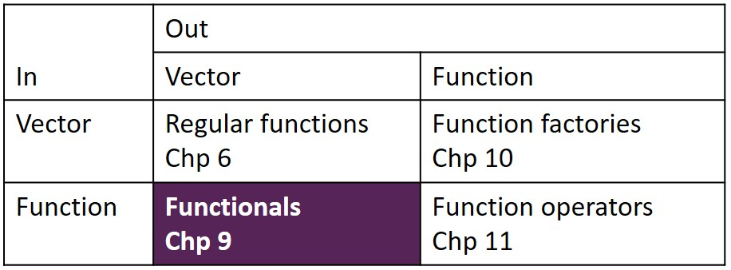

```{r setup, include=FALSE}
options(htmltools.dir.version = FALSE)

knitr::opts_chunk$set(message = FALSE, warning = FALSE, comment = "", cache = FALSE, echo = FALSE, fig.retina = 3)

options(warnPartialMatchDollar = FALSE)

# devtools::install_github("gadenbuie/xaringanExtra")

library(tidyverse)
library(knitr)
# remotes::install_github("allisonhorst/palmerpenguins")
library(palmerpenguins)

```

```{r xaringanExtra, echo=FALSE}

xaringanExtra::use_tile_view()

xaringanExtra::use_logo(
  image_url = "R-LadiesGlobal.png",
  width = "50px")

xaringanExtra::use_extra_styles(
  hover_code_line = TRUE,         #<<
  mute_unhighlighted_code = TRUE  #<<
)

xaringanExtra::use_webcam()

```


# Welcome!

- This is joint effort between RLadies Nijmegen, Rotterdam,
's-Hertogenbosch (Den Bosch), Amsterdam and Utrecht 
--

- We meet every 2 weeks to go through a chapter 
--

- Use the HackMD to present yourself, ask questions and see your breakout room 
--

- We split in breakout rooms after the presentation, and we return to the main jitsi link after xx min  
--

- There are still possibilities to present a chapter :) Sign up at https://rladiesnl.github.io/book_club/  
--

- https://advanced-r-solutions.rbind.io/ has some anwers and we could PR the ones missing  
--

- The R4DS book club repo has a Q&A section.https://github.com/r4ds/bookclub-Advanced_R 

--


```{r, out.height= "90%"}
knitr::include_graphics("tenor.gif")
```

---

# Thanks to:

- Hadley Wickham for writing [AdvancedR](https://adv-r.hadley.nz/)
- Allison Horst for the [palmerpenguins package](https://allisonhorst.github.io/palmerpenguins/)
- R Core Team (2020). R: A language and environment for statistical computing. R Foundation for Statistical Computing,
  Vienna, Austria. URL https://www.R-project.org/.  
- Lionel Henry and Hadley Wickham (2020). purrr: Functional Programming Tools. R package version 0.3.4.
  https://CRAN.R-project.org/package=purrr
- Gorman KB, Williams TD, Fraser WR (2014) Ecological Sexual Dimorphism and Environmental Variability within a Community of
  Antarctic Penguins (Genus Pygoscelis). PLoS ONE 9(3): e90081. https://doi.org/10.1371/journal.pone.0090081
- Yihui Xie (2020). xaringan: Presentation Ninja. R package version 0.16. https://CRAN.R-project.org/package=xaringan 
- Garrick Aden-Buie (2020). xaringanExtra: Extras And Extensions for Xaringan Slides. R package version 0.0.17.  https://github.com/gadenbuie/xaringanExtra  

and all the authors of R packages used in this presentation 

```{r}

```

---

# Functional programming - Chp 9, 10 and 11  

R has **first-class** functions. This means the language supports:   

*  assigning functions to variables
*  store funtions in a list
*  pass functions as arguments to other functions
*  create functions inside functions
*  return functions as the result of a function  

--

A functions is **pure**, if: 

*  the output only depends on the input (same input, same output)
*  the function has no side effects (so no actions beside the output value)  

--

R is not strictly a functional programming language,  
but it is very well possible to program in a **functional style**: 

*  decompose a problem in subproblems
*  solve each subproblem with a set of functions. 

---

# Functional programming - Chp 9, 10 and 11  

 
```{r, out.width="150%"}

```

---

# Functionals, **function**(function) = vector

```{r, echo=TRUE}
let_us <- function(f, inputs) f(inputs)
```

--

```{r, echo=TRUE}
let_us(sum, 1:4)
```
--

```{r, echo = TRUE}
let_us(median, 1:4)
```
--


```{r, echo = TRUE}
let_us(range, 1:4)
```

--


```{r, echo = TRUE}
let_us(sqrt, 1:4)
```

---

# About the demo data: palmerpenguins::penguins


```{r, out.width="40%"}
knitr::include_graphics("penguins_allisonhorst.png")
```
Artwork by @allison_horst  
--

```{r, echo = TRUE}
str(penguins)
```


---

# purrr::map( )  


.pull-left[

```{r, out.width="100%"}
knitr::include_graphics("Chp9_map.png")
```

input slot 1: vector  
input slot 2: function  
output: list


```{r, echo = TRUE}
str(purrr::map)
```


]

--

.pull-right[

```{r, echo = TRUE}
map(penguins, typeof)
```


]

---

# purrr::map( ) - atomic functions 1/3


.pull-left[

list as output
```{r, echo = TRUE}
map(penguins, typeof)
```


]

--

.pull-right[

chr vector as output

```{r, echo = TRUE}
map_chr(penguins, typeof)
```

]

---

# purrr::map( ) - atomic functions 2/3


logical vector as output

```{r, echo = TRUE, eval = FALSE}
map_lgl(penguins, is.double)
```

--
```{r}
map_lgl(penguins, is.double)
```


--

integer vector as output

```{r, echo = TRUE, eval = FALSE}
n_unique <- function(x) length(unique(x))
map_int(penguins, n_unique)
```

--

```{r}
n_unique <- function(x) length(unique(x))
map_int(penguins, n_unique)
```

---

# purrr::map( ) - atomic functions 3/3

```{r, echo = TRUE, eval = FALSE}
map_dbl(penguins, mean, na.rm = TRUE)
```

--

```{r}
map_dbl(penguins, mean, na.rm = TRUE)
```

--


This is an example of passing arguments:  


--

```{r}

```

--

Extra arguments (after f) will be passed along as is (no decomposition). 

---

# Anonymous functions and shortcuts 1/

```{r, echo = TRUE}
# instead of:
n_unique <- function(x) length(unique(x))
map_int(penguins, n_unique)
```

--

```{r, echo = TRUE}
# you can create an inline anonymous function:
map_int(penguins, function(x) length(unique(x)))
```
--

```{r, echo = TRUE}
# or even with less characters, and with a tilde/twiddle:
map_int(penguins, ~length(unique(.x)))
```

---


# Anonymous functions and shortcuts 2/ 

Very useful for making sets of random numbers

```{r, echo = TRUE}
x <- map(1:3, ~ runif(.x))
str(x)
```


--

If at the second spot there is a vector/list instead of function,  
result is extraction of elements from the input vector:  

--

```{r, echo = TRUE}
map_dbl(x, 1)
```
--


```{r, eval = FALSE, echo= TRUE}
map_dbl(x, 2)
```


```{r, error = TRUE}
map_dbl(x, 2)
```

---

# Anonymous functions and shortcuts 3/


```{r, error = TRUE,echo = TRUE}
map_dbl(x, 2)
```

--

Prevent this error by supplying a default value:

```{r, echo= TRUE}
map_dbl(x, 2, .default = NA)
```

--

Extract elements by:  

*  location, with an integer vector
*  by name, with a character vector
*  combi name/location, with a list


---

background-image: url("8cabcf7e19ecf6c73da7c1e7947b5394.gif")
background-size: cover

---
# Intermezzo on *trim*

--

Plain mean: 
```{r,echo = TRUE}
mean(c(1,1,2,2,2,2,2,2,2,2,1000,1000))
```
--

Trim 20% of the observations at both sides: 
```{r,echo = TRUE}
mean(c(1,1,2,2,2,2,2,2,2,2,1000,1000), trim = 0.2)
```

--

It cuts of from the ordered vector:

```{r,echo = TRUE}
mean(c(1000,1,2,2,2,2,2,2,2,2,1000,1), trim = 0.2)
```

--
So it trims the smallest and the largest values.

---

# Use argument names

Calculate the means for the numeric columns in `penguins`:  
```{r, echo = TRUE, eval = FALSE}
map_dbl(penguins[,3:6], mean, TRUE)
```
--

```{r, error = TRUE}
map_dbl(penguins[,3:6], mean, TRUE)
```

--

What we wanted was to have the `na.rm = TRUE`;

```{r, echo = TRUE, eval = FALSE}
map_dbl(penguins[,3:6], mean, na.rm = TRUE)
```
--

```{r, error = TRUE}
map_dbl(penguins[,3:6], mean, na.rm = TRUE)
```

--

Another example:  
```{r, echo = TRUE}
map_dbl(penguins[,3:6], mean, na.rm = TRUE, 0.1)
```

--

The 0.1 appears to be the *trim*. But would you know that by looking at the script?  


---

# Regression example

```{r, fig.width = 10}
colors_penguin <- c(Adelie = "#FF8C00",
                    Chinstrap = "#A034F0",
                    Gentoo = "#018B8B")
penguins %>%
  ggplot(aes(x = bill_length_mm, y = bill_depth_mm,
             color = species, shape = species)) +
  geom_point(size = 2) +
  geom_smooth(method = "lm", se = FALSE, size = 1.5) +
  scale_color_manual(values = colors_penguin) +
  theme_minimal()

```

---

# Regression example

```{r, echo=TRUE}
penguins_species <- split(penguins, penguins$species)
```

.pull-left[

```{r, echo = TRUE, eval = FALSE}

penguins_species %>%
  # inputs are the 3 splits
  # of penguins
  # function is the lm:
  map(~ lm(bill_depth_mm ~ 
             bill_length_mm,
           data = .x))
  
```

]

.pull-right[

```{r}

penguins_species %>%
  # inputs are the 3 splits of penguins
  # function is the lm:
  map(~ lm(bill_depth_mm ~ bill_length_mm,
           data = .x))
  
```

]

---


# Regression example

```{r, echo=TRUE}
penguins_species <- split(penguins, penguins$species)
```

.pull-left[

```{r, echo = TRUE, eval = FALSE}

penguins_species %>%
  # inputs are the 3 splits
  # of penguins
  # function is the lm:
  map(~ lm(bill_depth_mm ~ 
             bill_length_mm,
           data = .x)) %>%
  # inputs are the models
  # function is coef()
  map(coef) 
  
```

]

.pull-right[

```{r}

penguins_species %>%
  # inputs are the 3 splits of penguins
  # function is the lm:
  map(~ lm(bill_depth_mm ~ bill_length_mm,
           data = .x)) %>%
  # with baseR coef() extract coefficients
  map(coef)
  
```

]

---


# Regression example

```{r, echo=TRUE}
penguins_species <- split(penguins, penguins$species)
```

.pull-left[

```{r, echo = TRUE, eval = FALSE}

penguins_species %>%
  # inputs are the 3 splits
  # of penguins
  # function is the lm:
  map(~ lm(bill_depth_mm ~ 
             bill_length_mm,
           data = .x)) %>%
  # inputs are the models
  # function is coef()
  map(coef) %>%
  # inputs are sets of coefficients
  # subset to get the slopes
  map(2)
  
```

]

.pull-right[

```{r}

penguins_species %>%
  # inputs are the 3 splits of penguins
  # function is the lm:
  map(~ lm(bill_depth_mm ~ bill_length_mm,
           data = .x)) %>%
  # with baseR coef() extract coefficients
  map(coef) %>%
  # subset to get the slopes
  map(2)
  
```

]


---

# purrr::map2( )  


```{r, out.width="80%"}

```
--

```{r, echo = TRUE}
str(purrr::map2)
```
--


input slot 1: vector  
input slot 2: another vector  
input slot 3: function  
input slot 4: additional arguments to function  
output: list

---

# purrr::map2( ) - examples


```{r, echo=TRUE, eval = FALSE}
map2(1:3, 4:6, ~.x ^ .y)
```

--

```{r}
map2(1:3, 4:6, ~.x ^ .y)
```

--


```{r, echo = TRUE, eval = FALSE}
map2_chr(penguins$species, penguins$island, str_c, sep = " - ") %>% head(30)
```

--

```{r}
map2_chr(penguins$species, penguins$island, str_c, sep = " - ") %>% head(30)
```

---

# purrr::map2( ) recycles


```{r, echo=TRUE, eval = FALSE}
map2(1:3, 4,  ~.x ^ .y)
```

--

```{r}
map2(1:3, 4,  ~.x ^ .y)
```

--

This is equivalent with  
treating the second argument as an additional argument to the function in a map():  

--

```{r, echo=TRUE, eval = FALSE}
map(1:3, ~.x ^ .y, 4)
```

--

```{r}
map(1:3, ~.x ^ .y, 4)
```

---

# purrr::pmap( )


```{r, out.width="80%"}

```
--

```{r, echo = TRUE}
str(purrr::pmap)
```
--


input slot 1: list  
input slot 2: function  
input slot 3: additional arguments to function  
output: list

---

# purrr::pmap( ) - example  

Use pmap to draw sets of random samples from a number of normal distributions:  

--

```{r, echo = TRUE}
str(rnorm)
```
--
So we need a tibble with the desired inputs: 
--
```{r, echo = TRUE}

params <- tibble(n = 3:5, mean = c(30, 20, 10), sd = 1:3)

```
--

Because the variable names in `params` match the argument names in `rnorm`, this works:  

--

```{r, echo = TRUE, eval = FALSE}
pmap(params, rnorm)
```

--


```{r}
pmap(params, rnorm)
```

---

# purrr::imap( ) - example names 

```{r, echo = TRUE}
str(imap)
```

--


`imap(x,f)`:  
--

*  x has names $\rightarrow$ `map2(x, names(x), f)`

--
*  x has NO names $\rightarrow$ `map2(x, seq_along(x), f)`  

--

**Example** 

```{r, echo = TRUE, eval = FALSE}
imap_chr(penguins, ~ str_c("First value of ", .y, " is ", .x[[1]]))
```
--


```{r}
imap_chr(penguins, ~ str_c("First value of ", .y, " is ", .x[[1]]))
```

---
# purrr::imap( ) - example no names

```{r, echo = TRUE}
x <- map(1:3, ~ sample(1000, 10))
```

--

```{r, echo = TRUE}
x
```

--

```{r, echo = TRUE, eval = FALSE}
imap_chr(x, ~ paste0("The highest value of ", .y, " is ", max(.x)))
```

--
```{r}
imap_chr(x, ~ paste0("The highest value of ", .y, " is ", max(.x)))
```

---

background-image: url("tumblr_mvg9gwlqxd1qhpnsyo1_500.gif")
background-size: cover

---


# modify( )

Returns  a modified copy, same type of output as input.

--

```{r, echo=TRUE}
str(modify)
```
--

```{r, eval = FALSE, echo = TRUE}
map(penguins[3:6], ~.x*2) %>% str()
```
--


```{r}
map(penguins[3:6], ~.x*2) %>% str()
```
--

```{r, eval = FALSE, echo = TRUE}
modify(penguins[3:6], ~.x*2) %>% str()
```
--


```{r}
modify(penguins[3:6], ~.x*2) %>% str()
```

---

# walk( ) 

Most functions are used for their return value.  
--

Some mainly for their side-effects, like plot(), write.csv(), ...  
--

These latter functions do have an invisible return value (see 6.7.2),  
--

that become visible with map( ).  

--

```{r, echo = TRUE}
print(3:4)
```
--

```{r, echo = TRUE, eval = FALSE}
map_chr(3:4, print)

```

--

```{r}
map_chr(3:4, print)

```

--

Use `walk` when you only want the side-effect:  
--


```{r, echo = TRUE, eval = FALSE}
walk(3:4, print)

```

--

```{r}
walk(3:4, print)

```

---

# walk( ) - example saving multiple files

```{r, echo = TRUE} 
temp <- tempfile() 
# returns a vector of character strings 
# which can be used as names for temporary files
temp
```

--

```{r, echo = TRUE}
# make the temporary directory
dir.create(temp)
# and see that it is empty
dir(temp)
```

--

```{r, echo = TRUE, eval = FALSE}
peng <- split(penguins, penguins$species)
paths <- file.path(temp, paste0("species-", names(peng), ".csv"))
walk2(peng, paths, write.csv)
dir(temp)
```

--


```{r}
peng <- split(penguins, penguins$species)
paths <- file.path(temp, paste0("species-", names(peng), ".csv"))
walk2(peng, paths, write.csv)
dir(temp)
```


--

```{r, echo = TRUE}
# to clean up all the temp directories and content made
unlink(temp, recursive = TRUE)
```

---

# reduce( )

```{r, out.width="60%"}

```
--

```{r, echo = TRUE}
str(reduce)
```
---

# reduce( ) - example intersect  

```{r, echo=TRUE}
mylist <- map(1:3, ~ sample(1:10, 15, replace = T))
str(mylist)
```

--

How to find the common numbers?  

--

.pull-left[
```{r, echo = TRUE}
out <- mylist[[1]]
(out <- intersect(out, mylist[[2]]))
(out <- intersect(out, mylist[[3]]))
```
]

--

.pull-right[
```{r, echo = TRUE}
reduce(mylist, intersect)
accumulate(mylist, intersect)
```

]

---

# reduce( ) - use of .init 1/2

```{r, echo = TRUE, eval = FALSE}
reduce(1:4, `*`)
```

```{r}
reduce(1:4, `*`)
```


--

```{r, echo = TRUE, eval = FALSE}
reduce(3, `*`)
```
--

```{r}
reduce(3, `*`)
```
--


```{r, echo = TRUE, eval = FALSE}
reduce("purrrrrr", `*`)
```
--

```{r}
reduce("purrrrrr", `*`)
```

--
So, obviously no check on input type ...
---
# reduce( ) - use of .init 2/2


```{r,echo = TRUE, eval = FALSE}
reduce(integer(), `*`)
```
--

```{r, error = TRUE}
reduce(integer(), `*`)
```
--
From the help on `init`:  
If supplied, will be used as the first value to start the accumulation, rather than using .x[[1]]. This is useful if you want to ensure that reduce returns a correct value when .x is empty. If missing, and .x is empty, will throw an error.  
--
```{r, echo = TRUE}
# prod returns the product of all the values present in its arguments.
prod(integer())
```
--


```{r, echo = TRUE, error = FALSE}
reduce(integer(), `*`, .init=1)
```
--


```{r, echo = TRUE, error = TRUE}
reduce("purrrrrr", `*`, .init = 1)   # and now this DOES throw an error
```
---

# Map-reduce  

```{r, out.width="100%"}
knitr::include_graphics("MapReduce_Work_Structure.png")
```
Source: https://whatsbigdata.be/wp-content/uploads/2014/06/MapReduce_Work_Structure.png  
---

# Predicate functionals 1/4 

A **predicate function** is a function that returns TRUE or FALSE.  

```{r, echo = TRUE}
is.numeric(penguins$species)
```

--

A **predicate functional** applies a predicate function to each element of a vector:  

```{r, echo = TRUE}
# some returns TRUE when first TRUE element is seen
some(penguins, is.numeric)
```
--

```{r, echo=TRUE}
# every returns FALSE when first FALSE element is seen
every(penguins, is.numeric)
```
--

```{r, echo=TRUE}
# none has to check entire vector
none(mylist, is.numeric)
```
---

# Predicate functionals 2/4 

```{r, echo = TRUE}
detect(penguins %>% head(), is.factor)        # value of the first match
```
--

```{r, echo = TRUE}
detect_index(penguins %>% head(), is.factor)  # location of the first match
```
--
```{r, echo = TRUE}
keep(penguins %>% head(n = 1), is.numeric)
```


--
```{r, echo = TRUE}
discard(penguins %>% head(n = 1), is.numeric)
```

---

# Predicate functionals 3/4

```{r, echo = TRUE, eval = FALSE}
map_dbl(penguins, mean, na.rm = TRUE)
```

--

```{r}
map_dbl(penguins, mean, na.rm = TRUE)
```

--

```{r, echo = TRUE, eval = FALSE}
map_dbl(keep(penguins, is.numeric), mean, na.rm = TRUE)
```

--

```{r}
map_dbl(keep(penguins, is.numeric), mean, na.rm = TRUE)
```

---

# Predicate functionals 4/4


```{r, echo = TRUE, eval = FALSE}
map_if(penguins,is.numeric, mean, na.rm = TRUE) %>% str()
```
--

```{r}
map_if(penguins,is.numeric, mean, na.rm = TRUE) %>% str()
```
--

```{r, echo = TRUE, eval = FALSE}
modify_if(penguins,is.numeric, mean, na.rm = TRUE) %>% str()
```
--

```{r}
modify_if(penguins,is.numeric, mean, na.rm = TRUE) %>% str()
```

---

# bye


---

background-image: url("done.gif")
background-size: cover

--

```{r, out.width="100%"}

```

---

# Breakout questions  

* Did you use these functions before? Please share some details/tips/stories. 

* What are the 23 primary variants of `map( )` Hadley Wickham mentiones in 9.4?

* In case you want to try some exercises, try these:  
  *  9.2.6.3
  *  9.2.6.6
  *  9.6.3.5
  *  or any other exercise :)


