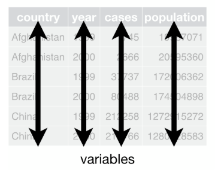
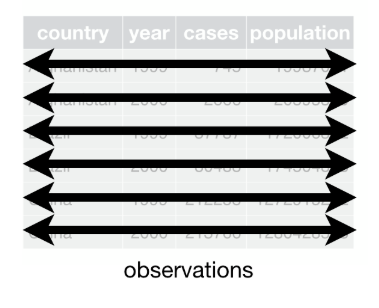
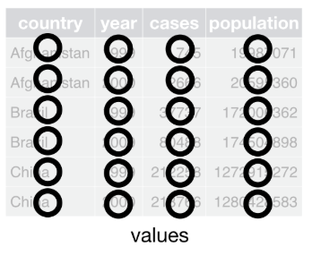
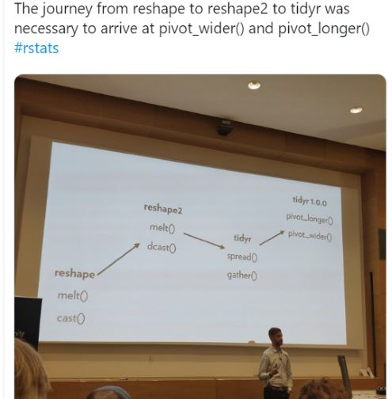

```{r setup, include=FALSE}
options(htmltools.dir.version = FALSE)
knitr::opts_chunk$set(warning = FALSE, message = FALSE, fig.retina = 3, fig.width =  9)
library(tidyverse)
library(lubridate)
library(kableExtra)

mytable <- function(df){
  kable(df) %>%
  kable_styling(bootstrap_options = c("hover", "condensed", "responsive"),
                full_width = F,
                font_size = 14)}
```

```{r xaringan-themer, include=FALSE}
library(xaringanthemer)
mono_accent(
  base_color = "#011A5E", 
  table_row_even_background_color = "#FFFFFF",
  header_font_google = google_font("Lora", "500"),
  text_font_google   = google_font("Lato", "400", "400i")
)
```

name: title
class: center, middle

#Tidy data#

L. Paloma Rojas Saunero


---

class: center, middle


---

```{r, message= FALSE}
library(tidyverse)
```

---

.pull-left[
#### Table 1
```{r eval = FALSE}
table1
```
```{r echo = FALSE}
table1 %>% 
  mytable()
```
]

.pull-right[
#### Table 2
```{r eval = FALSE}
table2
```
```{r echo = FALSE}
table2 %>% 
  mytable()
```
]

---

#### Table 3
```{r eval = FALSE}
table3
```
```{r echo = FALSE}
table3 %>% 
  mytable()
```

---
#### Table 4

.pull-left[
#### Cases
```{r eval = FALSE}
table4a
```
```{r echo = FALSE}
table4a %>% 
  mytable()
```
]

.pull-right[
#### Population
```{r eval = FALSE}
table4b
```
```{r echo = FALSE}
table4b %>% 
  mytable()
```
]

---

## The rules of Tidy data: Rule 1

.pull-left[

## Each variable must have its own column.

]

.pull-right[

]

---

## The rules of Tidy data: Rule 2

.pull-left[

## Each observation must have its own row.

]

.pull-right[
]

---

## The rules of Tidy data: Rule 3

.pull-left[

## Each value must have its own cell.

]

.pull-right[
]

---

### Advantages

- Following three rules makes a dataset tidy: variables are in columns, observations are in rows, and values are in cells.

- Put each dataset in a tibble

- Put each variable in a column.

--

- Consistent way to store data

- Most built-in R functions work with vectors of values, so transforming data feels more natural.

---

#### Example

```{r eval = FALSE}
table1 %>% 
  mutate(rate = cases / population * 10000) %>% 
  mytable()
```
```{r echo = FALSE}
table1 %>% 
  mutate(rate = cases / population * 10000) %>% 
  mytable()
```

---
```{r}
library(ggplot2)
ggplot(table1, aes(year, cases)) + 
  geom_line(aes(group = country), colour = "grey50") + 
  geom_point(aes(colour = country))
```

---
class: center, middle
### Disclaimers



---
## Gather()

.pull-left[
```{r}
table4a %>% 
  mytable()
```
]

.pull-right[
```{r}
table4a %>%
  gather(`1999`, `2000`,
         key = "year", 
         value = "cases") %>% 
  mytable()
```
]

`key`: is the variable that will have the **names** of the variables
`value`: is the column that contains the **information**
---

## pivot_longer

```{r}
table4a %>%
  pivot_longer(-country,
               names_to = "year",
               values_to = "cases") %>% 
  mytable()
```

---
class: center


.footnote[[Link](https://twitter.com/dataandme/status/1175913657907253254)]
---
## spread()

```{r}
table2
```

---
## spread()

```{r}
table2 %>%
  spread(key = type,
         value = count)%>% 
  mytable()
```

---
## pivot_wider

```{r}
table2 %>% 
  pivot_wider(names_from = type, 
              values_from = count) %>% mytable()
```

---

## separate()

```{r}
table3 %>% mytable()
```

---

## separate()
```{r}
table3 %>% 
  separate(rate, 
           into = c("cases", "population")) %>% 
  mytable()
```
]

`separate(data, col, into, sep = "[^[:alnum:]]+")`. The `sep` argument is very relevant, because it will not work if the pattern is not evident. If this is the case, we need to use **regular expression** notation, or **regex**, as in chapt 14.

---

## separate()

```{r}
stocks <- tibble(
  year   = c("year1", "year2", "year1", "year2"),
  half  = c(   1,    2,     1,    2),
  return = c(1.88, 0.59, 0.92, 0.17)
  )

stocks %>% mytable()
```

---
## separate()

```{r, warning=TRUE}
stocks %>% 
  separate(year, 
           into = c("name", "time")) %>%
  mytable()
```
---
## separate()

```{r}
stocks %>% 
  separate(year, 
           into = c("name", "time"), 
           sep = 4) %>% mytable()
```

---
## unite()

.pull-left[
```{r}
table5 %>% mytable()
```
]

---
## unite()

```{r}
table5 %>% 
  unite(new, century, year) %>% 
  mytable()
```

---

## unite()

```{r}
table5 %>% 
   unite(new, century, year, 
         sep = "-",
         remove = FALSE) %>% 
  mytable()
```

---
### Missing values

- **Explicitly**, i.e. flagged with NA.

- **Implicitly**, i.e. simply not present in the data.

```{r}
stocks <- tibble(
  year   = c(2015, 2015, 2015, 2015, 2016, 2016, 2016),
  qtr    = c(   1,    2,    3,    4,    2,    3,    4),
  return = c(1.88, 0.59, 0.35,   NA, 0.92, 0.17, 2.66)
)
stocks %>% mytable()
```

---
.pull-left[
```{r}
stocks %>% 
  spread(year, return) %>% mytable()
```
]

.pull-right[
```{r}
stocks %>% 
  pivot_wider(
    names_from = year,
    values_from = return
  ) %>% mytable()
```
]
---
## Removing the NA with gather()
```{r}
stocks %>% 
  spread(key = year, value = return) %>% 
  gather(key = year, value = return, 
         `2015`:`2016`, na.rm = TRUE) %>% 
  mytable()
```

---
## Removing the NA with pivot_long()
```{r}
stocks %>% 
  pivot_wider(names_from = year, values_from = return) %>% 
  pivot_longer(- qtr, names_to = "year", 
               values_to = "return", 
               values_drop_na = TRUE) %>% 
  mytable()
```

---

## Include the implicit missing values

```{r}
stocks %>% 
  complete(year, qtr) %>% 
  mytable()
```

---

## Filling the explicit missing values

```{r}
treatment <- tribble(
  ~ person,           ~ treatment, ~response,
  "Derrick Whitmore", 1,           7,
  NA,                 2,           10,
  NA,                 3,           9,
  "Katherine Burke",  1,           4
)
```

```{r}
treatment %>% 
  fill(person) %>% mytable()
```

---

```{r}
treatment %>% 
  fill(person, .direction = "up")
```

---
class: center, middle

# Case study#

---
```{r}
who %>% 
  select(1:7) %>% 
  slice(18:30) %>% mytable()
```

---
## Set to "long" with `gather()`
```{r}
who1 <- who %>% 
  gather(new_sp_m014:newrel_f65, 
         key = "key", 
         value = "cases", 
         na.rm = TRUE)
who1 %>% head() %>% 
  mytable()
```

---
## Set to "long" with `pivot()`
```{r}
who %>% 
  pivot_longer(new_sp_m014:newrel_f65, 
               names_to = "key", 
               values_to = "cases",
               values_drop_na = TRUE) %>% 
  head() %>%  
  mytable()
```

---
## Evaluate "key" variable
.pull-left[
```{r}
who1 %>% count(key, sort = TRUE) %>% 
  slice(1,10,20,30,40,50) %>%
  mytable()
```
]

.pull-right[
- `new` = new cases

- `ep` = extrapulmonary, `rel` = relapse, `sp` = pulmonary, smear positive, `sn` = pulmonary, smear negative

- `f` = female

- `014` = 0 to 14 years old

- `15-24` = 15 to 24 and so on
]

---
## Update "newrel" to "new_rel" in the "key" variable
```{r}
who2 <- who1 %>% 
  mutate(key = stringr::str_replace(key, "newrel", "new_rel"))
```

```{r}
who2 %>% count(key, sort = TRUE) %>% slice(1,10,20,30,40,50) %>% mytable()
```

---
## Separate "key" to 3 new variables
```{r}
who3 <- who2 %>% 
  separate(key, c("new", "type", "sexage"), sep = "_")

who3 %>% head() %>% mytable()
```

---
## Delete unnecesary variables

```{r}
who3 %>% count(new)

who4 <- who3 %>% 
  select(-new, -iso2, -iso3)

who4 %>% head() %>% mytable()
```

---
# Separate the "sex-age" variable
```{r}
who5 <- who4 %>% 
  separate(sexage, c("sex", "age"), sep = 1)

who5 %>% head() %>% mytable()
```

---
# All together

```{r eval = FALSE}
who %>%
  gather(key, value, new_sp_m014:newrel_f65, na.rm = TRUE) %>% 
  mutate(key = stringr::str_replace(key, "newrel", "new_rel")) %>%
  separate(key, c("new", "var", "sexage")) %>% 
  select(-new, -iso2, -iso3) %>% 
  separate(sexage, c("sex", "age"), sep = 1)
```

---

background-image: url("https://gph.to/2GrDSdk")
background-position: 50% 50%


# We did it!


